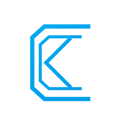

<div align="center">
  
  <h1 style="color: #00a0ea;">痕迹AI</h1>
  <h3>一个软件用上各种AI - 聚合多家供应商，一站式生成图片、视频和音频</h3>
  
  [](https://space.bilibili.com/39337803)
  
</div>


## 下载

<div align="center">
Windows 用户请下载 <strong>.msi</strong> 文件，macOS 用户请下载 <strong>.dmg</strong> 文件

当前桌面端已切到 Electron 迁移基线，新版本会随应用打包 Chromium，不再依赖系统 WebView2 运行时。

### Github下载
[](https://github.com/henjicc/Henji-AI/releases/latest)

### 网盘下载
**夸克网盘**：[https://pan.quark.cn/s/66bcb08a7713](https://pan.quark.cn/s/66bcb08a7713)

**蓝奏云**：[https://henji.lanzout.com/b01vdihsza](https://henji.lanzout.com/b01vdihsza) 提取码：g90x

</div>

## 重要说明
全新 2.0 正在开发中，目前尚未完善，存在许多问题，不建议小白尝试

## 功能特性

- 多家供应商可选，自由灵活
- 界面简洁美观，基础功能完善

## 适配列表

### 供应商
[派欧云](https://ppio.com/user/register?invited_by=MLBDS6)：访问与充值都比较方便，但 API 更新比较慢，且仅支持国内 AI

[fal](https://fal.ai/)：API 更新快，覆盖面广，但充值可能需要信用卡

[魔搭](https://modelscope.cn/)：免费，但仅支持开源模型

[KIE](https://kie.ai/zh-CN)：充值方便，部分模型有优惠，但某些 API 功能有所缺失

### 图片

| 模型 | 功能 | 供应商 |
|--------|------|------|
| 即梦图片 4.0 | 图片生成、图片编辑 | 派欧云、fal、KIE |
| 即梦图片 4.5 | 图片生成、图片编辑 | fal、KIE |
| Nano Banana | 图片生成、图片编辑 | fal |
| Nano Banana Pro | 图片生成、图片编辑 | fal、KIE |
| 可灵图片 O1 | 图片生成、图片编辑 | fal |
| Grok Imagine 图片 | 图片生成 | KIE |
| Z-Image-Turbo | 图片生成 | fal、魔搭、KIE |
| Qwen-Image | 图片生成 | 魔搭 |
| Qwen-Image-Edit-2509 | 图片编辑 | 魔搭 |
| FLUX.1-Krea-dev | 图片生成 | 魔搭 |
| 魔搭API自定义 | 图片生成、图片编辑 | 魔搭 |

### 视频

| 模型 | 功能 | 供应商 |
|--------|------|------|
| Veo 3.1 | 文生视频、图生视频、首尾帧、参考生视频 | fal |
| 即梦视频 3.0 | 文生视频、图生视频、首尾帧、参考生视频 | 派欧云、fal、KIE |
| Vidu Q1 | 文生视频、图生视频、首尾帧、参考生视频 | 派欧云 |
| 可灵 2.5 Turbo | 文生视频、图生视频 | 派欧云 |
| 可灵 V2.6 Pro | 文生视频、图生视频 | fal、KIE |
| 可灵 O1 | 图生视频、参考生视频、视频编辑、视频参考 | fal |
| 海螺 Hailuo 2.3 | 文生视频、图生视频 | 派欧云、fal、KIE |
| 海螺 Hailuo-02 | 文生视频、图生视频、首尾帧 | 派欧云、fal、KIE |
| 万相 2.5 Preview | 文生视频、图生视频 | 派欧云、fal |
| Vidu Q2 | 文生视频、图生视频、参考生视频、视频延长 | fal |
| PixVerse V4.5 | 文生视频、图生视频 | 派欧云 |
| PixVerse V5.5 | 文生视频、图生视频、首尾帧 | fal |
| LTX-2 | 文生视频、图生视频、视频编辑 | fal |
| Grok Imagine 视频 | 文生视频、图生视频 | KIE |

### 音频

| 模型 | 功能 | 供应商 |
|--------|------|------|
| MiniMax Speech-2.6 | 语音合成 | 派欧云 |

## 技术栈

- **桌面框架**: Electron 42 + Node/TypeScript 主进程
- **前端**: React 18 + TypeScript
- **构建工具**: Vite 4 + electron-vite
- **打包/更新**: electron-builder + electron-updater
- **样式**: Tailwind CSS
- **数据库**: SQLite + better-sqlite3
- **HTTP 客户端**: Axios
- **图片处理**: Pica + sharp


## 开发指南

### 环境要求

- **Node.js**: 18+ (推荐使用 LTS 版本)
- **Windows/macOS**: Electron 开发无需额外 Rust/Tauri 环境

### 安装依赖

```bash
npm install
```

### 开发模式

```bash
npm run electron:dev
```

裸 Vite 页面只适合调试纯渲染层：

```bash
npm run dev
```

### 构建应用

```bash
npm run electron:build
npm run electron:dist
```

常用验收命令：

```bash
npm run electron:smoke
npm run electron:canvas-stress
npm run electron:dpi-check
```

构建产物位于 `release/`。

### 进度预测 seeds

开发时如需把默认进度预测数据打进安装包，维护基础 seeds 后重新生成资源：

```bash
npm run gen:progress-seeds
```

基础 seeds 位于 `resources/progress-seeds.base.json`。如本地存在 `dev-data/progress-seeds.local.json`，执行 `npm run dev`、`npm run electron:dev`、`npm run electron:build`、`npm run electron:dist` 时会自动合并到 `resources/progress-seeds.json`，并作为打包默认值参与构建。

`resources/model-manifest.json` 与 `resources/progress-seeds.json` 是自动生成产物，已在 Git 中忽略。

## 架构说明

### Provider 架构（新系统）

项目采用 Provider + 配置驱动架构统一不同 AI 供应商的 API：

```
MediaGenerator/ConversationWorkspace
  → GenerationService
  → src/commands/aiRuntime.ts
  → src/platform
  → Electron preload IPC
  → electron/main/services/ai-runtime
  → Provider (PPIO / Fal / KIE / ModelScope)
```

模型定义集中在 `src/models/**/*.model.ts`，由 `loadAllModels()` 自动扫描注册到 `ModelRegistry`。请求构建由 `RequestBuilder` + `EndpointSelector` 完成。

### 数据存储

- **API Keys**: Electron safeStorage 加密后存储
- **历史记录/预设/设置/画布项目**: SQLite (`henji.db`)
- **媒体文件**: AppLocalData (`Henji-AI/Media/` 等旧数据目录)
- **缓存**: AppLocalData (`Henji-AI/Uploads/`, `Henji-AI/Waveforms/`)

### 跨平台适配

- Electron 提供统一 Chromium 运行环境
- 窗口控制自动适配操作系统风格
- 文件、媒体、剪贴板、拖拽等桌面能力统一走 `src/platform/*` 平台抽象层

## 扩展开发

想要添加新的 AI 模型或供应商？

- **[模型与供应商适配规范](docs/rules/model-adaptation.md)**：参数 Schema 定义、联动系统、请求构建、媒体上传约束、manifest 生成
- **[模型适配资料库](docs/model-adaptation/README.md)**：各模型在各供应商上的 API 契约与价格，是核对字段和价格的唯一来源

## 许可证

本项目采用 [Apache License 2.0](LICENSE) 开源许可证。
