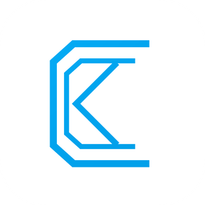

<p align="center">
  
</p>

# 痕迹AI · Henji-AI

**一个软件用上各种 AI，把图片、视频和音频创作放在同一个桌面工作台。**

痕迹AI 面向需要反复生成、编辑和整理素材的创作者。连接自己的模型供应商账号后，可以直接生成内容，也可以在节点画布中连接提示词、参考素材和生成结果，继续完成后续创作。

[下载应用](#下载应用) · [快速开始](#快速开始) · [从源码运行](#从源码运行) · [模型 SDK](packages/ai-sdk/README.md) · [反馈问题](https://github.com/henjicc/Henji-AI/issues)

> [!NOTE]
> 本文介绍 `main` 分支上的 **2.0 开发版**，当前源码版本为 `2.0.0-beta.1`。公开安装包仍是旧版，尚不包含下文全部能力；体验当前版本请参考「从源码运行」。

## 可以做什么

- **生成图片、视频和音频**：在同一界面选择供应商和模型，填写提示词、上传参考素材、调整参数，查看任务进度与历史结果。
- **用画布组织创作流程**：把文本、图片和生成节点连接起来，将上一步的结果用作下一步的参考，保存为可继续编辑的项目。
- **编辑图片**：裁剪、旋转、添加文字、箭头、序号与马赛克；可以从工具箱独立打开，也可以在画布中处理图片。
- **制作 3D 镜头参考**：搭建场景、摆放角色与姿势、调整机位，导出画面作为 AI 生成的参考图。
- **管理素材**：在素材库中导入、搜索素材，用标签和集合整理内容，再复用到创作中。
- **让助手参与操作**：通过内置助手查询内容、调整设置和操作画布；也可以为外部智能体创建 MCP 连接授权，按权限访问应用能力。

### 供应商与模型

图片、视频和音频生成已接入派欧云（PPIO）、Fal、魔搭（ModelScope）、KIE、APIMart、阿里云百炼、火山引擎、Grsai、硅基流动等服务。不同供应商提供的模型和功能并不相同。

| 创作类型 | 可选模型系列举例 |
| --- | --- |
| 图片生成与编辑 | Seedream（即梦）、Nano Banana、GPT Image、Qwen Image、Z-Image |
| 视频生成 | Kling（可灵）、Veo、Seedance（即梦）、Wan（万相）、Hailuo（海螺）、Vidu |
| 语音合成 | MiniMax Speech、CosyVoice、Qwen TTS、Seed-TTS |

实际可选模型以应用内「供应商与模型」和生成面板为准。具体参数、参考素材类型、价格与可用性取决于对应供应商；开发者可查阅[模型适配资料库](packages/ai-sdk/docs/model-adaptation/README.md)。

提示词优化与智能助手使用单独配置的大语言模型，也支持添加自定义大语言模型供应商。图片、视频和音频生成供应商目前使用内置适配。

## 下载应用

前往 [GitHub Releases](https://github.com/henjicc/Henji-AI/releases) 下载已发布版本并查看更新说明。

截至 2026 年 9 月 28 日，最新公开版本为 [v0.1.1](https://github.com/henjicc/Henji-AI/releases/tag/v0.1.1)，提供以下安装包：

| 系统 | 选择的安装包 |
| --- | --- |
| Windows x64 | `Henji-AI_0.1.1_x64_zh-CN.msi` |
| macOS（Intel / Apple Silicon） | `Henji-AI_0.1.1_universal.dmg` |

Windows 下载后运行安装程序；macOS 打开 DMG 后将应用拖入「应用程序」。旧版的界面和功能说明请查看 [v0.1.1 README](https://github.com/henjicc/Henji-AI/blob/v0.1.1/README.md)。

备用下载：[夸克网盘](https://pan.quark.cn/s/66bcb08a7713) · [蓝奏云](https://henji.lanzout.com/b01vdihsza)（提取码：`g90x`）。网盘中的版本以实际文件名为准。

当前 2.0 的构建目标为 Windows x64、macOS x64 和 macOS arm64，尚未配置 Linux 安装包。2.0 使用 Electron，自带 Chromium 运行环境。

## 快速开始

以下步骤适用于 **2.0 开发版**。先按下方源码说明启动应用，再完成一次图片生成：

1. **配置一个供应商。** 在首次引导中填写密钥，或打开「设置 → 供应商与模型」，选择已有账号的供应商，填入 API Key 并保存。只需配置本次使用的供应商。
2. **选择图片模型。** 进入生成页，选择同一供应商下支持文生图的模型，先保留默认参数。
3. **输入提示词。** 例如：「一只橘猫坐在窗边，午后阳光，柔和色调，插画风格」。
4. **开始生成。** 确认参数与预估费用后提交，等待任务返回结果。
5. **查看并保存。** 成功后，任务卡片会显示生成图片，可以放大预览或下载保存；后续也可以把素材放入画布继续创作。

AI 调用需要可访问的供应商服务、有效密钥和相应额度，费用由供应商收取。应用显示的费用是估算，实际扣费以供应商账单为准。

使用图片编辑、图生视频等需要参考素材的功能时，请通过上传入口选择文件。部分模型需要额外配置「通用文件上传服务」，可在设置中选择已配置密钥的 KIE 或 Fal。

## 数据与使用边界

- **本地保存**：设置、历史记录、画布项目等数据保存在本机，媒体存储位置可在设置中管理。直接引用的原文件被移动或删除后，相关素材可能失效。
- **密钥保存**：2.0 通过 Electron `safeStorage` 加密后在本机保存 API Key；系统加密不可用时会拒绝保存。
- **联网范围**：模型调用会把提示词和所需参考素材发送给相应服务。需要文件托管时，素材还会上传到使用的上传服务；助手交互会将相关对话和任务上下文发送给所配置的大语言模型。
- **离线使用**：本地图片编辑、3D 镜头参考等工具不依赖生成 API；AI 生成、提示词优化和在线模型助手需要联网。
- **开发版状态**：2.0 仍在迭代。助手能力取决于已接通的操作和当前授权，不能保证完成所有界面操作；MCP 接入也取决于外部客户端的协议兼容性。
- **安装包签名**：当前 2.0 构建流程尚未配置 macOS 签名与公证，源码打包后的应用可能触发系统安全提示。

## 从源码运行

### 开发环境

- Git。
- **Node.js 22.13 或更高的 22.x 版本**，建议使用该版本线的最新补丁版；项目 CI 使用 Node.js 22。
- npm；仓库使用 npm workspaces 管理应用与 `packages/ai-sdk`。
- Windows 或 macOS。安装依赖时需要联网下载 Electron 和相关原生依赖。

### 安装与启动

在 PowerShell 或 macOS 终端执行：

```bash
git clone https://github.com/henjicc/Henji-AI.git
cd Henji-AI
npm install
npm run electron:dev
```

启动成功后会打开痕迹AI 桌面窗口。首次使用可跟随引导完成设置，再按上方「快速开始」生成第一张图片。`npm install` 会自动准备媒体依赖并构建仓库内的 SDK。

需要后台开发或自动化验证时使用：

```bash
npm run electron:dev -- --background
```

该模式会在窗口启动后最小化，并保持后台渲染。`npm run dev` 只启动 Vite 渲染层，不包含完整桌面能力。

### 构建与验证

| 命令 | 用途 |
| --- | --- |
| `npm run electron:bundle` | 生成最新 SDK、资源与 Electron 运行产物，供本地调试或定向验收使用 |
| `npm run electron:build` | 执行完整构建门禁并构建 Electron 应用 |
| `npm run electron:dist` | 完整构建后生成安装包，输出到 `release/` |
| `npm run electron:rebuild` | 为 Electron 重建 `better-sqlite3` 原生模块，适用于出现 ABI 不匹配时 |

日常改动按[验证与测试规则](docs/rules/testing.md)选择匹配的检查：文档改动核对格式、链接和命令；局部代码改动运行相关检查；完整构建用于构建链检查或发布。真实桌面验收使用 `npm run test:reality`，具体场景与参数见同一规则。

### 项目结构

```text
src/                 React 界面、工作区与应用业务逻辑
electron/            Electron 主进程、preload 与桌面能力
packages/ai-sdk/     多供应商模型 SDK 与适配资料
resources/           应用图标、内置资源与助手技能
scripts/             开发、构建、检查与发布脚本
docs/rules/          架构、界面、测试等项目规则
```

主要技术栈为 Electron、React、TypeScript、Vite / electron-vite、Tailwind CSS 和 SQLite。生成协议由 `@henjicc/ai-sdk` 统一处理，桌面端负责本地文件、任务生命周期和界面交互。

如果只需要在其他项目中接入模型，可直接阅读 [SDK 文档与示例](packages/ai-sdk/README.md)，无需引入整个桌面应用。

## 帮助与贡献

- **报告问题或提出建议**：[GitHub Issues](https://github.com/henjicc/Henji-AI/issues)。请附上应用版本、系统与架构、复现步骤、相关供应商和模型；截图与错误信息请去除密钥及私人内容。
- **查看版本变化**：[GitHub Releases](https://github.com/henjicc/Henji-AI/releases)。
- **关注作者**：[Bilibili · 痕继痕迹](https://space.bilibili.com/39337803)。
- **参与开发**：先阅读 [AGENTS.md](AGENTS.md)，再按改动领域查看对应规则。提交 Pull Request 时说明解决的问题、改动范围和验证结果。

开发参考：

- [架构与目录边界](docs/rules/architecture.md)
- [模型与供应商适配规范](docs/rules/model-adaptation.md)
- [模型适配资料库](packages/ai-sdk/docs/model-adaptation/README.md)
- [智能助手当前状态与已知缺口](docs/rules/assistant-status.md)
- [日志调试中心使用手册](docs/日志调试中心使用手册.md)（开发与测试模式）
- [验证与测试规则](docs/rules/testing.md)

## 许可证

本项目采用 [Apache License 2.0](LICENSE)。第三方资源与依赖遵循各自的许可证。
