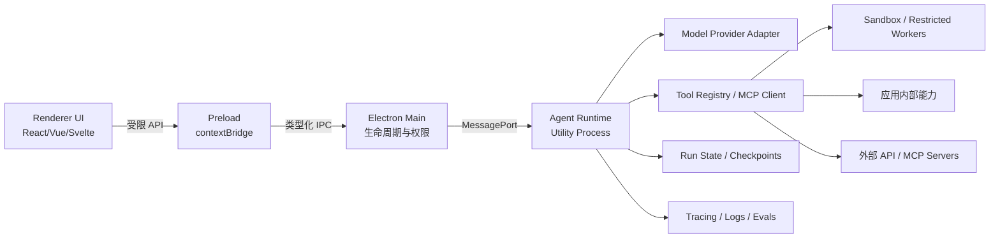
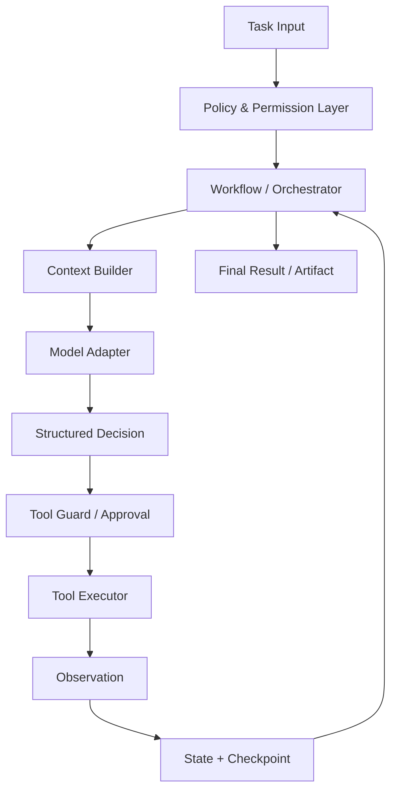

# 2026 年 AI Agent 开发原则、架构与 Electron 落地指南

> 更新时间：2026-07-23  
> 适用场景：在基于 Electron 的桌面软件中加入能够理解任务、调用工具、执行多步操作并与用户协作的 AI Agent。

## 一句话结论

**2026 年开发 AI Agent，最重要的不是堆叠多个 Agent、复杂提示词或“无限自主”，而是把不确定的模型能力放进一个可控制、可观察、可恢复、可评测、权限最小化的确定性软件系统中。**

推荐遵循：

> **工作流优先，单 Agent 优先；模型负责判断，代码负责控制；工具默认无权，敏感动作必须确认；每一步可追踪，每次失败可恢复，每次升级有评测。**

---

## 1. 2026 年主流 Agent 项目的共同趋势

目前有代表性的项目包括：

| 项目/体系 | 主要特点 | 更适合的场景 |
|---|---|---|
| OpenAI Agents SDK（TypeScript/Python） | 抽象较轻，提供 Agent、Tool、Handoff、Guardrail、Session、Tracing | 希望快速构建标准工具调用 Agent，尤其以 OpenAI 模型为主 |
| LangGraph / LangGraph.js | 状态图、持久化、断点恢复、人类介入、长任务执行 | 复杂、长时间运行、必须恢复和审计的工作流 |
| Mastra | TypeScript 原生，整合 Agent、Workflow、Memory、MCP、Evals、Observability | Electron/Node/TypeScript 技术栈，希望一体化开发 |
| Google ADK | Agent、工具、会话、状态、多 Agent、评测和部署体系完整 | Google Cloud 或 Gemini 生态 |
| Microsoft Agent Framework | AutoGen 与 Semantic Kernel 的后继统一框架，强调类型、状态、工作流和遥测 | .NET/Python、微软企业技术栈 |
| CrewAI | Crew + Flow，强调角色协作和生产流程 | Python 团队、业务自动化、多角色协作 |
| MCP | 统一 Agent 与外部工具、数据和资源的连接方式 | 工具插件生态、本地工具、第三方服务接入 |
| A2A | 不同厂商、框架和组织的独立 Agent 之间通信 | 跨服务、跨组织的 Agent 协作，不适合作为首版必需项 |

这些项目虽然 API 不同，但成熟架构正在趋同：

1. **Agent 本质上仍是一个受控循环**：接收目标 → 判断 → 调用工具 → 观察结果 → 继续或结束。
2. **确定性工作流与模型判断混合**：固定步骤交给代码，模糊决策才交给模型。
3. **状态和执行过程持久化**：长任务必须能暂停、恢复和重试。
4. **工具成为最关键的工程边界**：工具接口质量通常比提示词长度更重要。
5. **高风险操作引入审批**：发送、删除、付款、执行命令、修改系统配置不能默认自动完成。
6. **Tracing 与 Evals 成为基础设施**：不能只看最终回答，必须观察每次模型调用、工具调用、状态变化和失败原因。
7. **MCP 解决 Agent 到工具，A2A 解决 Agent 到 Agent**：两者互补，但首版通常只需要 MCP 或内部工具协议。
8. **多 Agent 不再被视为默认最佳实践**：只有职责、上下文或工具确实需要隔离时才拆分。

---

## 2. 最重要的开发原则

## 2.1 先判断是否真的需要 Agent

适合使用 Agent 的任务通常具备至少两个特征：

- 任务步骤无法完全预先写死；
- 需要理解自然语言、文件或非结构化信息；
- 需要在多个工具之间动态选择；
- 需要根据执行结果修正计划；
- 存在大量例外情况，传统规则系统维护成本过高；
- 任务有可以验证的完成标准。

不适合 Agent 的场景：

- 一个普通 API 调用就能完成；
- 步骤固定且规则明确；
- 对结果要求绝对确定；
- 错误成本非常高，但又无法提供人工审核；
- 只是聊天、总结或单次生成文本。

**能用普通函数解决，就不要使用 Agent；能用固定 Workflow 解决，就不要让模型自由规划。**

---

## 2.2 工作流优先，而不是自主优先

建议将系统能力分为三级：

### 第一级：单次模型调用

适合分类、提取、改写、摘要、结构化输出。

### 第二级：确定性 Workflow

由代码控制顺序，例如：

```text
读取文件 → 提取信息 → 校验格式 → 用户确认 → 写入结果
```

模型只负责其中的理解和生成步骤。

### 第三级：Agent Loop

只有在步骤数量、工具选择或执行路径无法预先确定时，才允许模型循环决策：

```text
目标 → 思考下一步 → 调用工具 → 获取真实结果 → 更新状态 → 判断是否完成
```

建议默认把 70%～90% 的流程控制权放在代码中，只把确实需要语义判断的部分交给模型。

---

## 2.3 单 Agent 优先，多 Agent 后置

首版应优先采用：

```text
一个主 Agent + 一组高质量工具 + 明确的状态机
```

只有出现以下情况时再拆分：

- 系统提示词已经包含大量互相冲突的规则；
- 工具数量多且名称、功能高度相似，模型经常选错；
- 不同任务需要完全不同的上下文和权限；
- 某个子任务需要独立模型、独立评测或独立运行环境；
- 多个子任务可以并行执行，且结果可独立验证；
- 某个专业 Agent 需要被多个产品复用。

多 Agent 常见成本：

- 调用次数、延迟和费用增加；
- 上下文在 Agent 间传递时丢失或变形；
- 责任边界变得模糊；
- 调试难度呈倍数增长；
- 循环委派、重复工作和互相矛盾更容易发生。

对于桌面软件，最稳妥的多 Agent 模式通常是：

```text
主控 Agent
├── 搜索/检索子 Agent
├── 文件分析子 Agent
├── 执行/自动化子 Agent
└── 评审子 Agent
```

主控 Agent 保留最终控制权和用户交互权，子 Agent 更像受限工具，而不是自由聊天的“虚拟团队”。

---

## 2.4 模型负责判断，代码负责约束

不要依靠提示词实现关键安全逻辑。

以下规则必须由程序执行：

- 最大循环次数；
- 最大工具调用次数；
- 最大总耗时；
- 最大 Token 和费用；
- 允许访问的路径；
- 允许连接的域名；
- 工具参数 Schema；
- 权限判断；
- 用户确认；
- 幂等键；
- 超时、重试和熔断；
- 敏感信息过滤；
- 最终输出格式校验。

提示词可以告诉 Agent “不要删除文件”，但真正的文件工具仍然必须拒绝未授权删除。

---

## 2.5 工具设计比复杂提示词更重要

一个优秀工具应满足：

- **单一职责**：一个工具只做一类明确动作；
- **名称清晰**：名称直接表达动作，例如 `read_text_file`；
- **参数结构化**：使用 JSON Schema/Zod，不接受模糊长文本；
- **返回值结构化**：返回状态、数据、错误码和可恢复建议；
- **权限明确**：标记 read / write / execute / network；
- **风险明确**：标记 low / medium / high；
- **可取消**：长操作支持 AbortSignal；
- **可重试**：说明是否安全重试；
- **幂等**：写操作尽量支持 idempotency key；
- **可预览**：写入前能返回 diff 或操作计划；
- **可观测**：工具调用有 traceId、耗时、结果摘要；
- **输出有限**：大文件、大日志不要全部塞回上下文。

推荐工具定义：

```ts
type ToolRisk = "low" | "medium" | "high";

interface AgentTool<Input, Output> {
  name: string;
  description: string;
  inputSchema: unknown;
  risk: ToolRisk;
  permissions: string[];
  timeoutMs: number;
  idempotent: boolean;

  execute(
    input: Input,
    context: ToolContext,
    signal: AbortSignal
  ): Promise<Output>;
}
```

工具返回值建议：

```ts
type ToolResult<T> =
  | {
      ok: true;
      data: T;
      summary: string;
      artifacts?: ArtifactRef[];
    }
  | {
      ok: false;
      code: string;
      message: string;
      retryable: boolean;
      recoveryHint?: string;
    };
```

---

## 2.6 权限应当渐进授予

不要在 Agent 启动时授予所有能力。

建议分为：

| 权限等级 | 示例 | 默认行为 |
|---|---|---|
| 只读 | 读取用户选中的文件、查询应用状态 | 可自动执行 |
| 可逆写入 | 新建草稿、写入临时区、生成新文件 | 可自动或一次性授权 |
| 影响性写入 | 覆盖文件、修改数据库、发送邮件 | 展示预览并确认 |
| 高风险操作 | 删除、付款、运行命令、安装插件、修改系统设置 | 每次明确确认 |
| 禁止操作 | 绕过安全限制、读取未授权凭据 | 工具层直接拒绝 |

授权对象应尽量具体：

```text
不推荐：允许访问文件系统
推荐：允许本次任务读取 D:\Project\docs，并写入 D:\Project\output
```

---

## 2.7 上下文不是越多越好

上下文管理应分层：

1. **系统规则**：固定、短小、稳定；
2. **任务上下文**：当前目标、约束和成功条件；
3. **运行状态**：已完成步骤、待办、工具结果；
4. **短期记忆**：当前会话必要信息；
5. **长期记忆**：经过筛选的用户偏好或事实；
6. **外部知识**：按需检索，不直接永久塞入提示词。

不要把完整聊天记录、完整文件、全部工具说明和所有历史运行一次性发送给模型。

建议采用：

- 滑动窗口；
- 历史摘要；
- 检索式记忆；
- 工具结果压缩；
- 大内容使用引用 ID；
- 只在需要时读取原文；
- 对写入长期记忆设置明确规则和用户控制。

---

## 2.8 每个任务必须有明确停止条件

Agent 不能只依赖“模型认为完成了”。

至少设置：

- `maxTurns`；
- `maxToolCalls`；
- `deadline`；
- `costBudget`；
- `consecutiveFailureLimit`；
- `noProgressLimit`；
- 用户取消信号；
- 结构化成功条件；
- 需要人工接管的异常条件。

示例：

```ts
interface RunBudget {
  maxTurns: number;
  maxToolCalls: number;
  maxDurationMs: number;
  maxEstimatedCostUsd: number;
  maxConsecutiveFailures: number;
}
```

---

## 3. 推荐的 Electron 总体架构

## 3.1 不要把 Agent Runtime 放在 Renderer 中

推荐结构：



### 各进程职责

#### Renderer

只负责：

- 输入任务；
- 展示流式输出；
- 展示计划和执行状态；
- 显示工具调用；
- 请求用户批准；
- 暂停、继续和取消；
- 查看生成物和操作差异。

不应拥有：

- 模型 API Key；
- Node.js 全权限；
- 文件系统直接访问；
- 任意命令执行；
- MCP Server 启动权限；
- 未校验的 IPC 通道。

#### Preload

只暴露很小的类型化接口：

```ts
interface AgentDesktopAPI {
  startRun(input: StartRunInput): Promise<{ runId: string }>;
  sendUserMessage(runId: string, text: string): Promise<void>;
  approveAction(requestId: string, decision: ApprovalDecision): Promise<void>;
  cancelRun(runId: string): Promise<void>;
  subscribe(listener: (event: AgentEvent) => void): () => void;
}
```

不要把整个 `ipcRenderer`、文件系统 API 或通用 `invoke(channel, args)` 暴露给 Renderer。

#### Main Process

只负责：

- 创建和管理窗口；
- 启动/停止 Agent Utility Process；
- IPC 参数校验；
- 权限和批准请求转发；
- 系统对话框；
- 安全存储；
- 应用升级和生命周期。

避免在 Main Process 中运行长时间模型循环，以免阻塞或导致整个应用崩溃。

#### Agent Utility Process

负责：

- Agent Loop；
- 工作流/状态机；
- 模型调用；
- 工具注册；
- MCP Client；
- 会话和检查点；
- 流式事件；
- 重试、超时和预算；
- Trace 与指标。

Electron 官方将 `utilityProcess` 定位为适合承载不可信服务、CPU 密集任务或容易崩溃组件的独立 Node.js 进程，因此它非常适合作为桌面 Agent Runtime。

#### Sandbox / Restricted Worker

以下操作不要直接在 Agent Runtime 的主权限环境中执行：

- Shell 命令；
- Python/Node 动态代码；
- 第三方插件；
- 本地 MCP Server；
- 浏览器自动化；
- 解压和解析不可信文件；
- 可能崩溃的原生模块。

可选隔离方案：

- 独立子进程 + 受限工作目录；
- 容器；
- Windows AppContainer/低完整性进程；
- macOS Sandbox；
- Linux namespace / bubblewrap / firejail；
- 远程执行沙箱。

---

## 3.2 推荐的 Agent Runtime 分层



建议代码分层：

```text
src/
├─ renderer/
│  ├─ agent-ui/
│  └─ stores/
├─ preload/
│  └─ agent-api.ts
├─ main/
│  ├─ agent-runtime-manager.ts
│  ├─ ipc/
│  ├─ permissions/
│  └─ secrets/
├─ agent-runtime/
│  ├─ core/
│  │  ├─ runner.ts
│  │  ├─ state-machine.ts
│  │  ├─ budgets.ts
│  │  └─ events.ts
│  ├─ agents/
│  ├─ workflows/
│  ├─ models/
│  ├─ tools/
│  ├─ mcp/
│  ├─ memory/
│  ├─ checkpoints/
│  ├─ approvals/
│  ├─ tracing/
│  └─ evals/
├─ shared/
│  ├─ schemas/
│  └─ types/
└─ sandbox/
   ├─ command-runner/
   └─ plugin-host/
```

---

## 3.3 使用事件流，而不是只返回最终字符串

统一事件协议：

```ts
type AgentEvent =
  | { type: "run.started"; runId: string }
  | { type: "assistant.delta"; runId: string; text: string }
  | { type: "plan.updated"; runId: string; steps: PlanStep[] }
  | { type: "tool.requested"; runId: string; call: ToolCall }
  | { type: "approval.required"; runId: string; request: ApprovalRequest }
  | { type: "tool.started"; runId: string; callId: string }
  | { type: "tool.completed"; runId: string; callId: string; result: unknown }
  | { type: "checkpoint.saved"; runId: string; checkpointId: string }
  | { type: "artifact.created"; runId: string; artifact: ArtifactRef }
  | { type: "run.completed"; runId: string; result: RunResult }
  | { type: "run.failed"; runId: string; error: SerializedError }
  | { type: "run.cancelled"; runId: string };
```

UI 应让用户清楚看到：

- Agent 当前在做什么；
- 为什么调用某个工具；
- 即将修改什么；
- 哪一步失败；
- 是否还能重试；
- 已经消耗多少时间和费用；
- 如何暂停或接管。

不要向用户暴露模型的私有思维链；展示简洁的计划、操作理由和可验证证据即可。

---

## 4. Agent Loop 的基础实现

一个最小但可靠的循环大致如下：

```ts
async function runAgent(ctx: RunContext): Promise<RunResult> {
  while (!ctx.done) {
    ctx.budget.assertAvailable();
    ctx.signal.throwIfAborted();

    const modelInput = await ctx.contextBuilder.build(ctx.state);

    const decision = await ctx.model.generateStructured({
      input: modelInput,
      tools: ctx.toolRegistry.getVisibleTools(ctx.permissions),
      signal: ctx.signal,
    });

    await ctx.trace.recordModelDecision(decision);

    if (decision.type === "final") {
      const result = await ctx.outputValidator.validate(decision.output);
      await ctx.checkpoints.save(ctx.state);
      return result;
    }

    if (decision.type === "tool_call") {
      const tool = ctx.toolRegistry.require(decision.toolName);
      const args = tool.inputSchema.parse(decision.arguments);

      await ctx.policy.assertAllowed(tool, args, ctx);

      if (ctx.policy.requiresApproval(tool, args)) {
        await ctx.approvals.waitForUser({
          tool,
          args,
          preview: await ctx.policy.createPreview(tool, args),
        });
      }

      const observation = await ctx.toolExecutor.execute(tool, args, ctx);
      ctx.state.appendObservation(observation);

      await ctx.checkpoints.save(ctx.state);
    }
  }

  throw new Error("Agent stopped without a final result");
}
```

生产版本还需加入：

- 模型降级和重试；
- 网络错误恢复；
- Tool 超时；
- 幂等处理；
- Context 压缩；
- 死循环检测；
- 多次重复调用检测；
- 敏感内容脱敏；
- 检查点版本迁移；
- 模型和 Prompt 版本记录。

---

## 5. 状态、记忆与检查点

不要把“聊天记录”当作完整状态。

建议运行状态至少包含：

```ts
interface AgentRunState {
  runId: string;
  threadId: string;
  status: "running" | "waiting_approval" | "paused" | "completed" | "failed";
  goal: string;
  constraints: string[];
  plan: PlanStep[];
  messages: MessageRef[];
  observations: ObservationRef[];
  artifacts: ArtifactRef[];
  permissions: GrantedPermission[];
  budget: BudgetUsage;
  modelVersion: string;
  promptVersion: string;
  checkpointVersion: number;
  createdAt: string;
  updatedAt: string;
}
```

### 建议分开存储

- SQLite：运行、消息索引、检查点、权限和审计记录；
- 文件目录/对象存储：大文件、模型生成物、长日志；
- 向量库：确实需要语义检索的长期记忆；
- OS 安全存储：API Key、OAuth Refresh Token 等凭据。

### 记忆写入原则

长期记忆应满足：

- 对未来任务确实有帮助；
- 信息来源明确；
- 用户可查看和删除；
- 有作用域和过期时间；
- 不自动保存敏感内容；
- 不把模型推断当成用户事实；
- 写入前可进行去重和冲突检测。

---

## 6. MCP 与插件体系

对于 Electron 软件，MCP 很适合作为外部工具协议，但不要让所有内部能力都强行经过 MCP。

推荐：

```text
内部核心工具：直接使用 TypeScript Tool Interface
第三方/可安装工具：使用 MCP
远程独立 Agent：未来需要时使用 A2A
```

### MCP Client 必须具备

- Server 白名单；
- 安装来源校验；
- 可执行文件和参数预览；
- 工具列表快照与变更提示；
- 每个 Server 独立权限；
- stdio 进程隔离；
- 网络出口限制；
- OAuth Token audience 校验；
- 禁止 Token passthrough；
- 最小 Scope；
- 日志脱敏；
- 超时和资源限制；
- Server 崩溃自动回收；
- 卸载时清理授权。

特别注意：本地 MCP Server 本质上是本地可执行程序，不应因为它使用了“标准协议”就默认可信。

---

## 7. Electron 安全注意事项

必须遵守：

- `nodeIntegration: false`；
- `contextIsolation: true`；
- Renderer 启用 sandbox；
- 只通过 `contextBridge` 暴露精确 API；
- 校验所有 IPC sender 和参数；
- 不允许任意 channel 调用；
- 不在 Renderer 保存 API Key；
- 不加载带 Node 权限的远程页面；
- 使用严格 CSP；
- 限制导航和新窗口；
- `shell.openExternal` 只接受校验后的 URL；
- Agent Runtime 使用 Utility Process；
- Shell、插件和 MCP stdio 再次隔离；
- 更新 Electron、Chromium、Node 和依赖；
- 对第三方工具和插件做签名、哈希或来源校验。

### 凭据存储

可以使用 Electron `safeStorage`，但需注意：

- 优先异步加解密 API；
- Windows 下同一用户空间的其他应用安全边界有限；
- Linux 需检查是否退化为 `basic_text`；
- 更高安全需求可使用系统 Keychain/Credential Manager/Secret Service；
- 凭据只在需要时解密；
- 不写入日志、Trace、模型上下文或工具结果。

---

## 8. Guardrail 与人工确认

Guardrail 至少应有五层：

```text
输入校验
→ 上下文与数据隔离
→ 模型输出结构校验
→ 工具调用权限校验
→ 工具执行结果校验
```

人工确认不是一个简单的“确定/取消”弹窗，而应展示：

- Agent 要做什么；
- 目标对象；
- 具体参数；
- 预期影响；
- 是否可撤销；
- diff 或预览；
- 权限范围；
- 本次允许还是永久允许。

高风险工具建议采用“两阶段执行”：

```text
prepare / preview → 用户批准 → commit
```

例如文件修改：

```text
生成 Patch → 展示 Diff → 用户批准 → 原子写入 → 验证结果
```

---

## 9. 可观测性与评测

没有 Trace 和 Evals 的 Agent 不应进入生产环境。

### 每次运行至少记录

- 用户目标；
- 模型、参数和版本；
- Prompt 版本；
- 上下文引用；
- 每次模型调用耗时和 Token；
- 工具名称、参数摘要、耗时和状态；
- 权限判断；
- 用户批准；
- 重试和异常；
- 检查点；
- 最终生成物；
- 总耗时和估算成本。

敏感数据应脱敏，Trace 不等于保存所有原文。

### 评测应覆盖

1. **任务成功率**：是否真正完成用户目标；
2. **工具选择正确率**；
3. **参数正确率**；
4. **不应执行的动作是否被拦截**；
5. **高风险动作是否要求确认**；
6. **文件和数据是否被错误修改**；
7. **是否出现死循环或无效重复**；
8. **失败后能否恢复**；
9. **Token、费用和延迟**；
10. **不同模型/Prompt 版本回归对比**。

建议建立三类数据集：

- 黄金用例；
- 历史失败用例；
- 对抗和安全用例。

每次修改以下内容都运行回归评测：

- Prompt；
- 模型；
- 工具描述；
- Tool Schema；
- 工作流；
- 记忆策略；
- 权限策略；
- MCP Server 版本。

---

## 10. 框架选择建议

## 方案 A：最推荐的 Electron 首版

```text
TypeScript
+ 自己定义 AgentRuntime/Tool/Event 接口
+ OpenAI Agents SDK TS 或 Mastra
+ SQLite
+ Zod
+ Electron Utility Process
+ MCP TypeScript SDK
```

选择 OpenAI Agents SDK TS：

- 希望抽象少；
- 主要使用 OpenAI；
- 需要 Tool、Handoff、Guardrail 和 Tracing；
- 希望快速做出首版。

选择 Mastra：

- 希望 TypeScript 一体化；
- 需要多模型；
- 希望内置 Workflow、Memory、MCP、Evals 和 Observability；
- 不想自己拼太多组件。

## 方案 B：复杂长任务

```text
TypeScript
+ LangGraph.js
+ 持久化 Checkpointer
+ 自定义 Tool Gateway
+ Electron Utility Process
```

适合：

- 任务跨越较长时间；
- 经常需要暂停和恢复；
- 有明确状态图；
- 需要人类在任意节点介入；
- 失败后必须从检查点继续。

## 方案 C：独立 Python Agent 服务

```text
Electron UI
+ 本地/远程 Python Agent Service
+ gRPC/WebSocket/HTTP
+ LangGraph / Microsoft Agent Framework / Google ADK / CrewAI
```

只有在以下情况下才值得：

- 已有大量 Python AI 依赖；
- 需要 Python 专属模型或库；
- Agent 将来会部署到服务端；
- 可以接受打包、进程管理和升级复杂度；
- 需要与桌面 UI 解耦。

对于纯 Electron 产品，不建议一开始就引入 Python Sidecar，除非业务确实依赖 Python 生态。

---

## 11. 推荐开发路线

### 阶段 1：定义一个明确用例

不要先做“万能 Agent”。

选择一个可验证任务，例如：

- 分析用户选择的文件并生成报告；
- 根据自然语言调用软件内部功能；
- 批量整理指定目录中的文件；
- 根据用户要求生成工具包；
- 在受限项目目录中修改代码并运行测试。

定义：

- 输入；
- 成功标准；
- 可用工具；
- 禁止动作；
- 需要确认的动作；
- 最大时间和费用。

### 阶段 2：实现单 Agent MVP

只包含：

- 一个 Agent；
- 3～8 个清晰工具；
- 结构化输出；
- 最大循环次数；
- 流式事件；
- 取消；
- 工具 Trace；
- 高风险确认。

### 阶段 3：加入持久化与恢复

- SQLite Run Store；
- 每次工具调用后保存检查点；
- 应用重启后恢复；
- 重试和幂等；
- 运行历史界面。

### 阶段 4：加入权限与沙箱

- 路径权限；
- 网络权限；
- Tool Risk；
- Approval UI；
- Shell/插件隔离；
- 凭据安全存储。

### 阶段 5：加入评测

先收集 30～100 个真实任务，再建立：

- 成功率；
- 工具调用准确率；
- 安全拦截率；
- 延迟；
- 成本；
- 回归测试。

### 阶段 6：按证据增加复杂度

只有评测表明单 Agent 存在明确瓶颈时，才增加：

- Router；
- 专业子 Agent；
- 并行 Worker；
- Evaluator；
- MCP 插件市场；
- A2A 远程 Agent。

---

## 12. 常见错误

### 错误 1：先设计十几个 Agent

结果通常是系统昂贵、缓慢、难调试，却没有明显优于单 Agent。

### 错误 2：把提示词当权限系统

模型可能忽略提示词，权限必须在工具执行层强制控制。

### 错误 3：给 Agent 一个通用 Shell

通用 Shell 几乎等于把整台电脑交给模型。应提供受限命令、受限目录和沙箱。

### 错误 4：工具过于宽泛

例如：

```text
bad: manage_files(instruction: string)
good: list_directory(path), read_file(path), create_patch(path, diff)
```

### 错误 5：只保存聊天消息

恢复长任务需要状态、计划、观察、工具结果、权限和检查点，而不只是对话。

### 错误 6：工具结果无限回填

大日志和大文件会迅速污染上下文。应摘要、分页、引用和按需读取。

### 错误 7：没有取消和停止条件

任何 Agent 都必须允许用户立即终止。

### 错误 8：没有真实环境反馈

Agent 必须通过工具结果、测试、文件状态或 API 返回值获得“事实”，不能只根据自己的上一段文本继续推测。

### 错误 9：过早锁死模型厂商

在 Runtime 内定义统一 Model Adapter，使 Prompt、工具和业务状态不依赖某一家 API 的私有格式。

### 错误 10：没有评测就凭感觉迭代

Agent 的某个修改可能改善一个案例，却破坏其他案例。必须有回归数据集。

---

## 13. 最终推荐结构

对于你的 Electron 软件，建议采用下面这套基础框架：

```text
Electron Renderer
    ↓ 类型化、受限 IPC
Electron Main
    ↓ 启停、权限、Secret、系统能力
Agent Utility Process
    ├─ Agent Runner
    ├─ Workflow / State Machine
    ├─ Model Adapter
    ├─ Context Builder
    ├─ Tool Registry
    ├─ MCP Client
    ├─ Permission & Approval Engine
    ├─ Checkpoint Store
    ├─ Memory Store
    ├─ Trace / Metrics
    └─ Eval Hooks
         ↓
Restricted Tool Workers / Sandbox
```

首版的技术选择可以直接定为：

```text
Electron + TypeScript
Zod：所有 IPC、模型输出和工具参数校验
SQLite：运行状态、检查点、权限和审计
Utility Process：Agent Runtime
MessagePort：流式事件
OpenAI Agents SDK TS 或 Mastra：Agent 基础能力
MCP TypeScript SDK：可安装第三方工具
自定义 Tool Gateway：权限、审批、超时、审计
```

最核心的设计决策是：

1. **Agent Runtime 独立进程运行；**
2. **内部工具采用自定义强类型接口；**
3. **MCP 主要用于第三方扩展；**
4. **所有写操作经过统一 Tool Gateway；**
5. **高风险动作使用预览 + 用户确认 + 提交；**
6. **每次工具调用后保存检查点；**
7. **从第一天记录 Trace，从第一个可用版本建立 Evals；**
8. **先实现单 Agent，不提前建设复杂多 Agent 平台。**

---

## 14. 参考资料

- [Anthropic：Building effective agents](https://www.anthropic.com/engineering/building-effective-agents)
- [OpenAI：A practical guide to building agents](https://openai.com/business/guides-and-resources/a-practical-guide-to-building-ai-agents/)
- [OpenAI Agents SDK for TypeScript](https://openai.github.io/openai-agents-js/)
- [OpenAI Agents SDK for Python](https://openai.github.io/openai-agents-python/)
- [LangGraph.js Overview](https://docs.langchain.com/oss/javascript/langgraph/overview)
- [LangGraph Persistence](https://docs.langchain.com/oss/javascript/langgraph/persistence)
- [Mastra](https://mastra.ai/)
- [Google Agent Development Kit](https://google.github.io/adk-docs/)
- [Microsoft Agent Framework](https://learn.microsoft.com/en-us/agent-framework/overview/)
- [CrewAI Documentation](https://docs.crewai.com/)
- [Model Context Protocol](https://modelcontextprotocol.io/docs/getting-started/intro)
- [MCP Architecture](https://modelcontextprotocol.io/docs/learn/architecture)
- [MCP Security Best Practices](https://modelcontextprotocol.io/docs/tutorials/security/security_best_practices)
- [Agent2Agent Protocol](https://a2a-protocol.org/latest/)
- [Electron Process Model](https://www.electronjs.org/docs/latest/tutorial/process-model)
- [Electron Security](https://www.electronjs.org/docs/latest/tutorial/security)
- [Electron utilityProcess](https://www.electronjs.org/docs/latest/api/utility-process)
- [Electron contextBridge](https://www.electronjs.org/docs/latest/api/context-bridge/)
- [Electron safeStorage](https://www.electronjs.org/docs/latest/api/safe-storage/)
- [OWASP Agentic AI – Threats and Mitigations](https://genai.owasp.org/resource/agentic-ai-threats-and-mitigations/)
