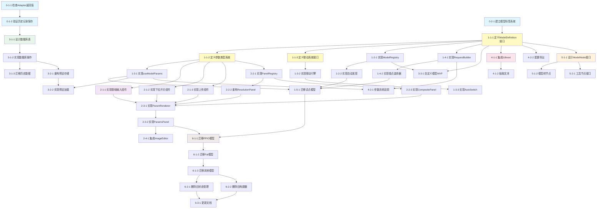

# 任务依赖关系

## 关键路径

Phase 0 → Phase 1 类型系统 → Phase 1 Registry → Phase 1 试点 → Phase 2 组件 → Phase 6 迁移

## 可并行任务

### Phase 1 中可并行
- 1-2-1 和 1-4-1 可并行
- 1-3-2 和 1-4-2 可并行

### Phase 2 中可并行
- 2-1-1, 2-1-2, 2-1-3 可并行
- 2-2-2 和 2-2-3 可并行

### Phase 3 中可并行
- 3-2-1 和 3-3-1 可并行（都依赖 3-1-2）

### Phase 4 中可并行
- 4-2-1 和 4-2-2 可并行

### Phase 6 中可并行
- 6-2-1 和 6-2-2 可并行
