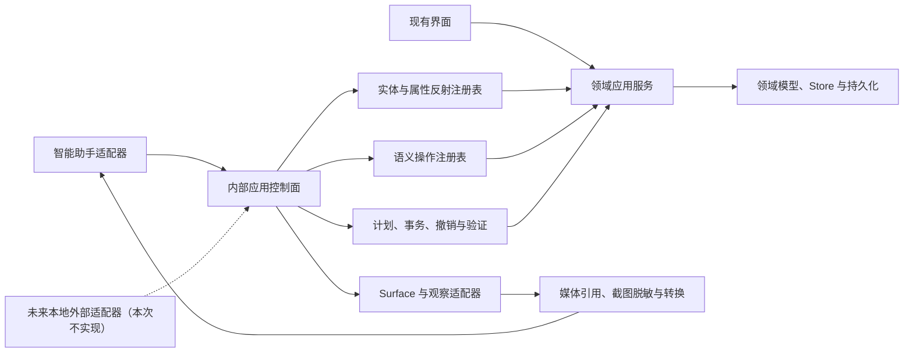

# 内部应用接口与智能助手控制升级实施方案

## 一、当前项目与相关功能现状

### 1. 已有基础

- `src/core/assistant/applicationCapabilities.ts` 已定义 `ApplicationCapabilityDefinition`、能力目录版本、稳定引用、权限、风险、撤销和证据等契约。
- `src/core/assistant/capabilities/` 目前有 10 个领域能力文件；连同内置能力约 81 项，其中领域能力约 70 项。
- `src/features/assistant/applicationCapabilities/registry.ts` 负责渲染层能力注册和调用分发，`hostActions.ts` 汇集大量宿主操作。
- `src/features/assistant/applicationCapabilities/settingsRegistry.ts` 与 `settingsRegistryAdditional.ts` 已实现 43 项设置的搜索、读取、计划、revision、原子应用和撤销，是最接近目标结构的现有样板。
- `src/features/assistant/applicationCapabilities/surfaceRegistry.ts` 已登记约 22 个界面 Surface，具备导航目标和稳定引用基础。
- `electron/main/services/agent-runtime/` 已具备持久运行、工具激活、结果验证、Artifact、外部等待、恢复和日志能力；既有计划中的这些成果不重做。
- `src/features/cameraStage/domain/` 已包含场景、镜头、关键帧、空间轨迹和 `orbit`、`dolly`、`truck`、`crane` 等运镜预设。
- `src/features/imageEdit/tools/registry.ts` 和图片编辑执行层已有工具注册、事务和撤销思路，可作为领域操作注册的另一参考。
- `src/features/assistant/conversation/useConversationAutoScroll.ts` 已有自动跟随、用户滚动接管和 ResizeObserver 逻辑，因此滚动问题属于真实运行场景下的回归与容器契约问题，不是从零新增滚动功能。
- `src/core/llm/types.ts` 的 `LlmCapabilities` 已包含 `image`、`video`、`audio`，`LlmModelDialog.tsx` 也已有对应的“图片输入、视频输入、音频输入”勾选项；无需新增第二套模型多模态设置。
- `LlmChatMessage` 已定义图片、视频和音频内容片段，但 `modelStepCapabilitiesSchema` 尚未携带输入模态，助手对话也没有完整附件持久化和发送链路，当前配置还不能成为可靠运行时门禁。

### 2. 当前能力分布

| 领域 | 现有能力数量 | 主要入口 | 迁移重点 |
|---|---:|---|---|
| 内置能力 | 11 | `builtinApplicationCapabilityRegistry.ts` | 保留运行时基础工具，调整发现与组合方式 |
| 素材 | 8 | `assetApplicationCapabilities.ts` | 统一素材实体、引用、状态与操作 |
| 助手运行时 | 8 | `assistantRuntimeApplicationCapabilities.ts` | 保留诊断/恢复语义，避免与应用业务层耦合 |
| 3D 镜头 | 12 | `cameraStageApplicationCapabilities.ts` | 首个完整纵向样板，补齐属性与运镜语义 |
| 画布批量 | 3 | `canvasBatchApplicationCapabilities.ts` | 合并到正式画布应用服务与事务 |
| 画布变更 | 11 | `canvasMutationApplicationCapabilities.ts` | 以节点/边实体和受限字段替代零散 Patch |
| 画布项目 | 9 | `canvasProjectApplicationCapabilities.ts` | 统一项目查询、切换和生命周期操作 |
| 生成 | 7 | `generationApplicationCapabilities.ts` | 复用模型 schema 与 `GenerationService` |
| 工具箱 | 7 | `toolboxApplicationCapabilities.ts` | 复用工具注册表，不复制参数定义 |
| 工作流 | 5 | `workflowApplicationCapabilities.ts` | 统一工作流实体、执行状态和长任务协议 |

数量取自计划创建时的注册表盘点；执行 1.2 时需由脚本重新生成并确认，防止代码已变化。

### 3. 已观察到的失败证据

最近一次代表性失败运行 `ba36b4cf-67d0-4650-9333-abb8ad4a576a` 共进行 32 轮、32 次工具调用，累计约 75.5 万 Token，最终由用户取消。其中 `search_application_capabilities` 约调用 15 次。具体表现为：

- 路由只识别 `canvas`，没有把一次需求拆成 `camera_stage`、`navigation` 等多个领域。
- 系统提示要求先完成业务操作再打开 Surface，导致用户长时间看不到对应编辑器。
- 新建 3D 工程已有默认摄像机和镜头卡，但助手先新增摄像机，之后才读取状态。
- 添加物体能力不接受位置，立方体与棱锥落在同一默认原点。
- 运镜能力实际存在于领域代码中，却未被能力层暴露；模型只能继续搜索不存在的工具。
- 单次能力搜索只接收一个查询，结果中的完整输入 schema 又可能因体积被省略，促成反复换词搜索。

## 二、问题根因

根因不是单独一条提示词，也不是模型“不够聪明”，而是应用控制面缺少以下结构：

1. 缺少统一的实体和属性反射，模型不知道当前对象、可调字段、单位、范围、可编辑条件和关系。
2. 动作工具与真实领域模型脱节，例如 3D 对象 Patch 是 `Record<string, unknown>` 再手工过滤，调用方无法发现完整参数。
3. 查询、计划、写入和验证没有统一协议，模型容易先写后读，也无法可靠判断任务是否完成。
4. Router 只给出单域标签，无法一次建立跨领域任务图。
5. 工具发现以关键词循环搜索为主，缺少批量领域激活、schema 引用和稳定分页消费。
6. Surface 展示被当作收尾动作，而不是可视任务的第一项用户反馈。
7. 领域语义操作没有成为正式应用服务，导致 UI、助手能力和底层 Store 之间容易出现多份实现。

## 三、最终目标

建立一套内部 Application API，满足以下条件：

- 与 UI、智能助手、未来本地外部适配器解耦，不依赖 MCP 或 HTTP。
- 能列举实体、读取状态、描述属性、校验约束、计划修改、原子提交、撤销和验证。
- 同时支持低层受限属性修改和高层语义操作；例如既能调整摄像机位置，也能调用正式的“环绕目标”操作。
- 所有可暴露能力都来自唯一注册表或领域 schema，不手工复制多份参数定义。
- 智能助手先观察真实状态，再规划最小变更，优先复用已有对象，提交后依据结构化证据和必要的视觉观察验证。
- 一次用户请求可拆解成多个领域 Facet，一次批量取得所需能力和 schema，避免搜索循环。
- 明确无法完成、缺少权限、缺少能力或没有进展时主动停止并告诉用户，不用耗尽轮次。
- 对可视任务，在取得稳定目标引用后尽早打开对应 Surface，让用户看到连续变化并可随时接管。
- 用户可在助手对话中附加图片、视频和音频；只有当前主要模型或专用观察模型声明支持对应输入模态时才发送媒体，否则明确要求切换/配置模型。
- 模型可以在确有必要时自主申请观察任意已注册 Surface、生成结果或媒体实体；观察结果通过权限、范围、脱敏、大小和模态能力检查后进入上下文。

## 四、总体架构

### 1. 领域模型层

继续以现有 `cameraStage/domain`、画布 application、图片编辑执行层、`GenerationService` 等作为业务真相。内部控制面不得绕过正式领域服务直接任意修改 Store。

### 2. 反射注册层

参考 Blender 的 DNA/RNA 分离思路，但采用 TypeScript 与项目现有 Zod/schema 体系：

- 实体定义：类型、稳定引用、显示名称、父子关系、枚举和查询入口。
- 属性定义：路径、数据类型、单位、枚举、硬/软范围、默认值、可空性、只读原因、敏感等级和 revision 范围。
- 动态可用性：根据当前项目、选择、权限或状态返回是否可读写及原因。
- 暴露范围：区分 UI、助手和未来本地外部适配器；本次只实现前两者所需行为。
- Schema 引用：大 schema 通过稳定引用按需读取，避免重复把全文塞入上下文。

### 3. 语义操作层

保留 `ApplicationCapabilityDefinition` 作为 Operator 类动作的唯一元数据源。一个语义操作需要声明：

- 输入/输出 schema、领域、风险、权限、幂等性和撤销语义。
- `canExecute` 或等价动态判断，返回不可用原因。
- 执行方式：即时、长耗时、需要确认、需要交互或可取消。
- 影响的实体与属性，用于计划预览、revision 检查和结果验证。

### 4. 计划与事务层

统一执行流程为：

1. 读取目标实体、revision、相关约束和空间/关系状态。
2. 生成受限 Patch 或语义操作计划，返回影响摘要和风险。
3. 用户确认高风险操作；普通操作直接提交。
4. 在 revision 一致的前提下原子应用，多步业务操作使用分组事务。
5. 返回新 revision、稳定引用、撤销令牌、结构化证据和后续观察建议。
6. 验证目标条件；不满足时只允许有证据的修正，不允许无进展重复。

### 5. 助手适配层

助手不再面对几十个平铺工具，而是面对少量通用工具与按任务激活的语义操作：

- 批量解析需求 Facet 和目标 Surface。
- 批量查询实体、能力摘要与控制 schema。
- 规划并提交受限变更。
- 调用领域语义操作。
- 读取验证证据并报告结果。

具体工具名和最终 schema 在 1.1 中冻结，避免计划阶段先写死不成熟协议。

### 6. 多模态输入与全域观察层

- 继续以 `LlmCapabilities.image/video/audio` 作为模型输入能力唯一来源，并把它们贯通到 Agent profile、模型步骤、供应商适配和工具可用性判断。
- 在现有 `primary/router/summarizer/fallback` 角色之外增加可选 `observer` 模型角色。主要模型支持目标模态时直接观察；否则由已配置且支持该模态的 observer 生成带证据的结构化描述；两者都不支持时能力不可用并主动说明。
- Router 和 summarizer 默认只消费文字化附件清单或观察摘要，不无条件接收原始媒体；每个模型步骤按自身配置独立门禁。
- 用户附件持久化为稳定媒体引用，消息中不保存或传播裸本地路径。进入 `/<video>/<audio>`、fetch、主进程文件读取和供应商上传前分别在既有媒体边界转换。
- 每个 Surface 都登记观察提供者。优先获取领域原生预览、画布/3D 视口或生成媒体；没有专用预览时使用应用内 Surface 区域截图。
- Surface 截图只覆盖 Henji-AI 自身窗口的目标区域；C2/C3 内容、API Key、路径和其他敏感控件在截图前遮罩。禁止操作系统全屏、其他应用窗口和未声明区域的任意截取。
- 生成结果和素材观察优先直接读取稳定媒体引用，避免对缩略图或整个界面重复截图。图片可按预算缩放；视频/音频按供应商真实支持方式发送，不能通过勾选配置伪造协议支持。
- 模型申请观察必须说明目标引用和用途，由能力可用性、数据等级、模态支持、上下文预算和用户取消状态共同裁决；观察本身只读，但敏感数据访问需要审计。

## 五、Blender 与 Blender MCP 的参考结论

### 可借鉴

- Blender 的 DNA/RNA/Operator/Window Manager 分层证明：数据结构、属性反射、语义动作和撤销事务应分开设计。
- RNA 对类型、单位、范围、枚举、动态可见性和更新回调的描述，适合用于内部接口的自省。
- Operator 的 `poll/exec/invoke/modal/cancel` 能启发动态可用性、长任务和用户交互协议。
- Blender MCP 的场景摘要、对象详情、包围盒和视口截图说明：复杂 3D 操作需要结构化观察与视觉观察结合。

### 不采用

- 不提供任意 Python、JavaScript、Store Patch 或文件系统执行入口。
- 不把 UI 当前焦点、选择状态或临时上下文作为唯一执行前提。
- 不把 Blender 的庞大 API 逐项照搬；只吸收反射、操作和事务的架构思想。
- 本次不实现 MCP Server、HTTP Server、Socket 或任何外部连接。

## 六、阶段划分与关系

1. 第一阶段固定契约和覆盖基线，避免后续迁移过程中不断改名、漏功能。
2. 第二阶段搭建独立于具体领域的反射和事务内核。
3. 第三阶段改造助手如何理解、发现、停止和说明；其中 3.1 可与第二阶段部分并行。
4. 第四阶段用 3D 作为纵向样板，因为它同时覆盖实体复用、空间关系、参数控制、语义动作、Surface 和视觉验证。
5. 第五阶段在样板稳定后迁移其他领域，四个迁移任务可并行。
6. 第六阶段完善用户可见执行体验，并接通模型多模态配置、用户附件和全 Surface 视觉观察；其中 6.3 可提前并行，6.5 在领域迁移后完成统一覆盖。
7. 第七阶段更新规则、技能、门禁并清理旧路径，最后做整体验收。

## 七、任务范围

### 本次包含

- 内部应用控制契约、反射注册表、计划/事务/验证协议。
- 助手 Router、能力发现、schema 加载、循环终止和结果说明。
- 3D、设置、Surface、画布、素材、图片编辑、分镜、生成、模型、工作流及运行时能力迁移。
- 助手执行界面的滚动、可视进度、用户接管和失败反馈。
- 助手图片/视频/音频附件、稳定媒体引用、消息持久化和模型输入适配。
- 全部已注册 Surface、生成结果和媒体实体的受限视觉观察，以及可选 observer 模型角色。
- Codex/Claude 项目技能、项目规则、能力覆盖检查和回归评测更新。
- 为未来本地适配器保留不依赖 UI/Agent 的核心接口和暴露元数据。

### 本次不包含

- MCP、HTTP、WebSocket、本地端口、远程服务或第三方 SDK。
- 账户体系、远程鉴权、网络级限流、外部 API 版本发布策略。
- 任意脚本执行、插件沙箱或通用代码解释器。
- 与本架构无关的新产品功能、新生成模型或新编辑工具。
- 对 Blender 功能集合的复刻。

## 八、新旧实现兼容方式

- 采用逐领域迁移，不进行一次性大爆炸替换。
- 单个领域迁移期间允许极短期薄适配，但该领域任务完成前必须删除旧能力 ID 和旧执行入口，不保留跨阶段双实现。
- 已持久化的对话、运行事件和旧能力调用记录继续只读展示；旧能力调用不支持恢复执行或重放。
- 项目文件、画布、3D 场景、设置值和素材数据格式默认不变化；如某任务确需变化，必须提供版本迁移与回退验证。
- 能力目录需要版本化；新旧目录并存时必须能明确识别，不允许模型混合调用语义重复的两套工具。
- UI 中拖拽过程、悬停、临时选区和未提交草稿仍可保持组件本地状态；落盘或跨界面复用的业务操作必须进入正式应用服务。

## 九、风险控制与恢复原则

| 风险 | 控制方式 |
|---|---|
| 通用 Patch 演变成任意 Store 修改器 | 只允许注册表声明的实体、属性和操作；执行层再次校验，不信任调用方输入 |
| Schema 太大导致上下文膨胀 | 摘要目录、稳定 schemaRef、按实体/字段读取、分页 Artifact 和上下文预算共同控制 |
| 新旧能力重复导致模型选错 | 每个领域迁移时建立唯一入口和废弃映射，门禁阻止重复注册 |
| revision 冲突覆盖用户操作 | 计划携带 baseRevision，提交时校验；冲突后重新观察，不静默覆盖 |
| 多步任务部分成功 | 分组事务或明确补偿操作；执行结果逐步持久化，能说明已完成和未完成部分 |
| Surface 过早切换但目标尚不存在 | 先取得项目或目标稳定引用；必要时先创建最小容器，再立即导航 |
| 视觉验证成本过高 | 结构化验证为默认，只有空间布局、渲染结果等结构化信息不足时才请求截图/预览 |
| 截图泄露密钥、路径或无关内容 | 仅捕获注册 Surface 区域，截图前按数据等级遮罩；禁止操作系统全屏和其他应用窗口 |
| 勾选了模态但供应商协议不支持 | 配置、模型步骤 schema、provider adapter 和可选能力冒烟四层校验；失败时禁用观察而非尝试发送 |
| 视频/音频或高分辨率图片挤爆上下文 | 通过稳定媒体引用、大小/时长限制、缩放/采样策略和 observer 摘要控制，原件不进入普通文本上下文 |
| 迁移期间破坏旧数据 | 默认不改持久化格式；涉及格式变更的任务必须单独备份、迁移和回退测试 |
| 文件继续膨胀 | 新模块按职责拆分，优先不超过 400 行；现有超过 500 行的设置注册表在迁移时拆分 |

## 十、全局开发约束

- 遵守 `docs/rules/architecture.md`、`assistant-capability.md`、`logging.md`、`electron-desktop.md` 和 `testing.md`。
- `ApplicationCapabilityDefinition` 保持动作元数据唯一来源；Codex 与 Claude 的项目技能同步维护。
- 不新增旧式 `HostCommand` / `HostQuery`，不在 UI 组件中堆放可复用业务逻辑。
- 渲染层通过领域服务、commands 或 platform 访问桌面能力，保持 Electron 隔离边界。
- 所有用户可见失败、长任务、文件/网络操作和状态流转使用既有结构化日志链路，不新建日志系统。
- 每个任务开始和完成时同步更新本计划；每个代码任务一个独立 Git 提交。
- 当前工作区的 11 个未提交文件属于前序工作，实施本计划前必须先独立校对和处理，禁止混入 1.1 及后续提交。

## 十一、最终验收条件

- 完整复杂请求能够一次拆出多领域任务图，并在一次批量发现中获得所需能力和 schema。
- 3D 代表任务会先显示目标编辑器，复用默认摄像机，合理分开放置对象，使用正式运镜语义并验证结果。
- 相同搜索或无进展操作不会无限重复；达到明确阈值后助手主动停止并说明缺少什么。
- 所有计划内领域均有实体/操作覆盖清单，不再依赖任意 Store Patch 或组件私有持久逻辑。
- 修改操作具备 revision 校验、风险判断、结构化证据和可用的撤销/补偿方式。
- 助手执行过程可自动跟随，也允许用户手动向上查看，内容增长后仍可滚动。
- 助手附件可以持久显示并按当前模型真实支持的图片/视频/音频模态发送；不支持时在提交前明确阻止。
- 任意注册 Surface 和生成结果都可被模型按需申请观察，截图范围与敏感信息受到严格限制。
- 旧项目、设置和持久化会话仍可读取和继续使用。
- 对应 lint、TypeScript、Vitest、能力门禁、助手生产评测、UI 检查和 Electron 检查按任务类型通过；鼠标交互和真实复杂任务由用户完成手动验收。

## 十二、计划维护与接力流程

### 开始任务前

1. 先阅读 `00-任务总览.md`、本实施方案和当前任务文件。
2. 如当前任务依赖已完成任务，再阅读前置任务最新执行记录和相关提交。
3. 用 `git status --short` 核对工作区，确认没有把其他任务或用户改动混入当前范围。
4. 对照真实代码检查任务文件中的路径、数量和方案是否仍成立；不一致时先更新计划，不擅自扩大任务。
5. 将当前任务和总览状态改为“进行中”，在总览最近记录中登记开始日期。

### 执行任务时

1. 只处理当前任务的目标、文件范围和验收项；关联任务只记录，不顺带实现。
2. 新发现的跨任务决定写入 `重要记录.md`；整体架构变化同步更新本实施方案。
3. 新增依赖或任务时使用新的永久编号，不重排已有编号。
4. 用户可见失败、长任务和状态流转沿用现有结构化日志；不得为当前任务另建日志通道。
5. 需要改变数据格式、兼容策略或高风险执行边界时，先将决定标为“待确认”，获得确认后再继续。

### 完成或阻塞时

1. 按任务文件和 `docs/rules/testing.md` 运行与改动类型匹配的检查，如实记录命令与结果。
2. 功能完成但需要用户手动验证时标为“待验证”；自动与约定手动验收均通过后才标为“已完成”。
3. 在任务执行记录中填写实际改动、验证、遗留、偏差、后续影响和提交号，并同步总览计数、当前任务和最近记录。
4. 代码任务创建独立 Git 提交，不夹带其他任务、日志、截图或前序存量改动。
5. 阻塞时标为“已阻塞”，写明原因、解除条件、受影响任务和替代方案；不要靠扩大权限或绕过接口继续。
