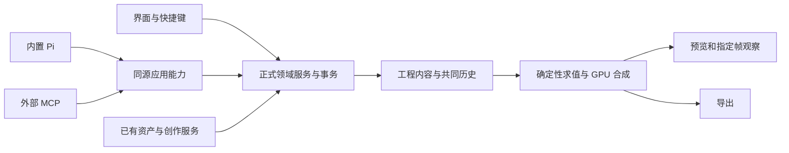

# 实施方案

## 阅读与基线

本文件记录稳定方案，不维护任务状态；状态只在[任务总览](00-任务总览.md)与各任务文件中更新。首次接手先读根 [AGENTS.md](../../../AGENTS.md)，再读本文件、当前任务及必要的前置执行记录。资料核对日期为 2026-09-30，代码基线为 main / adc08124；执行前必须重新核对差异。

2026-09-30仅建立计划；2026-10-01用户已授权实施。1.1/1.2已接通v2多序列、同源事务及可停靠工作区，并完成本轮正式Electron、保存导出和原素材4K60验证；证据与状态维护在任务文件。下表保留历史基线以便比较，不能作为当前接口声明；当前已冻结接口见下文。未安装新依赖或调用付费模型。

## 目标与范围

用户希望同时得到专业剪辑的基本操作效率和 Henji-AI 的跨创作能力：可自由布局的剪辑页面、磁盘工程、多序列、原路径素材，以及可直接编写和调参的原生代码素材。内置 Pi 和外部 Agent 都能理解对象、提交编辑、检查真实画面，并与人共用历史和保存。

| 本期必须形成闭环 | 本期暂缓 |
|---|---|
| 工程、素材箱、多序列、基础设置、原路径导入、资产来源保留 | 旧工程格式迁移、Premiere/Resolve 工程文件兼容 |
| 可调尺寸、停靠分组、页面内浮动、独立浮窗、布局记忆 | 云协作、远程多用户编辑 |
| 多选、音画链接、移动、修剪、剃刀、删除/波纹删除、插入/覆盖、复制粘贴、核心快捷键 | 完整滑移/滑动/滚动/比率伸缩工具、复杂变速曲线、多机位 |
| 源/节目监视器、标记、波形、电平、基础字幕导入和编辑 | 重做口播剪辑、独立语音识别/模型配置、专业混音台 |
| 代码素材生成器、源码编辑、动态参数、基本关键帧、单输入代码处理效果 | 任意 Node/宿主脚本执行、任意 npm 包、原生插件市场 |
| 纯色、基本形状/文字、调整图层、一个基础转场 | 完整矢量设计器、专业调色、完整三维、HDR 全链路承诺 |
| 资产库/生成/画布/图片编辑/口播/三维结果与剪辑的明确联动 | 所有领域对象跨工作区实时嵌套、复杂依赖图编辑器 |
| 同源 Pi/MCP、运行时技能、4K60 SDR 性能、保存与导出 | 未获授权的付费验收；任意复杂代码或任意层数均实时的承诺 |

截图中还出现了很多 Premiere 上下文命令。本期只显示真实已接通的命令；未实现项不能用无效菜单制造完整感。高级工具列入后续范围，不随本计划默认执行。

## 真实现状与入口

仓库根为 `D:/VibeCode/Henji-AI`。以下路径均相对仓库根，除 AEPR 只读参考之外。

| 范围 | 当前事实 | 直接入口 |
|---|---|---|
| 工程模型 | 一个工程直接持有尺寸、fps 和 clips；24/25/30/60fps；八个编号轨道；最多 200 素材、500 片段、30 分钟 | `src/core/videoEdit/document.ts` |
| 工程实例 | 页面之外的实例 Map、单选、共同历史、静默自动保存、保存失败保留修改及退出屏障 | `src/features/videoEdit/application/videoEditService.ts`、同名测试 |
| 导入与拖拽 | 原绝对路径、Mediabunny 元数据检查、授权媒体根；异步导入预先绑定工程/落点；资产拖拽现在退化为路径 | `src/features/videoEdit/application/videoEditMedia.ts`、`videoEditDrop.ts` |
| 页面 | 固定三栏和八行时间线；基础拖动/修剪/缩放/吸附、文字和亮度；缺素材箱、多序列、完整效果控件和命令注册 | `src/features/videoEdit/VideoEditApp.tsx`、`VideoEditTimeline.tsx`、`VideoEditPreview.tsx` |
| 渲染 | 原视频解码、WebGPU 合成；预览与导出共用 RenderSession/Worker/Renderer；音频当前固定 48 kHz | `src/features/videoEdit/engine/` |
| 缓存 | 每预览 8 GiB 帧工作集；解码输入有界；合成器空闲纹理池最多 64 MiB；已删除自动磁盘转码路径 | `videoEditFrameCache.ts`、`videoEditSeekDecoder.ts`、`videoEditGpuCompositor.ts` |
| 导出 | 固定快照，Mediabunny MP4，取消和部分输出清理；任务只在当前应用生命周期内管理 | `src/features/videoEdit/application/videoEditExport.ts` |
| 停靠基础 | 三维工作区已采用 Dockview，记忆/重置布局；面板头菜单目前只做重置，不能视为剪辑浮窗已完成 | `src/features/cameraStage/layout/CameraStageDock.tsx`、`dockLayout.ts`、`DockChrome.tsx` |
| 原生窗口 | 主窗口的外部开窗处理当前全部拒绝 | `electron/main/window.ts` |
| 应用能力 | 已有 project/clip/annotation/media 四类实体及八个语义能力；无代码素材/序列/动态参数实体 | `src/features/videoEdit/application/`、`src/core/application-control/domains/videoEdit/videoEditApplicationCapabilities.ts` |
| 宿主上下文 | 已提供剪辑工程和单片段选区，需扩展序列、多选、范围及观察结果 | `src/features/application-control/hostContext/hostContext.ts` |
| 资产库 | 只支持 image/video/audio 与本地文件收录，已有稳定 assetId、来源、库和标签；无原生代码资产格式 | `src/platform/contracts/assetLibrary.ts`、`electron/main/services/asset-library/` |
| 资产复用 | 已有正式收录、跨工作区拖拽、资产加入画布及剪辑引用入口 | `src/features/assets/services/assetCollectionService.ts`、`src/features/assets/drag/assetDragPayload.ts`、`src/features/assets/application/assetCanvasApplicationService.ts` |
| 音频复用 | 口播领域已有波形显示与字幕算法，不能再写一套口播服务 | `src/features/audioEdit/waveformViewport.ts`、`src/core/audioEdit/subtitles.ts` |
| 真实验收 | 已有视频综合与 4K60 拖动场景可扩展 | `scripts/lib/uiInspectionSceneVideoEditProbe.cjs`、`uiInspectionSceneVideoEditScrub.cjs` |

当前依赖：Mediabunny 锁定 `1.61.0`（公开 MPL-2.0 路线），Dockview 安装/锁文件版本 `7.0.2`，但 package.json 声明仍为 `^7.0.2`；React 18、Electron 42 系列。计划不引入第二套媒体引擎，执行时核对锁文件与确切运行版本。新依赖只有试验证明必要时才加入，并锁精确版本、核对许可；本轮不改 package.json。

## 界面与交互要求

默认参照用户截图：左侧源监视器/效果控件，中央节目监视器，下方时间线，右侧项目/效果/属性标签，左侧紧凑工具条，时间线旁电平。所有位置可重排，不把默认截图当固定布局。

- 项目面板：双击空白导入；右键新建素材箱、序列、代码素材、纯色及调整图层；树/列表、标签、搜索、缩略图；双击素材进入源监视器，双击序列打开时间线。
- 项目与序列：新建大工程先选磁盘路径；“新建项目项”中的序列是独立时间线，有预设与基础设置。多序列以标签切换，标签关闭不删除序列。
- 面板：边缘拖入拆分、中心拖入分组、拖动尺寸、菜单关闭/恢复/浮动，活动面板有清晰焦点边界。页面内浮动与可拖出主窗口的系统浮窗分别验收。
- 时间线：独立音视频轨道、轨道头、锁定/输出/静音/独奏、多选、链接、波形、标签、字幕行、时间标尺、标记、缩放和滚动。按钮与右键是同一命令的不同入口。
- 效果控件：通用变换/不透明度/音量、代码素材专有参数、附加效果链和基础关键帧。源码声明决定参数控件，不需要安装插件。
- 节目画面：操作手柄、适合窗口/100%显示、标注和精确时间。显示缩放不能改变 4K 内部渲染分辨率。
- 继续使用 Henji 主题令牌与 Ui*，减少额外顶部横条；只呈现用户可操作内容，性能计数和内部版本进入现有诊断/日志。

建议的首期 Windows 键位如下，实施时以命令可用性和焦点测试为准，支持用户改键。

| 操作 | 键位 |
|---|---|
| 新建工程／新建序列／导入 | Ctrl+Alt+N／Ctrl+N／Ctrl+I |
| 保存／撤销／重做 | Ctrl+S／Ctrl+Z／Ctrl+Shift+Z |
| 选择／剃刀／手形／轨道向前选择 | V／C／H／A |
| 播放暂停／逐帧 | Space／左右方向键 |
| 反向、停止、正向穿梭 | J、K、L；先定义可靠倍率与停止语义 |
| 源或序列入出点 | I／O，按焦点确定对象 |
| 播放头处拆分／全部目标轨道拆分 | Ctrl+K／Ctrl+Shift+K |
| 删除／波纹删除／吸附 | Delete／Shift+Delete／S |
| 插入／覆盖／缩放 | 逗号／句号／等号与减号 |
| 复制粘贴／全选／导出 | Ctrl+C、Ctrl+V／Ctrl+A／Ctrl+M |

文本编辑、中文输入法和代码编辑器内保留编辑语义；其他 PR 高级工具键在对应功能开发前不注册。快捷键以本产品命令为准，不宣称完整兼容全部 Adobe 默认键位。

## 领域和数据结构

1.1已验证的实现：工程v2持有media/bins/items/sequences，片段以itemId引用源，序列具有显式tracks及尺寸/PAR/音频格式；渲染只接收指定序列派生快照。序列时间用整数帧与有理帧率，源时间用整数微秒和分数余量，音频用绝对采样边界。唯一实例Map持有工程、共同历史、串行静默保存与关闭屏障，各序列播放位置/选区及停靠布局独立于持久工程。2.2已接入内嵌代码定义、固定项目项/片段实例及正式渲染器；编译元数据/IR不持久化，候选通过检查和同源全尺寸试渲染后才进入共同历史。

1.3已验证接口：项目项/素材箱由正式服务管理，保存标签与assetId来源；导入与按itemId/sequenceId插入或匹配新序列保持单次历史。源预览是独立非持久会话，实际媒体确认后才更新可观察位置，公共通用属性和手动控制共用服务；逐帧播放不改节目/历史/保存。项目视图具有正式选区、素材箱和打开序列状态。缩略图可见域请求/取消复用有界宿主缓存，节目序列切换等待旧GPU/Worker释放。原路径、资产拖入、保存重开、源MCP回读与500项/200箱虚拟视口正式验收通过。

1.3/3.2依赖补正：1.3已接通真实基础源监视器（按项目项打开、原路径显示/播放、指定时刻定位与关闭释放）；3.2在其基础上扩展源入出点、时间码、波形、电平与字幕。基础源会话不占用节目8GiB帧缓存，源回退/补偿通过逻辑命令身份保护手动后续与新实例。

建议关系如下，确切类型在 1.1 与 2.1 固化，不代表已经存在的 API：

```text
本地工程
├─ 项目项与素材箱
│  ├─ 本地媒体引用／资产库引用
│  ├─ 代码素材定义 → 不可变源码版本＋参数声明＋资源引用
│  └─ 纯色／结构化图形／序列引用
└─ 多个序列
   ├─ 序列设置、标记、字幕和画面标注
   └─ 音视频轨道 → 片段实例
      └─ 项目项引用、源入点、时长、变换、参数、关键帧和附加效果
```

工程内容、编辑会话（播放头/选区/工具）和布局分开。只有内容编辑进入共同历史；一次事务或拖动是一步，持续指针移动不落盘每个中间状态。工程保存可编辑内容，原媒体不复制。

序列使用有理帧率和明确时间基准；源帧按实际 PTS 取样，音频按采样时间换算，禁止长期浮点累加。首期尺寸至少覆盖 3840×2160 与竖屏；修改帧率、尺寸或像素长宽比时规定时间/位置保持规则并验证输出，不能只改 UI 字段。

## 原生代码素材

这是本计划的核心产品对象，必须允许 Agent 创作新模块，不只提供内置模板换参数。

| 对象 | 职责 |
|---|---|
| 代码素材定义 | 名称、静态/动态声明、尺寸、默认时长、源码、作者接口版本、参数 schema、依赖引用和确定性种子 |
| 不可变源码版本 | 固定源码及声明，支持检查、试渲染、提交和回退；导出引用具体版本 |
| 时间线代码片段 | 引用定义与版本；独立裁剪、变换、参数值、关键帧与局部时间映射 |
| 附加代码处理效果 | 消费片段输入画面，输出处理结果，不创建一份假素材 |
| 调整图层 | 对定义好的下方轨道合成应用效果，作用范围与普通片段不同 |
| 结构化图形 | AI 可直接理解并修改的形状/文字树；自由代码不能自动承诺反解成图形树 |

静态代码素材按图片使用，可延长显示；动态代码素材按视频使用，有明确时间范围和源入点。裁剪、复制和拆分保持连续时间；改变参数不改变其他实例。源码更新采用“草稿→检查/编译→指定帧试渲染→提交”，失败保留有效版本。默认只更新明确选中的实例/定义版本；批量更新必须显式给出范围。

参数声明是唯一事实源：稳定键、类型、默认值、范围、单位、是否可动画、用户 tooltip 和 Agent description。界面控件、AI 可读写契约、校验、默认值及求值不能各维护一份表。重排/改标签不改变键；删除键或改类型需显式处理既有参数和动画，不悄悄丢弃。

2.1已验证并采用受限 TypeScript 风格作者 API 与现有 WebGPU 合成；不引入完整 React/DOM 页面渲染器、Remotion 或第二套 GPU 框架。图形布局可以借鉴前端语义，但输出是按指定时间求值的画面，不依赖 requestAnimationFrame、系统时钟或前一帧状态。

2026-10-01正式路线：TypeScript 5.9.3 AST校验→有类型/预算的封闭IR，不转译后执行JavaScript。元数据与参数静态声明，render纯指定时间；生成器输出rect/ellipse/line/text，滤镜采样当前单输入并输出RGBA。源码64KiB、AST8192/深度64、图形256/帧文本8192、参数32，滤镜128标量/4采样。独立编译Worker队列8未回执、超时5秒、缓存32份/16MiB序列化估计；安全依据为白名单，Worker只负责线程/恢复。生成器CPU确定性求值，滤镜GPU f32采用保守误差区间，三角输入须可证明±π；不承诺CPU/GPU逐位相同。共享设备、代码目标/字形合计256MiB、16目标/64字形/32滤镜管线；透明图形、动态标题、滤镜及乱序4K有限实验通过，证据见2.1；2.2代码混剪/实际播放4K60已通过，后续功能集成后的完整矩阵由5.1验收。

源码采用v2工程可选codeMaterials内嵌定义，版本仅存id/apiVersion/languageVersion/source；schema和IR从源重建，不另写旁托管文件。默认版本与实例固定版本分开，追加源不替换已有实例；演进不静默丢参数或曲线。64定义/每定义64版本/总源码8MiB。2.2真实代码项目项已通过保存重开、MCP原创源码创建及4K60混剪/音画导出；2.3源码参数/关键帧版本演进已完成真实验收，最小可编辑代码资产格式由3.4实现。媒体继续原路径；滤镜仅消费当前输入，字体限系统三族。2.3图片参数引用工程mediaId，宿主解析原路径及生命周期；实际透明PNG混剪/导出验证通过，禁止路径/URL输入。编译缓存可重建，不自动烘焙代码片段。

2.2统一实际视频取帧：首次seek、缓存命中、顺序播放和导出消费同一紧凑GPU格式策略，避免原外部纹理与有损缓存重建之间切换产生不同像素。原8GiB预算、原文件路径和无磁盘转码保持；顺序复制与最终合成同device.queue提交，外部帧保留到复制完成、关闭等待复制/合成，并发复制最多2份。静态代码按固定版本/规范参数复用，动态可见实例按连续时间求值，原片段缓存不因标量参数变化整体失效。混剪和原素材正式压力证据见2.2；5.1仍负责后续功能集成后的完整性能矩阵。

2.3已验证契约：曲线锚定连续源微秒及有理余量，数值/颜色linear/hold/ease、离散hold，裁剪拆分不重定动画。图片参数引用工程mediaId，由现有原路径媒体解析与同设备纹理共享；图片不支持动画，显式重新定位用可选sourceRevision刷新指定资源，标量编辑不失效无关视频缓存。最多2份原生图片解码，图片与文字可见GPU工作集32份/256MiB，按实际像素准入并回收取消/迟到结果。源码候选先检查与完整混剪试渲染，再显式确认迁移与single/matching目标，原目标或内容基线变化则拒绝；固定版本只追加，通用版本集合及参数/曲线/版本写入共用领域/历史/保存，隐藏字段和受控code对象禁止经集合注入。未改值控件仅捕获目标时刻，实际write才开启手势，完成一次撤销/自动保存。正式4K60控件混剪约60.01完成更新/秒、180帧音画导出、原素材359帧/5999.6ms无缺帧及关闭资源归零通过；性能具体证据与限制在2.3原任务文件维护。

指定帧统一调用codeMaterialContextForFrame：time为含源入点/微秒分数的连续源秒，localTime为相对片段秒，sequenceTime为序列秒，frame为序列请求整数帧；裁剪/拆分连续性使用time，不把局部时钟当源时钟。静态可延长，动态有限源时长；片段尾排他，转换容差仅4×EPSILON×时间量级。程序自然尺寸与序列合成/显示缩放分离。

### AEPR 只读参考

参考根：`D:/VibeCode/AEPR控制测试`，禁止修改。

| 文件 | 可借鉴内容 | 不直接搬入的内容 |
|---|---|---|
| `packages/adapter-cep/src/js/lib/codefx/effects.ts` | generator/filter 分类、稳定参数键、范围和默认值 | 16 槽、仅 range/color 的宿主限制 |
| `packages/adapter-cep/src/js/lib/codefx/frame-renderer.ts` | 指定时间绘制、纹理/画布复用、透明与方向处理、dispose | CEP/CEF 像素桥、CPU 逐帧读回路径 |
| `packages/hub/src/codefx.ts` | 源码定位、实例与源码分离、检查后更新、失败保留 | Node 动态导入源码读取元数据、数字插件 ID 和 Hub 协议 |
| `packages/hub/src/codefx-compiler.ts` | 编译去重、内容缓存、诊断和产物限制 | 默认部署 CUDA/NVRTC，或把编译超时当 GPU 内核可取消 |
| `packages/knowledge/guides/pr-codefx.md` | 参数设计、随机时间、透明叠加和失败检查经验 | 将该项目历史性能结论当 Henji 通过证据 |

特别注意：AEPR 网页交互示例使用墙钟不代表剪辑时钟可照搬；其可信本地代码边界也不等同 Henji 的 Agent 素材执行边界。Worker 不等于安全沙箱。执行隔离、可访问 API、资源预算和失控恢复需通过有限实验；实质改变安全边界或费用时才向用户提出具体确认。

## 资产库与其他工作区联动

资产库是已有全应用服务，工程项目面板只是当前工程组织；不再开发另一个模板库或素材库。资产记录、文件位置、生成任务结果、项目项和片段身份分开保存，来源可追踪。

| 流程 | 本期结果 |
|---|---|
| 资产库→剪辑 | 选择或拖入即引用，保留 assetId、原路径和来源，不复制原媒体 |
| 生成页/生成画布→剪辑 | 已落盘结果加入或替换预先绑定的目标片段，沿用正式任务和取消 |
| 剪辑选帧→图片编辑→剪辑 | 选定时间真实合成帧送入已有编辑服务，结果作为明确新素材/版本回填 |
| 口播编辑→序列 | 复用原音频工程的保留范围/字幕/输出，不复制口播算法 |
| 三维→剪辑 | 使用既有正式渲染产物及来源，首期不把三维场景实时嵌入剪辑渲染器 |
| 剪辑导出/选帧→资产库→画布 | 复用正式收录与画布导入，避免重复文件和第二份资产记录 |
| 代码素材→资产库→另一工程 | 保留可编辑定义、参数与依赖；预览图片/视频是衍生物，不能冒充完整代码资产 |

代码资产在当前类型系统中不存在。3.4 必须核对 PAL/主进程/SQLite/缩略图/筛选/拖拽/直接消费者后确定最小扩展方式。保持现有图片、视频、音频流程；代码资产预览只按需生成，不扫描全库渲染。来源重新定位可更新解析结果，但不自动把正在导出的固定版本替换掉。

## 应用能力与技能

业务唯一入口继续是正式领域服务。UI、Pi、MCP 都通过同一参数声明与执行器操作，外部协议层不维护业务字段表。



现有入口：

- 字段与反射：`src/core/application-control/fieldDefinition.ts`、`src/features/videoEdit/application/videoEditFields.ts`、`videoEditReflection.ts`、`videoEditExecutors.ts`。
- 领域装配：`src/features/videoEdit/application/applicationDomain.ts`、`src/features/application-control/applicationDomains.ts`。
- 公共宿主与投影：`src/features/application-control/localApplicationHost.ts`、`externalCapabilityInventory.ts`。
- 执行与账本：`electron/main/services/application-runtime/toolCatalog.ts`、`applicationToolDispatcher.ts`、`operationCoordinator.ts`。
- 工具发现读改：现有 `list_application_entities`、`read_application_entity`、`change_application_entities`；最终名称/参数从真实目录读取，不在技能中猜测。
- 能力覆盖：`src/core/application-control/applicationControlCoverage.ts` 及正式能力检查。

需要补齐的是序列、项目项、代码定义/版本/参数实例等覆盖，以及源时间/序列时间的实际画面观察。AI 必须分别验证选了哪份素材、位于什么时间；源缩略图不能冒充最终合成帧。高频改参数用批量事务，源码通过受限素材契约检查后提交，不新增 executeScript/eval/任意 Store patch。

### 技能是独立交付项

| 层面 | 当前事实 | 本期要做 |
|---|---|---|
| 仓库开发技能 | `.codex/skills`、`.claude/skills` 为编程工具维护仓库所用 | 如需新增维护技能需两份同步，不能当作 Pi 自动可用 |
| 运行时技能源 | `resources/assistant-skills` 和用户数据目录，由 `electron/main/services/assistant/skills/registry.ts` 管理 | 中文剪辑/代码创作说明、按需作者参考和可验证小样例 |
| Pi 加载 | `embedded-agent/piEngine.ts` 关闭原生扫描；`skills.ts` 仅准入三个已有技能，`service.ts` 手动注入 | 接通新技能索引、正文、参考、启用/禁用并真实验证 |
| 外部 MCP | `load_assistant_skill` 为 backend 能力，现有外部策略不自动投影；现有 MCP 资源无技能模板 | 最小只读发现/加载通路，共用 registry，不暴露全部 backend 能力 |

技能正文教 Agent 使用真实契约、选素材、找时间、写新代码和参数、试渲染、提交、检查与恢复；不复制工具 schema，不要求外部客户端必须支持 prompts 或资源订阅。最终证明是无历史会话成功发现并调用，不是文件存在。

## 性能策略与证据

性能是每个任务的验收维度。保持既有原文件解码、限额预取、最近帧复用、GPU 合成和迟到隔离；业务状态与画面时钟分离。新代码模块和控制面板不能每帧重编译、读回像素、重建 React 树或重启 FFmpeg。

- 素材：用户允许测试的 `D:/视频制作/0A0片头片尾和素材/2021片头V2 4K 60FPS.mp4`，文件 13,209,973 字节；历史探测为 H.264 High、8 位 4:2:0、BT.709 SDR、3840×2160、60fps、7 秒、420 帧，无音轨。原文件只读。
- 历史机器：Ryzen 9 5900X、64 GB 内存、RTX 4090 24 GB；运行 Electron 42.5.0 / Chromium 148。执行时重新记录，不能假定其他机器相同。
- 历史短基准：两层同源视频加文字，360 帧约 5.99 秒，快速正向/缓存命中反向约 59.5 更新/秒，首次出画约 1.16 秒；40 秒测试段按约 30Hz 拖动输入验收。不能据此声称任意冷跳转均 60fps。
- 历史证据在 `node_modules/.cache/video-edit-scrub-original/evidence.json`、`node_modules/.cache/video-edit-probe/evidence-final.json`；这是可被清理的本机产物，任务必须能通过正式场景重建。
- 当前 8 GiB 是每个预览的帧缓存账面预算，不是全局显存上限。多序列、源/节目监视器和浮窗要制定跨会话总资源预算。
- 源码编译按内容与依赖版本去重；GPU 管线/纹理复用，静态代码帧按需求值。失效键包含代码版本、依赖版本、参数求值、精确时间及尺寸/色彩；不无条件丢弃原视频帧缓存。
- 指针输入、GPU 队列提交、GPU 完成和屏幕显示是不同测量；记录真实帧及时间戳、重复/遗漏、P50/P95/P99、最大间隔。缓存命中、首次解码、参数修改和源码编译分别报告。
- 每次有限回归沿用原基准；新增代码/多层负载单列。标准负载为原 4K60 基准及其增加一个代码生成片段、一个受控效果与音轨的版本，实际层数和代码成本在验收前固定。
- 5.1 进行至少 60 秒持续播放与长片/多文件压力测量；目标为 4K60 全分辨率实时，测量容差开始前固化。不得降低分辨率、跳过难样本或用平均值掩盖长时间冻结。
- 内存/显存只报告可测值并说明归属；原材料、代码资产缩略图、效果预览均不默认逐个建立磁盘渲染文件。
- AEPR 的复用、缓存、透明处理和 GPU 传输经验可定向参考；是否引入原生模块由 Henji 实测瓶颈决定。

## 阶段关系与并行

任务图以总览前置列为准。阶段表示主要交付主题，不强制把所有工作串成五道大门。

- 1.1 与 1.2 可先并行：领域模型与布局装配分开；1.2 不改共同实例契约。
- 1.3 与 2.1 在 1.1 完成后可并行；原生代码能力因此不会等到全部传统剪辑功能完成才开始。
- 2.3 与 3.1 可按效果控件/时间线命令分工；共享事务接口先冻结，修改串行。
- 3.2、3.3、3.4 可分模块推进；共同 Renderer、字段注册和 PAL 不允许并发修改。
- 4.1 与 4.2 可按窗口与能力分工；4.3 在工具契约冻结后可与 5.1 独立编辑。
- 共享构建、Git 提交、真实 Electron 和 GPU 压力验证必须串行。使用完成工作所需的最少代理，不为并行而并行。

## 风险、恢复和待确认

确切待确认事项及负责任务记录在[重要记录](重要记录.md)。最关键的是代码执行边界、源码/代码资产可携带格式、原生浮窗状态与 GPU 归属、真实模型授权和多显示器条件。

新格式不承担旧数据兼容；不能主动改写或删除用户旧工程。打开不支持格式时明确说明，开发验证用隔离资料。每任务独立提交，出现回归优先回退对应完整改动；不恢复已经废弃的第二套引擎作为长期旁路。

源码发布保留最后有效版本；保存失败保留当前修改与重试入口；导出绑定内容快照；外部资源缺失不静默换成其他素材；任务重试只做未完成部分。普通资产删除只解除引用，清理派生缓存必须验证路径和所有权。

## 全局约束与验收方式

必读规则按领域加载：`docs/rules/architecture.md`、`assistant-goal.md`、`assistant-status.md`、`assistant-capability.md`、`media-url.md`、`frontend-ui.md`、`electron-desktop.md`、`logging.md`、`testing.md`。界面和能力分别使用 `henji-ui-surface`、`henji-application-capability`；后续创建技能时按 skill-creator 执行。涉及 VGPU 不确定 API 按 AGENTS 优先查官方资料。

组件不能直接调用模型、主进程或 provider；复用 PAL、GenerationService、资产与任务服务。主进程只协调 I/O/权限/生命周期，CPU 重计算进 Worker/utility process，GPU 工作依据测量安排。不另建助手、模型配置、日志通道、素材库或口播实现。

本轮计划是 L0：只查中文命名、引用、依赖、内容一致性和 Git 范围，不跑构建或重启开发环境。后续任务按当时 testing.md 的风险选最小匹配检查，不机械重跑历史清单。常用现有入口如下：

```text
npx vitest run <本次精确测试文件>
npx tsc -p tsconfig.json --noEmit
npx tsc -p tsconfig.electron.json --noEmit
npm run verify:changed -- --level L1 <本次明确文件>
npm run check:assistant-capabilities
npm run electron:bundle
npm run test:reality -- --suite ui --only video-edit-engine-probe --size 1440x900
npm run test:reality -- --suite ui --only video-edit-4k60-scrub --size 1440x900
npm run logs:query -- --chain <实际运行标识>
```

类型检查只覆盖改动所属工程；需要新运行产物时才 bundle；跨窗口/原生桥接/合成依赖真实 Electron 时做精确 Reality 并目视截图。禁止以裸 Vite 或浏览器替代桌面验收。模型工具回环先验证，无授权不带 `--approval full_access`；没有实际付费模型结果不能算模型效果通过。

最终验收必须完成：创建本地工程与两个序列→原路径/资产导入→创建一个新源码素材→混合剪辑→控件调参和关键帧→Pi/MCP 修改与真实帧检查→手动撤销→静默保存→冷重开→导出及音画边界核验。另验资产往返、浮窗停靠、失败恢复及上述性能标准。使用受控模型和真实付费模型的证据分别记录。

## 后续执行约定

开始前：读总览、方案、当前任务及必要前置记录，核对真实代码，再把任务改为“进行中”。执行中只处理该任务；发现差异先更新计划，重要决定写重要记录，不重新编号。

完成后：按任务验收填写实际改动、验证、遗留、偏差、后续影响与提交；验证未充分则“待验证”，通过才“已完成”；同步总览完成数量、阶段和最近记录，并检查后续依赖。阻塞时写清原因、解除条件、受影响任务和替代路线。

2026-10-01 用户已明确授权实施计划。用户暂停 GitHub 推送的要求持续有效。新增运行时技能保留协议要求的 SKILL.md 文件名；本次计划文件夹和文档名称全部使用中文。

### 2026-10-01 实施恢复

重新核对 main/aba26e9c，干净工作区已 pull --rebase，与远端一致。主 Agent 承担 1.1，单个子 Agent 承担 1.2。1.2 先装配已有项目素材、节目、效果控件、时间线；源监视器在 3.2 有真实业务后登记，助手继续复用现有宿主，不用空面板占位。GitHub 推送暂停仍有效。
