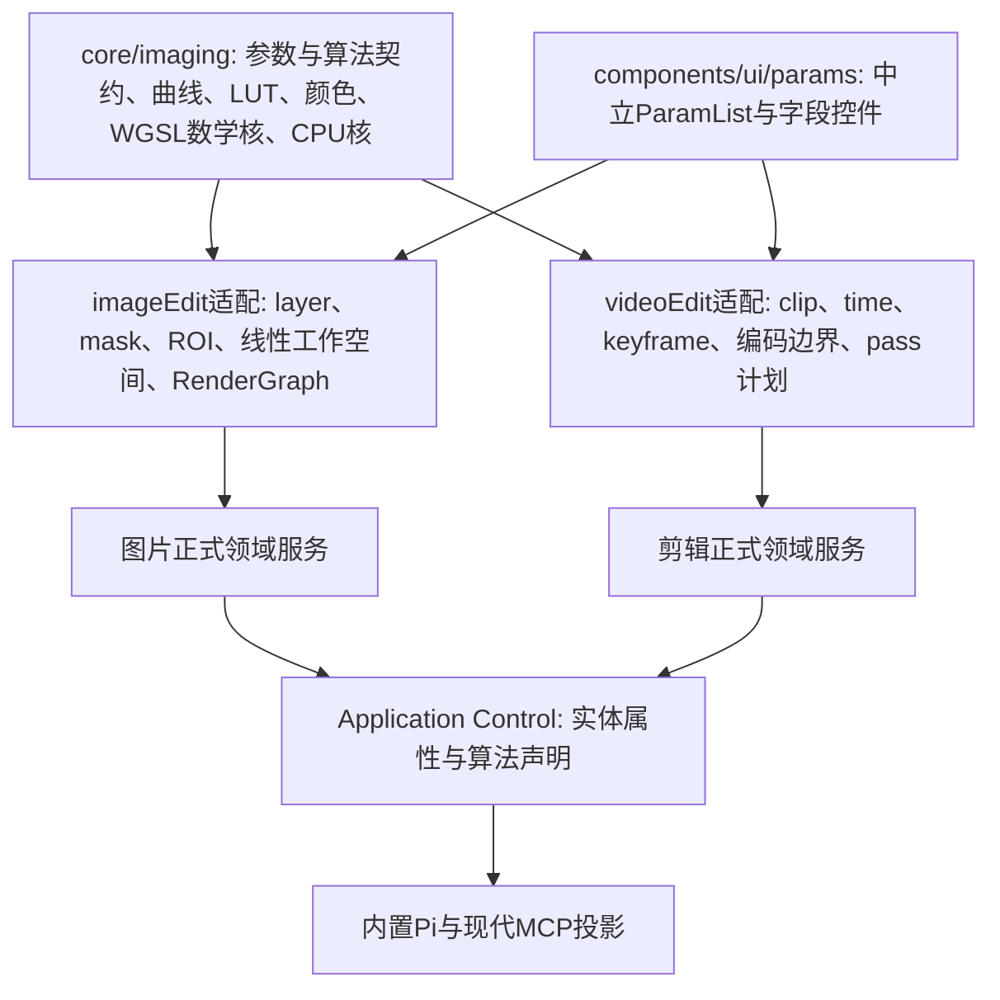

# t97 图片编辑能力调研与路线设计

日期：2026-10-09。范围：只读仓库与官方资料，设计后续实施路线。本轮不改源码、不执行Git写操作、不下载/运行新模型、不调用付费生成。本方案是待审查设计，能力名、模块路径和预算目标标为拟定，不当成已实现接口。

## 1. 结论与现状

第一阶段不重写图片编辑器：沿现有V3文档、GPU Scene、稀疏画笔、撤销与保存链，开放共享调整层和独立选区，接本地快速移除/指定来源修补。剪辑和图片使用同一调整算法/schema/面板内核，两端保留各自时间、坐标、颜色和宿主生命周期适配。

现有核心支持五类图层、五种混合模式、Float32稀疏蒙版、仿射、几何选区、四个调整与四个效果、稳定快照与九种栅格导出；但full/canvas-edit没有开放调整、mask控制或独立几何选区。现有框选直接编辑mask，不能用作不破坏原蒙版的PS式临时选择。imageMark已经复用文档/标注服务，不增第二套编辑器。

助手已经能反射image_edit对象、读改图层属性/集合，打开来源/画布文档、生成预览和提交、导出图层/组/标注；image_document归documents文档种类。新功能只扩原真相源和算法声明，不能另做Pi/MCP业务实现。

细目与路径见[现状证据](调研/01-仓库现状与证据.md)。[PS逐项对标](调研/02-Photoshop对标.md)覆盖选区、调整、修复、变换、图层、滤镜、裁剪、文字、导出，区分已有/部分/缺失；优先级是本项目判断，不是使用率统计。

## 2. 通用调整底座

### 2.1 模块切分和依赖方向（拟定路径）



图中箭头表示被上层消费/装配，不允许core反向导入feature。主进程会用到的core导入用相对路径。拟定 `src/core/imaging/` 为纯媒体数学核，文件按职责分：

| 模块 | 内容 | 排除的宿主职责 |
|---|---|---|
| adjustments/definitions | 闭合参数schema、默认值、单位、分组、约束、颜色域、操作顺序、可导出性 | clip/layer/ref/store、UI文案补丁 |
| adjustments/curves、wheels、hsl、analysis | 曲线求值/LUT构建、色轮、颜色key、统计自动校色/参考匹配 | 视频取帧、图片合成源选择、媒体I/O |
| color、lut | 解/预乘、原色/transfer边界、.cube解析与插值 | 文件上传、路径、项目资源管理 |
| effects/kernels、wgsl、cpu | Gaussian/unsharp等核、数学fragment、CPU等价；pass/halo描述 | device/target/frame创建、Worker、GPU资源生命周期 |
| 中立ParamList/fieldSpec | 标量、曲线、色轮、资源选择的字段呈现与preview/commit/cancel | 视频动画时间/关键帧、图片层选择/蒙版 |

这是从现有成熟模块抽取，不是创建另一套同功能算法；新目录名称实施前结合最新仓库领域归属确认。当前 [video core](../../../src/core/videoEdit/colorGrade.ts) 依赖builtinEffects，须连同字段定义抽纯；图像feature禁止直接import视频面板。资源层继续通过commands/platform/领域服务访问桌面能力，Electron只协调I/O、权限与生命周期。

### 2.2 同一WGSL、schema、ParamList和助手属性怎么落地

统一WGSL数学函数和操作序列；视频wrapper仍绑定自己的纹理/Vertex/uniform ABI，图片wrapper绑定现有RenderGraph。两者只注入采样、颜色边界和尺寸，不复制曲线/色轮/HSL公式。邻域效果由同一pass描述生成两端计划；时间相关输入留视频适配。

同一参数定义同时投影为领域验证、ParamList字段与助手 `params` 属性约束。数组/曲线用结构化数据；LUT/渐变用稳定资源引用与上传入口；没有手填URL/路径，没有随意JSON补丁或助手代码字段。曝光用档位、blur/羽化用画面或区域比例，视频/图片在adapter转内部尺寸。

图片默认新增“调整”层，作用于下方合成；支持通过蒙版限定主体/区域。仅作用选定图层时使用明确作用域或隔离组，由领域服务构建，不把作用域偷偷烘焙到像素。普通数值与层CRUD走通用实体；自动校色/匹配产出建议后走同一事务。已有“曝光/曲线”等单项节点与新全能调整必须从同一目录派生，不能继续各写参数和公式。

需要保留CPU evaluator供图片fallback/分块导出。CPU和WGSL必然是两种后端代码，但schema、算法语义、顺序及fixture是一份真相。不要把“同一实现”误写成CPU直接执行WGSL或视频shader直接兼容图片颜色。

### 2.3 迁移顺序

1. 冻结目前两个工作区的参数/像素/颜色语义样本，记录现有pass顺序与不同之处。
2. 从video core抽schema、曲线、LUT、统计分析；已有视频服务改为消费通用模块，视频keyframe/取帧/clip状态仍在原层。
3. 抽WGSL数学核与邻域pass契约，视频先保持当前视觉结果；CPU实现与图片颜色adapter补齐。
4. 抽中立ParamList/fieldSpec，复用UiCurveEditor/UiGradeWheel；视频动画插槽、图片mask/scope由适配注入。删除已替代的重复字段实现。
5. 图片RenderGraph接全能调整节点，启用full/canvas-edit对应profile；同源反射/集合执行器、导出与资源引用同步接入。
6. 自动校色/参考匹配复用分析算法，图片采冻结源，避免把已经目标调色的图再当未调色源分析。
7. 按共享效果逐个迁移Gaussian、锐化、辉光和可用于静态图片的着色器组件；不能要求所有专业滤镜齐全才交首阶段。

开发期不做旧数据迁移或“旧入口隐藏、运行仍兼容”的分支。涉及落盘字段时按当前persistence登记开发期格式变化，从文档、能力、渲染、导出一并改；保持当前应用操作契约的变更是设计问题，不以旧格式兼容为理由另留实现。计划中的模块名不是现存文件引用。

### 2.4 不可省略的颜色与视觉决定

剪辑shader边界是编码sRGB，图片Scene中间结果为线性预乘并有P3/Rec.2020/高精度底座；调整应声明linear-working/perceptual-working等域，边界adapter转换并保护alpha=0和半透明。HDR/超白与未定义LUT组合明确限制，不默认把全图夹为8-bit sRGB。

现有 `hsl_show_mask` 能影响持久输出，拟定将“看选区”改为临时观察状态。实施前总管理者确认两端新语义，并一并验证；不在一端偷偷改变导出。图片与视频glow/blur的同名观感未证等价，先共享核，必要时在同一目录保留明确算法变体，不以改名掩盖结果不同。详见[渲染与性能依据](调研/04-共享渲染与性能依据.md)。

## 3. 独立选区、蒙版与修复事务

### 3.1 选区模型

引入文档编辑会话下独立selection：稳定引用、来源、空间/画布尺寸、原始coverage资源、组合语义、羽化/扩展比例、状态与结果摘要。原始0..1 coverage与边缘处理参数分离，重复调整羽化不会累积模糊。selection不直接等于图层mask；“应用为蒙版”“仅调整此区域”“移除此区域”都是显式消费它的操作。

简单几何/参数与选择元数据可通用实体读写；栅格化、形态学、分割、应用到mask通过正式算法服务。UI笔迹不逐点通过助手工具，走现有高频笔迹输入队列；助手以意图区域/形状/点框提示调用同一服务。选区操作与文档操作统一撤销语义：一次用户手势一个条目，会话态结果清理不污染文档历史；被文档mask/修复结果引用的coverage须进入正式资源管理。

首批框选/椭圆/套索/画笔、replace/add/subtract/intersect、羽化；主体点/框选随后接。现有4096瓦片/8192套索点、反射512引用是既有规模缺口：改为流式瓦片、曲线简化/分批、分页引用与进度/取消，不成为产品数量上限。保留明确GPU最大纹理尺寸、数值有限性、坐标精度等技术约束，并由运行设备/契约判定，不能用未解释常量替代。

### 3.2 自动移除与指定来源修补

拟定公共算法意图（不是本轮已注册能力名）：

| 意图 | 语义参数 | 输出 |
|---|---|---|
| 移除所选物体 | document/target引用、region=现有selection或主体/人脸/点框、sample_scope=当前层/可见合成、quality=快速/精细、输出模式 | repair preview或提交后的补丁层/资源引用、实际区域、验证证据 |
| 用指定区域修补 | 上述目标区域，加donor引用/来源区域、对齐方式、边缘融合比例 | 保留采样来源的补丁层与可读回来源关系 |
| 选择主体/天空等区域 | 源引用、region意图、可选正负点/框、combine、羽化比例 | selection引用、候选/歧义、预览 |

自动移除用MI-GAN优先、LaMa备选；指定来源修补先采样/仿制/纹理融合，不能仅把MI-GAN输出标“修补”。实现前评估成熟OpenCV/WASM融合/经典inpaint模块的效果和打包成本，模块不可用再明确自研边界；不引入完整Python服务。模型推荐、许可与未核验体积/速度见[模型选型](调研/03-本地模型选型.md)。

事务顺序：解析稳定源与selection → 冻结文档/源revision和资源lease → 合成规定采样范围 → ROI+上下文、归一化 → 本地模型/指定来源融合 → 验证边界与未选择区域 → 预览或单次原子补丁提交 → 读回/观察结果。共享领域服务执行，UI/Pi/MCP只是调用入口。

补丁只含处理区域的稀疏raster tiles，默认新修复层；保持原图资源、图层变换、颜色/透明通道和上方调整，避免重复烘焙调色。若用户选择“可见合成”采样，须明确哪些合成结果被采进补丁、图层放置位置与上方效果，利用固定fixture排除双重调色/重影。整图8-bit模型转换不能替换整个高精度文档；第一阶段模型只定义SDR适用组合，未处理区保持原精度，宽色域/HDR内修复须有独立验证后开放。

预览不进权威历史；确认/已授权直接提交才增加一笔undo。undo/redo复用相同结果资源，不重跑模型。源被修改/目标删除/会话关闭时拒绝迟到提交；错误说明可重试/重新选择/下载恢复，不吞错、不另建日志文件。取消立即结束用户等待状态并丢弃结果，原生run释放遵循真实能力，不强杀共享进程影响其他作业。

### 3.3 本地设施

扩既有local-models manifest与local-inference协议，增加闭合的静态图片分割/修复/后续超分作业。主进程协调下载、大小/哈希校验、权限、进度与资源，utility process执行ONNX，CPU像素预后处理放worker/utility，不堵主进程。

Windows先复用DirectML→CPU；WebGPU/WASM是可测备选，不重复创建图形设备或承诺跨进程零拷贝。EfficientTAM现有追踪加载五文件，静态编码器/decoder拆分要验证输入图；RVM静态首帧/透明mask边缘与Selfie粗分割按用途分开。自动“主要主体”不是点选模型自动带来的能力，需要候选/消歧，天空另作专项。

## 4. AI调用与渐进式披露

| 内容 | 按规则分级 | 正式调用 |
|---|---|---|
| 工具分组、面板、快捷键呈现 | 仅呈现变化 | 不加能力/MCP工具 |
| 打开完整编辑器/画布宿主、导出既有目标入口 | 覆盖核对 | 复用已登记导航/算法与稳定引用，核对Surface观察 |
| 调整层/效果/蒙版/选区数据、新增参数、集合CRUD | 能力增量 | 注册实体字段和mutation/collection执行器，通用describe/read/change |
| 自动校色、参考匹配、语义/连通选择、移除、纹理修补、几何求解、超分 | 能力增量 | ApplicationCapabilityDefinition算法能力；schema、权限、账本、取消、结果证据同源 |

不建“set_brightness”“add_one_layer”“set_feather”等专用工具。实例约束由反射给出，算法schema严格闭合；写入效果由control.impacts及真实结果引用验证。通用事务能一次改多个参数并回读，不让助手为每个滑块往返一轮。

披露顺序：

1. 基础助手提示只说明图片编辑能做的任务、共享工作台与引用/回读原则；不常驻整套PS能力、模型名或WGSL。
2. 当前文档/宿主摘要告知目标、可操作对象与观察能力；工具组搜索按“调整/选择/修复/交付”找到小集合。
3. 针对目标调用describe，取得该实例可写属性、范围与完整算法schema；仅在实际操作时披露详细参数。
4. 多步修图再按需load_assistant_skill，提供“先看图→选择→处理→回读→必要时撤销”策略与真实可调用标识。新增运行时skill必须同步正式注册、准入名单与load链，不能只写SKILL.md后宣称助手能用。
5. Pi和MCP从同一反射/能力声明投影，无第二份手写字段表；外部授权逐请求核验。skill说明不绕过权限，也不让每个本地可撤销动作新增确认闸门。

当前准入锚点是 [agentSkills.ts](../../../electron/main/services/assistant/skills/agentSkills.ts)，工具披露锚点为 [toolDisclosure.ts](../../../electron/main/services/embedded-agent/toolDisclosure.ts) 与 [toolDisclosureProfiles.ts](../../../electron/main/services/embedded-agent/toolDisclosureProfiles.ts)。图片修图skill为未来增量，本轮不修改准入表、提示词、MCP或台账。

## 5. 界面骨架与PS取舍

```text
唯一命令带：返回/文档名称 · 撤销重做/比较 · 交付
同底色从属区域：仅当前工具的范围/画笔/羽化/采样来源
左：窄工具组      中：图片工作面与就地选区/预览      右：图层与当前属性
助手：复用全局侧栏按需展开；不再加一条“AI修图”头带
```

沿henji-ui-surface：一个表面一个主动作，一个视觉深度只画一次边框/背景；内部分组用留白/扁平标题，不层层卡片。UiToolbar command容纳返回/文件/工具/交付，同属工具参数与它共底色和下边框。浮在图片上的小控制才用玻璃，普通属性面板用实底语义token；Ui*控件、lucide图标，禁原生输入/emoji图标/硬编码色。

左工具按导航/构图、选择、修复、绘制/文字分组，次要工具收进同组菜单/搜索；不把全部PS工具排成长条。右侧一块图层树加当前对象属性，“调整”按基本、曲线、色轮、HSL、LUT分组渐进展开。参数拖动复用preview→commit/cancel，当前选择自动决定范围但明确可切换当前层/合成，用户不用先学内部RenderGraph。

移除时就在图上涂选、看结果、比较/撤销；需要模型首次下载时只解释用途、体积、进度和取消。自动校色/主体先给结果，人微调；已授权助手同路可直接提交。历史、直方图、颜色等辅助按任务展开，不新增常驻横带；历史名称用“移除背景物体”等任务语言，不显示revision/hash/Worker/EP。

图层长列表与候选按虚拟化/分页处理，不限定素材/图层/候选数量。画布节点打开自己的文档宿主原位保存；工具箱独立编辑器沿自身交付语义，不强迫“应用后新建结果节点”。保留PS的专业选区、图层、非破坏编辑和快捷操作，舍弃其面板堆叠与每一步从零调参数的默认方式。

## 6. 性能与阶段验证

先测现有拖参，再迁移；主线程响应、event-to-present、抬手稳定帧、保存完成、模型端到端分别记录。现有逐点150ms/blur250ms/glow500ms不是所有功能60fps证据。拟定常用逐点GPU热态p95≤33.4ms，现有主线程p95≤16.7ms；blur/glow沿原预算并用mip/halo渐进。目标、真实测量和参考机配置分开写。

拖参只更新最新uniform/transient，不重编pipeline、不重传整图、不每帧落盘/读回、不整棵React树刷新；抬手一次提交、取消还原、离屏延后。模型作业与Scene共享资源预算，不让下载/推理把交互堵住。scale靠瓦片/进度/取消/分页，不靠产品数量上限。

[任务总览](00-任务总览.md)已逐项列前置、独立交付/验收、AI形态与披露方式。实现测试随完成边界，精确单测/所属类型检查/相关门禁；本轮L0只校对文档，不跑全量、Reality、Electron或模型benchmark。未来原生推理与GPU可见呈现需要对应真实证据后才宣布通过。

## 7. 设计自查、选型依据与审查风险

1. **助手只凭名称和说明能否用对？** 目标是能：操作表达移除目标/指定来源修补/选择主体/匹配参考，参数有稳定引用、区域和范围；普通属性用通用读写。未实现能力均标拟定，不能先把流程写入正式提示词当真。
2. **能否AI先做、人只确认？** 主体候选、自动校色、参考匹配、局部移除先产出可检查结果；人改区域/强度或撤销。助手有授权即可执行同一事务，人确认是产品可选预览方式，不是新增普遍权限门槛。
3. **产物能否直接流进其他工作区？** 原文档/补丁层可编辑，平面结果用正式预览/导出和素材引用给画布/剪辑；不搬文件、不重传内部媒体、不另建结果类型。消费者尚未支持的嵌套层树不宣称已经跨区可编辑。

成熟实现优先：复用现有调色/ParamList/GPU Scene/ONNX下载与utility，首选官方MI-GAN、已有EfficientTAM、人像RVM；LaMa作转换/质量对照，经典修补评估OpenCV等成熟模块。未找到可直接交付的PatchMatch模块时才限定自研范围；视频glow不经对照不直接替换图片glow。详细比较与来源写在本任务调研文件中，无新SDK/供应商依赖。

管理者注意：共享工作区有其他任务在修改core/videoEdit、助手与持久化相关文件，实际实施需先核对最终契约；本轮只写此目录。新模型速度、算子兼容、画质、权重再分发与专利条件未实测/未定；天空与超分不列首阶段必须交付，避免阻塞四项核心优先级。VGPU官网本轮工具访问失败，官方仓库与仓内0.3.1资料用于总体方向，实施仍须按当前版本核验具体API。不改assistant-status、不启动或重启开发环境；Git审查/提交由总管理者处理。曾执行只读Git状态/差异检查，未暂存、提交、推送或改变任何Git状态。
