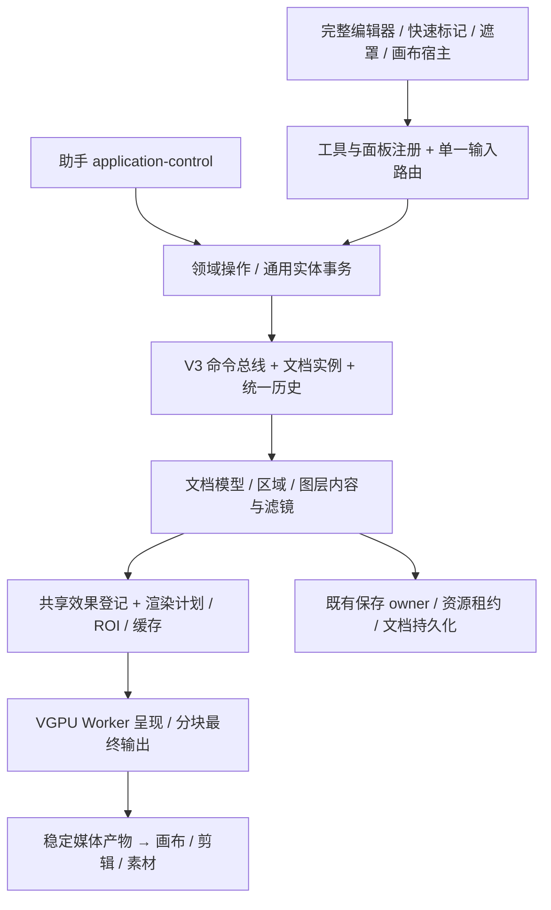

# t118 图片编辑器整体重构方案

> 2026-10-09；状态：调研与设计完成，待总管理者审查。本文不是实现完成声明。
> 范围：仅本目录的方案文档；没有修改代码、配置、SDK、其他任务记录或 Git 暂存区。未启动应用、未做真实付费调用。
> 配套：[证据与参考项目](01-证据与参考项目.md)、[实施任务拆分](02-实施任务拆分.md)。后续任务均未实施。

## 1. 决策摘要与目标

建议重构编辑器的组织方式和能力模型，保留已经成立的 V3 文档、命令、资源、保存、共享效果与 GPU 底座。现在的主要问题不是“没有 GPU”或“没有图层”，而是图层语义不足、工具入口分散、区域对象割裂、工作面板未成体系。继续在现有工具 union 和多个 TSX 条件分支里加按钮，会放大这些问题。

目标是能连续完成“选主体 → 合成分层 → 局部调色/修饰 → 排版 → 交付”的图片工作台。修图操作和专业手感参照 PS；助手调用同一业务操作，自动选区、修补和生成直接落入当前文档。传统软件能力是下限，不能把 PS 菜单搬过来而让助手仍依赖坐标点击。

三项先做：**可注册工具框架、可停靠 UI 骨架、选区与蒙版统一**。再补图层语义、滤镜挂载和历史，之后逐项建设专业能力。采用成熟算法模块的方向明确，但不整栈移植两个参考软件，不另建第二套文档、效果目录或撤销栈。

| 任务 | 本次状态 | 交付边界 |
| --- | --- | --- |
| t118 | 调研与方案完成，待审查 | 两个参考仓库的源码快照分析、V3 诊断、目标结构、18 个实施任务；未声称画质或真实窗口验收通过 |
| t118b | 补充审查完成，待总管理者审查 | 第 9 节落实跨宿主同核、剪辑时间扩展、逐任务 Electron 截图；同步拆分与证据附录，仅修改本目录文档，未实施或截图 |

## 2. 研究口径

当前仓库基线为 `1019cf2642a76fdc313c447a103fedc0627139a7`，main；共享工作区存在其他任务的改动，本文描述的是本次读取到的工作区实现，不是对整个 HEAD 的可复现发布验收。

参考项目克隆于仓库外 `D:/VibeCode/henji-codex-tasks/runs/t118-data/`，固定快照：

- [Compositor](https://github.com/robbietilton/Compositor)：`22c7b8d5b23bb1e27a5746912061b23757c4f554`。
- [PhotoCraft](https://github.com/storytold/photocraft)：`ec350d64aedd019afc5eda290cc32909bc9bab7d`。

下文 Compositor 源码路径相对克隆目录内的 `Compositor/` 子目录，PhotoCraft 路径相对克隆根目录；完整本机路径见附录。

判断以源码为先，README 功能宣称不作为验收。未构建或运行参考项目；交互手感、跨平台兼容、画质和性能均需后续专项验证。现有路线图记录的是历史完成边界，不能直接当作今日的 PS 等价能力清单。下文“已有且可用”指存在完整可调用实现，并在适用处列出精确测试证据；不代表本次进行了全工具真实窗口体验。

## 3. 参考项目分析与采用方向

### 3.1 Compositor

这是 macOS 原生 Swift/AppKit 编辑器，Core Image、Metal 与 Core Graphics 组合。`Document/EditorSession.swift:4` 的图层包含父组、蒙版、剪贴来源、调整、形状、文字等；`Rendering/GPUCanvas.swift:1` 显示其平台依赖。其价值主要在连续绘画和交互中的资源组织，不在跨平台宿主复用。

| 领域 | 源码事实与可借鉴点 | 不适合直接采用及原因 |
| --- | --- | --- |
| 文档/图层 | `Document/EditorSession.swift:4`：图层共同属性与内容组合，组与剪贴关系明确；`IO/ProjectStore.swift:38`：清单与像素资源分离 | 其 flat parentID、Swift 数据模型和逐层图片保存不能直接替换我们的稀疏资源/文档服务；助手经文件监听改文档的路线不满足痕迹的统一事务、权限和撤销 |
| 渲染 | `Rendering/GPUCanvas.swift:26`：图片身份 + mip 缓存；`:38` 帧龄淘汰；`:69` 内存压力回收；`Rendering/TiledLayerRenderer.swift:4`：分块对齐与 halo 以免接缝 | Core Image/Metal/AppKit 不适用于 Electron 全平台；其 sRGB 合成口径不能直接当作我们的线性/HDR 契约 |
| 绘画/交互 | `Document/BrushStroke.swift:119`：仅分配触及块；`:180`：笔划累计覆盖；`:187`：脏区；完成后替换不可变图片，撤销共享旧像素 | 不照搬 256/1024 的块尺寸；我们的资源块与 GPU 页可不同。工具仍是 enum 加集中分支，不是目标插件框架 |
| 历史 | `Document/DocumentHistory.swift:55`、`:63`：手势 begin/end 合并，无变化不破坏 redo；CGImage 共享降低快照成本 | `:28` 默认 100 条/256MiB，以及裁掉历史的政策不能作为产品数量限制；保留我们的命令 delta、资源租约与持久历史更合适 |
| 滤镜/调整 | `Document/Filters.swift:573` 异步预览，`:666` 过期结果检查；调整层与像素滤镜分别组织 | `:681` 提交滤镜替换栅格 asset，是烘焙路线；不能代替 R13 图层滤镜栈和滤镜图层 |
| UI | `ContentView.swift:80`：工具栏、画面、侧面板构成完整工作区，选中工具改变选项 | 选项分支仍集中在 `ContentView.swift:27`；原生窗口/浮动面板不能直接移入石墨 UI |
| 性能与边界 | 缓存、mip、脏区、不可变像素共享值得采用 | `Document/DocumentLimits.swift:18`、`:25`、`:35` 有尺寸/总像素限制；我们用资源预算与流式处理，不能照抄为图层数量或作品规模上限 |

采用决定：借鉴笔划事务、笔划覆盖累积、脏区和缓存生命周期；不引入 Swift/Metal 宿主，也不复制其文档或文件监听 Agent 模式。许可证 MIT，复用源码须保留版权、许可和免责文本；详见证据附录。

### 3.2 PhotoCraft

这是 Rust workspace，文档、像素、算法、绘画、CPU/GPU 合成、编解码、引擎、egui UI 分层。它比 Compositor 更适合抽取专业算法，仍不能凭模块数量推定已经达到 PS 的全部质量。

| 领域 | 源码事实与可借鉴点 | 不适合直接采用及原因 |
| --- | --- | --- |
| 文档/图层 | `crates/doc/src/lib.rs:448` 智能对象及滤镜；`:524` 七类内容；`:557` opacity/fill、剪贴、栅格/矢量蒙版、样式 | PSD 原始字段保留服务于互操作，不应成为本项目新格式的兼容包袱；linked source 的路径需要改为受管理引用 |
| 渲染 | `crates/gpu/src/lib.rs:6` 分页纹理、tile 身份增量上传、LRU；`:15` 效果缓存与扩展损伤；`:19` RGBA32F 分页累积与直接呈现 | wgpu 是另一完整后端；已有 VGPU/t117 时不并存两套合成器。其误差注释也不代替我们的 fp16/fp32/HDR 误差验收 |
| 工具/绘画 | `crates/paint/src/lib.rs:5` seeded dab 序列；`:8` flow 与整笔 opacity 分离；`crates/paint/src/retouch.rs:1` 克隆/修复复用同一 dab 引擎 | `crates/ui-egui/src/state.rs:64` 工具 enum、`:419` 集中选项，`crates/ui-egui/src/canvas.rs:548` 集中事件仍需改为注册式工具；egui UI 不直接采用 |
| 历史 | `crates/ops/src/lib.rs:1` Arc/COW 快照共享像素；`:146` 历史条目适合面板投影 | JS 对象没有 Rust Arc 的等价成本；`:57` 50 状态默认值不照搬；我们的命令 delta 和持久资源更契合现有底座 |
| 滤镜/调整 | `crates/engine/src/filters.rs:151` 普通栅格和智能滤镜共享运算；`:253` 智能滤镜记录参数后重算 | 不复制 string-match 滤镜目录；继续使用共享效果登记，保留图片/剪辑同一 canonical id |
| 选区/变换/修补 | `crates/algo/src/selection.rs:160` 魔棒、`:434` 色彩范围、`:771` 扩展/收缩；`crates/algo/src/segment/focus.rs:1` 明确是焦点启发式；`crates/algo/src/seam.rs:1` seam carving；`crates/algo/src/inpaint.rs:211` PatchMatch | GRAY8 选区不能替换现有 float32 覆盖；焦点算法不是语义主体分割；seam carving 也不承诺复杂场景与 PS 等价 |
| UI | `crates/ui-egui/src/dock.rs:1` 分组、tab、重排、折叠、组内滚动、末组占余高；历史/文字/导航面板成体系 | 不移植原生 egui、配色或通用 ui.set 协议；只借鉴布局行为，走 Ui* 与统一应用控制 |
| 性能 | native Rayon；WebAssembly 像素代码优化；稀疏像素与缓存复用 | Rust/WASM 内存复制、线程与 Electron 打包未验证；不能以算法模块存在宣称端到端低延迟 |

采用决定：优先做独立算法适配验证，候选为 `paint` 的确定性 dab/flow、`algo` 的选区形态学与色彩范围、PatchMatch 和 seam carving。输出必须进入现有 float32 区域/稀疏块/命令体系。采用门槛为画质、拷贝开销、取消、内存和构建可接受；未通过时明确拒绝该模块，不引入完整 Rust 文档/egui/wgpu 栈。现有 LaMa/MIGAN/主体分割继续保留，不用 PatchMatch 名称替代实际效果比较。

项目声明 MIT OR Apache-2.0；拟复用核心按 MIT 路径履行许可义务，素材、字典、图标与依赖另查各自许可。许可证不作为方案否决理由；专利、分发义务和构建依赖需要实施任务记录，不在本次声称已经审完。

### 3.3 停靠布局直接采用仓内成熟实现

`package.json:124` 已有 dockview-react；本机安装为 7.0.2（MIT）。`src/components/DockviewHost.tsx:3` 是剪辑与镜头工作区共用宿主，已处理隔离层级、浮动主题和分隔条原生拖放；`src/components/dockviewDocking.ts:92` 起有停靠行为，`src/components/dockviewHostTheme.ts:1` 有共享主题。目标直接复用它们，只新增图片的面板登记与布局配置，不自研第三套拖拽/停靠器、不修改剪辑专属布局。[Dockview 官方概念](https://dockview.dev/docs/core/overview/)可供查证；实际 API 以本机安装版本为准，不假设官网新功能已经在 7.0.2。

## 4. 现状诊断：按真实工作流

### 4.1 能力表

| 工作流 / 能力 | 状态 | 代码证据、缺口与质量边界 |
| --- | --- | --- |
| 分层合成：图层、组、排序、可见、锁定、opacity | 已有且可用 | `src/core/imageEdit/v3/layerTypes.ts:48`、`:90`；图层面板 `src/features/imageEdit/v3/editor/ImageEditorLayersPanelV3.tsx:403` 已使用 Virtuoso，不是无虚拟化列表 |
| 混合、填充、剪贴 | 有但专业能力不足 / 部分缺失 | `layerTypes.ts:3` 仅 normal/multiply/screen/overlay/soft-light 五种；`:48` 共同属性没有 fill opacity 和 clipping。其他专业混合、填充与整体透明度独立控制缺失 |
| 蒙版：稀疏图层蒙版、绘制、反相 | 已有且可用；完整蒙版体系不足 | `layerTypes.ts:32` float32 稀疏块、默认覆盖；`:56` 单一 mask。缺独立变换/链接、density、矢量蒙版、蒙版与像素明确编辑目标；快速参数遮罩还有另一会话路径，见 4.2 |
| 选取：框/椭圆/套索/刷选/主体、组合、羽化、反相 | 已有且可用 | `src/core/imageEdit/v3/selection/session.ts:7`、`:14`；`src/features/imageEdit/v3/application/imageEditSelectionServiceV3.ts:95` 支持转蒙版/复制/删除，不能再沿旧路线图记为“无独立选区” |
| 魔棒/色彩范围/焦点、选区修改、命名存储/通道 | 缺失 | 当前 session union 与文档字段无相应语义；`src/core/imageEdit/v3/documentTypes.ts:36` 为图层，未有命名区域/通道集合。主体能力不等于魔棒、色彩范围或焦点区域 |
| 移动、缩放、旋转、错切 | 已有且可用 | `src/features/imageEdit/v3/editor/layerTransformV3.ts:18`、`:76`；`layerTypes.ts:17` 为六参数 affine。精确 transform 测试通过；透视/变形/内容识别缩放缺失 |
| 绘画：软硬笔、压感、橡皮、稀疏块、单笔撤销 | 已有基础；画笔质量不够 | `brush/rasterize.ts:22` 使用压力调整半径，`:144` 覆盖乘 opacity/pressure；逐段 source-over 缺整筆 opacity 与 flow 分离。`ImageEditorRasterBrushOverlayV3.tsx:256` 已取 coalesced events；不能说“没有压感”。缺笔尖间距、动态曲线、倾角、纹理/平滑、渐变和区域填充 |
| 移除/智能修补/供体修补 | 已有基础；画质边界明显 | `imageEditRepairServiceV3.ts:45` 明确拒绝宽色域/HDR，已有限制而非假装支持；已有取消、过期检查、稀疏提交。`src/core/imageEdit/v3/repair.ts:6` 到 SDR Uint8 代理、`:24` 回填，细节画质和未来 HDR 修改区需另验 |
| 仿制图章/修复画笔/区域修补/内容识别填充 | 缺完整工作流 | 供体 sample 后端不是连续仿制笔划；没有统一 dab、对齐供体、预览叠加、连续修饰工具状态。当前智能修补不能代表这些工具全部完成 |
| 非破坏调整图层 | 已有；完整专业组织不足 | `layerTypes.ts:83` adjustment；`builtInRenderNodes.ts:79` color-grade 与共享节点。主 profile `imageEditorHostProfiles.ts:136` 起主要开放 color_grade；缺统一调整库、明确局部范围与通道工作流 |
| 图层滤镜 / 滤镜图层 | 滤镜图层基础已有；图层滤镜缺失 | `layerTypes.ts:75` effect 为独立层，共同属性无滤镜列表；R13 第 9 节是目标，不是已实现字段。缺局部图层挂载、逐滤镜蒙版、可转换 scope 和完整共享库入口 |
| 智能对象 / 智能滤镜 | 缺失 | `layerTypes.ts:97` 五种 layer kind 无嵌入文档/智能对象。图层滤镜可先支持普通图层；智能对象另外解决原始来源保留与嵌套编辑，不能仅给 effect 改名 |
| 排版：文字、形状/矢量 | 有标记；专业能力缺失 | `src/core/imageEdit/types.ts:61` TextMark 只有文本、位置、颜色、字号/背景；不是字体 run/段落/可编辑路径。annotation 画矩形椭圆不是专业 shape/path 文档模型 |
| 裁剪、旋转、镜像 | 已有且可用 | `commandDocumentReducer.ts:6` orientation/crop；`imageEditV3Fields.ts:377` 起对应实体字段 |
| 画布尺寸 / 图像重采样尺寸 | 缺失 | 上述 reducer 只改 orientation/crop，不是改文档宽高或重采样所有相关图层；需要区分“改边界”和“重采样像素” |
| 色彩管理 / 位深 | 底座已有；专业 UI 与全链覆盖不足 | `colorTypes.ts:3` sRGB/P3/Rec2020，`:5` 8/16/float16/float32，`:7` SDR/PQ/HLG 与 ICC；不是只有 8bit。缺 CMYK/Lab 文档通道、软打样与清楚的指定/转换配置文件流程；笔刷/修补等逐项需检查精度 |
| 导出 | 已有多格式；部分内容阻断 | `electron/main/services/image-editor-v3/export/capabilities.ts:8` 九种输出变体；`src/features/imageEdit/v3/export/capabilities.ts:25` 拒绝 mosaic annotation。查看成功不等于任何标记都能导出；必须消除这类内容与导出契约分裂 |
| 历史/撤销 | 撤销已有且可用；历史面板缺失 | `imageEditCommandBus.ts:21` 合并 selection 与 command 会话条目；`:115` 持久快照不存 selection；`commandHistory.ts:23` 200 默认命令条数。主 profile `:142` 只开 layers/properties；不是已实现完整历史面板 |
| 快捷键/操作手感 | 基础已有；体系不足，手感待确认 | `ImageEditorV3.tsx:20` 历史快捷键；工具、overlay、导航事件在多个组件独立判断。缺统一工具快捷键/临时工具/取消/文本 IME 优先级协议。此次没有真实窗口测试，不能断言已发生具体事件抢占或延迟 |

表中省略目录的 V3 文件均以 `src/core/imageEdit/v3/` 或 `src/features/imageEdit/v3/` 为根；完整路径索引见附录。PS fill 与整体 opacity 的差异参考 [Adobe 官方说明](https://helpx.adobe.com/uk/photoshop/using/layer-opacity-blending.html)；不能用单一 opacity 控件假装两种语义都存在。

画笔质量的具体证据：`brush/strokeSession.ts:297` 对工作块持续调用逐段 rasterize，`brush/rasterize.ts:87` 的 alpha 更新为 sourceAlpha + beforeAlpha × (1-sourceAlpha)。由公式推导，透明位置在同一笔内被两段 0.5 覆盖时会到 0.75；这是静态数学推导，尚未增加像素测试。它与“整笔 opacity 为 0.5、flow 只影响笔内积累”的语义不同，修复应建设 stroke coverage 而不是换个滑条名称。

### 4.2 结构性根因与影响范围

1. **文档只能表达简化合成，功能被迫挤进 annotation 或 effect 层。** `layerTypes.ts:48` 单一蒙版、无剪贴/填充/滤镜列表；`:97` 五种内容；`types.ts:61` 简化文字。结果是文字、路径、局部智能滤镜无法自然保存、读回和撤销。mask legacy 分支 `layerTypes.ts:23`、`:146` 也需要随新格式直接删除，不延续兼容壳。
2. **工具没有完整注册边界。** `imageEditorHostProfiles.ts:5` 工具 union，`ImageEditorToolRailV3.tsx:35` 图标和 `:71` 分组，`ImageEditorToolParametersV3.tsx:45` 起条件选项，`ImageEditorPreviewV3.tsx:480` 起多 overlay 条件。加一个工具要跨这些文件，光标、状态和参数很容易不同步。静态证据说明组织风险，具体 pointer 冲突仍待真实窗口确认。
3. **选区、图层蒙版、快速参数遮罩是不同编辑路径。** `selection/session.ts:7` 会话几何；`imageEditSelectionServiceV3.ts:34` 物化；`src/features/maskEditor/MaskEditorModal.tsx:49` V3 与 `:62` quick 分流，`:73` 使用独立 useMaskEditorSession。`src/components/params/DerivedMediaParamControl.tsx:162` 仍用 quick initialDocument。R05 已把图片快速标记统一 V3，`src/features/imageMark/viewer/ViewerMarkEditor.tsx:8` 的 ImageEditorV3 不能误判为第二持久编辑器；需要合并的是剩余区域编辑内核和表示。
4. **底座已分块，但每个新算法仍需明确空间/颜色/质量契约。** t117 解决高斯区域求值，不等于所有邻域效果、变形和组合自动支持 tile。修补的 SDR 代理与 annotation mosaic 的导出拒绝说明“能预览”与“能完整交付”尚有断点。
5. **UI 是两个浮动面板，未形成专业面板体系。** `ImageEditorFloatingPanelsV3.tsx:50`、`:56`、`:90` 仅 layers/properties；history/color/histogram 的枚举不代表面板已实现。当前 `ImageEditorCommandBarV3.tsx:19` 已是响应式命令带加从属选项，不能再诊断成旧的四条栏。保留这条带逻辑，扩展面板注册、停靠和工作区布局。
6. **历史缺面板投影和大规模持久组织，不是缺撤销。** `imageEditCommandBus.ts:63` 会话历史与 `:66` 持久历史已经有明确分工；新历史面板应投影同一时间线，不能另建快照栈。200 条默认裁剪与产品无数量上限的目标需重新设计为磁盘分页/检查点，详见任务 05。

排查覆盖完整图片编辑宿主、工具箱、快速标记、生成参数遮罩、画布文档宿主与主进程资源/导出/本地推理路径；不是全项目缺陷审计。此次没有修复代码，同源问题均进入实施任务，不把精确测试通过扩大成全部功能可用声明。

## 5. 目标架构

### 5.1 单一文档实例，内容与宿主分离



文档实例拥有作品状态、历史、资源租约与保存 owner；宿主只附着视图、profile 和交互状态。viewport、面板停靠、工具临时参数不进入作品历史。多宿主不能各持一份可写文档，继续复用 `imageEditDocumentInstances.ts`。

领域纯计算留 core；像素重计算进 Worker/WASM/utility process；主进程只管 I/O、权限、任务生命周期和资源。算法实现不能藏在 TSX 或主进程事件回调中。新增层与效果须可被 CPU 参考、GPU、持久化、实体读写与导出同时解释。

### 5.2 文档与图层

文档包含：几何、色彩描述、图层树、资源引用、命名区域/通道、作品历史关联。新模型采用受验证的内容类型：栅格、文字、形状/路径、组、调整/滤镜图层、智能对象。快速标记通过同一内容和操作的受限 profile 实现，不保留长期 annotation 独立语义。

图层共同属性：可见/锁定、整体 opacity、fill opacity、blend、空间变换、栅格与矢量蒙版附件、蒙版链接/独立变换、剪贴关系、图层滤镜列表。组支持隔离与 pass-through 的明确语义。剪贴按明确基底关系求值，删除/移动基底时原子更新，不能依赖偶然数组索引。

智能对象保存受管理的来源资源或嵌入文档引用与实例变换；打开内容编辑会产生新的内容版本，经命令更新引用，可撤销。必须检查循环引用、资源租约与读写权限。不是路径文本框，也不是“应用一次滤镜后存张 PNG”。栅格化是用户明确操作，可读回结果和撤销。

R13 两种滤镜挂载直接采用：

- **图层滤镜**：内容上的有序实例列表，每个实例有共享效果 id、参数、开关、混合/强度、独立蒙版；有选区时取不可变区域快照作为该实例蒙版。普通图层也能使用，不强迫先转智能对象。
- **滤镜图层**：同样的效果实例，作用于所在组作用域内下方合成结果；图层 mask、blend、opacity 仍生效。
- 两种挂载编译成同一效果节点。转换是原子命令，但作用范围可能改变：必须让用户看清转换前后影响对象；不能承诺多层场景像素无损等价。

滤镜使用自身声明的 reference grid/空间契约；智能对象内部滤镜在内容空间求值，宿主图层滤镜在声明的图层/文档空间求值，不能偷偷跟 viewport 缩放改变强度。fill 作用于内容，整体 opacity 作用于含图层样式的最终层结果；蒙版/滤镜/样式的顺序用像素 golden 固定。完整混合与色彩规则也必须固定，不只补枚举。

模型变更走 persistence 的 dev-break、schema/version、资源枚举、fixture 和全部读取/导出消费者门禁；删除旧类型时不写迁移，不保留隐藏兼容运行路径。

### 5.3 工具框架：一个目录加一处登记

工具契约包含：稳定 id、分组/别名、lucide 图标、宿主可用性、意图说明、选项字段、光标、快捷键、状态机 factory、领域操作绑定、预览/提交/取消生命周期。一个新工具只新增 `tools/<toolId>/` 与其一个登记条目；登记条目可按模块收集，中央登记器负责类型验证、id/快捷键冲突检查和启动失败说明，不为每个工具改中央 switch。此处是内置模块注册，不承诺加载任意第三方可执行代码。

状态基本为 idle → armed → dragging/preview → committing → idle，按工具扩展子状态；Esc、pointercancel、lostpointercapture、宿主切换、文档删除统一清理。异步工具取消令牌、资源租约和过期结果检查来自领域任务，不各写一套。pointerup 必须提交末尾点，压力/倾角/合并事件交给工具，不能统一降成 mouse 坐标。

单一输入路由处理优先级：模态/文本 IME → 临时导航键 → 活跃工具。快捷键在输入框/文本编辑时避让，临时工具释放后恢复原工具。变换/绘画的连续预览不写历史，完成一次手势只提交一个命令，失败撤销预览。现有工具先通过薄适配器登记，适配器调用旧领域服务而非复制业务；替换完成立即删除对应旧 overlay 分支。

工具选项栏从选项契约和自定义受约束 slot 组成，基础枚举/滑条用现有参数控件；算法意图参数用比例、目标区域、强度等，不暴露内部缓存、revision 或请求 ID。

### 5.4 选区与蒙版统一

共享区域内核表示连续覆盖 0..1：稀疏 float32 tiles、默认覆盖、文档坐标域、变换、边界、可选路径/几何源。选区会话、图层 mask、滤镜 mask、生成遮罩共用采样、羽化、形态学、布尔运算与可视化。选区转蒙版产生不可变快照/COW，后续修改选区不意外改已挂载蒙版；编辑目标明确为图层像素、蒙版或路径。

框选/套索保留矢量源以便高质量重新求值；魔棒需跨 tile 连通，不可逐块独立 flood fill；色彩范围需颜色空间与容差契约；焦点选区是可修正的启发式结果。羽化、扩展、收缩、平滑、边界由统一算法生成。session 区域不必落盘，用户“存储选区”才创建命名区域/通道实体。图层可超出画布，坐标域不能以 UI 的 0..1 范围裁掉合法的画布外内容。

快速参数遮罩保留业务入口和确认行为，内核替换为同一区域会话；不因为统一就把一次性参数编辑强制保存为作品。float32 是权威覆盖，GRAY8 仅作为指定消费者的输出编码。

### 5.5 渲染、失效与缓存

保留 VGPU Worker 与 retained scene。编译器把图层内容、变换、滤镜、mask/clipping、组作用域和合成组织为可求值 DAG。每个节点声明：输入空间、输出边界、反推 ROI、halo、颜色/alpha/精度、interactive/final 支持、取消与资源成本。邻域滤镜逐个验证 tile/full-frame 一致性，不能仅改 `hosts` 就开放。

缓存 key 包含内容版本、canonical 参数、输入资源身份、mask、空间网格、质量档、色彩/精度与 ROI；脏区从笔划/变换/区域修改传播，按节点 footprint 扩展。内容缓存与 viewport 呈现分离，拖动画面不重算整个作品。保留 t117 全局相位、窗口纹理、池化和真实分配字节预算；方向/裁剪 fallback 与非高斯邻域组合分别补测。

GPU atlas/mip/窗口和 CPU cache 按字节预算淘汰，作品资源与历史资源按租约保护。可降低预览 LOD、分批调度和取消过期帧，不丢文档内容；不设图层、素材、笔划或历史条目数量上限。GPU texture dimension、编码器约束、磁盘不足才是真实限制，应由分页/可恢复任务处理或明确失败。

热路径禁止逐帧 readback/全幅 encode。最终输出按 final 档分块流式，报告进度与取消；CPU oracle 用于一致性与 GPU 失效 fallback，不是每帧复制一张 8K 图片。GPU float16/float32 的使用须遵守逐效果精度门槛，不用“高性能”掩盖 HDR 损失。

### 5.6 历史与事务

保留命令 delta、逆命令与资源租约。历史面板投影命令总线的同一时间线：名称、缩略图、用户操作类型、当前位置；不显示内部 revision/id。连续手势、参数拖动和 AI 一次应用合并为一项。selection 会话条目可撤销但关闭后不伪装成持久作品历史；命名区域是持久命令。

大历史采用持久分页、检查点和按需资源加载，不依条目数裁剪。RAM 超预算时卸载缓存，磁盘不足或资源损坏时明确说明可恢复边界。历史跳转走同一事务/逆命令，取消和失败不能留半份文档。不能把 UI 面板快照当第二撤销栈；保存状态与撤销状态分别表达。

### 5.7 UI 骨架

```text
命令带：文件/编辑/图像/图层/选择/滤镜 + 撤销/重做 + 导出
从属选项带：当前工具的选项、目标和应用/取消（仅需要时出现）
左：工具组 | 中：画面、标尺/辅助线与就地操作 | 右：停靠面板组
右上：属性 / 调整 / 颜色；右中：图层 / 通道 / 路径；右下：历史 / 导航
```

沿用当前命令带响应式策略：一条命令带 + 0/1 条从属带，共享底色、同层级，外层统一边框；不在选项、标题、状态上层层加条带。面板 tab、属性区域和画面交互层各司其职，左工具组少量默认入口加长按/展开同组工具，显示当前目标，保留键盘可达与 tooltip。

右侧停靠复用 DockviewHost/主题/停靠行为，布局支持组内 tabs、折叠、重排、宽度调整与恢复默认；可浮动但默认停靠。低高度时面板内部滚动，图层/历史虚拟化。布局属于用户工作区偏好，不进入作品历史；不暴露 GPU/cache/风险分级等实现状态。继续使用 Ui*、styleTokens、lucide 与现有参数/弹层组件，先扩展现有有限变体再考虑新组件。

工具箱、画布节点、快速标记与遮罩共用 shell，只用 profile 改可见工具/面板与交付行为，不复制编辑器。真实验收应分别进入各实际宿主，工具箱截图不能替代画布节点验证。

### 5.8 AI 原生、互通与操作覆盖

每个工具分解为可读回的实体字段或领域操作；工具本身是交互方式，助手不必“按鼠标”。图层/滤镜/蒙版/命名区域/文字等 CRUD、参数修改、排序走通用实体事务；不新增 `apply_filter`、`set_brush_size` 或每工具一个 MCP。算法型能力仅留主体/区域求解、修补、变形/重采样等无法属性写入表达的操作；已有能力直接复用。

例：“背景模糊，保留主体”通过主体分割 → 反选区域 → 向目标层添加共享高斯滤镜并挂该区域蒙版 → 读回效果/预览；每一步共用人的命令与历史。自动选主体、移除、供体推荐/智能修补先给结果，人能改区域和强度；扩图按当前文档边界与提示生成，走现有生成服务，落入新层并保留可撤销来源，不另写 API 或改 SDK。

覆盖分级：工具栏/停靠行为主要是纯呈现；新作品字段必须在同次任务登记为通用实体属性；新增算法检查现有能力及任务取消/授权/进度；跨宿主上下文和稳定引用由集成任务负责。助手台账只在实际实施改变通断/欠账/推翻既有结论时更新，本次不修改台账。

编辑文档引用与可消费像素媒体严格区分。画布节点仍通过正式文档实例和 CAS 更新预览，成功保存/物化后再释放宿主；剪辑或生成消费者需要像素时请求版本快照的物化产物，经资源/素材服务返回稳定引用。可编辑关系保存文档来源，扁平结果带可追溯来源，但不承诺剪辑已经直接理解全部图片图层树。导出、媒体 URL、跨平台路径走既有 PAL/commands，不通过临时本地路径手工搬运。

剪辑侧这条底座已经存在：`src/features/videoEdit/application/videoEditCreativeSources.ts:141` 起按图片文档版本渲染/物化，`src/features/videoEdit/application/videoEditImageLinks.ts:12` 起描述保存后链接片段刷新，`:44` 起正式 refresh 操作。18 的职责是让新内容继续被这条链正确消费与取消，不另建一个“图片到剪辑”私有导出器；现有实现是否覆盖全部新模型要用下游测试证明。

## 6. 与现有底座的关系

| 底座 | 决定 | 需要调整的边界 |
| --- | --- | --- |
| V3 文档 / 命令总线 | 保留并扩展 | layer/region 类型、滤镜列表、新算法命令、持久分页；删除被取代内容与兼容分支，不能保留 V3/V4 两套长期写模型 |
| 共享效果登记 R13 / R04 | 保留为唯一来源 | 图片称“滤镜”，共享 canonical id、参数与质量档；增 image host 前验证 tile/halo/颜色；新挂载不新增效果计算副本 |
| t117 GPU 区域求值 | 保留 | 现有高斯规则推广为节点契约；新邻域算法、变形、mask/clipping 和多层组合逐项覆盖，不宣称已有全部能力 |
| 本地小模型 | 保留 | MIGAN/LaMa、传统 OpenCV 与主体分割继续走 utility 生命周期；改善高分辨率/颜色回填与连续工具；不默认云端付费 |
| 文档持久化 / 资源 / save owner | 保留 | 新类型增加资源枚举、schema/fixture/dev-break；复用保存队列、租约、删除屏障、导出会话 |
| application-control | 保留 | 用通用实体扩展图层子集合/区域/文字；少量算法注册，业务/UI/Pi/MCP 同源；不写旧 HostCommand/HostQuery |
| 现有图层虚拟列表、响应式命令带、参数控件 | 保留 | 嵌入 dock/工具注册 slot；不是另起一个主题和控件库 |
| quick annotation / quick mask | 分别处理 | R05 的 V3 宿主复用继续保留；新内容模型完成后删 annotation 特例；剩余 quick mask 独立区域实现统一 |

## 7. 性能目标与验收口径

以下为**拟定目标，未实测**；实施任务先固定设备、驱动、DPR、尺寸、场景和记录方法，再以数据调整。4K 指 3840×2160，8K 指 7680×4320，不混同 8192 方图。

先用 t117 相同 4090/D3D12 设备作可比较基准，再列至少一种集显与另一独显，弱设备目标待确认。场景固定为 S1 单栅格+蒙版绘画、S2 三层合成+一组+两级高斯+局部蒙版、S3 文字/形状/智能内容混合；分别记录，不把简单场景延迟推广到任意滤镜/图层规模。场景层数只是基准构造，不是产品上限；更大规模报告吞吐、预览降档与恢复行为。

| 场景 | 目标 | 必须测什么 |
| --- | --- | --- |
| 4K/8K 已暖缓存、1440×810 视口拖动/缩放 | GPU 帧 p95 ≤16.7ms；输入到呈现 p95 ≤33ms | 含输入路由、scene/viewport 更新、调度与合成；冷缓存单列，不只测 shader |
| 4K 绘画、常用软笔，8K 同视口绘画 | 输入到呈现 p95 ≤24ms / ≤33ms；停止后完整提交无缺尾 | 不同笔宽/压力、跨块、缩放、蒙版目标；显示延迟和后台提交分别量测 |
| 冷打开/大历史/超出显存 | 首个可操作预览分阶段出现、进度可取消；不长时间冻结主线程 | 资源解码、上传、内存峰值、磁盘分页；不设作品数量上限 |
| 导出 | final 与 CPU 参考在逐效果门槛内；有进度/取消/清理 | 4K/8K 多层、边缘/半透明/HDR、mask/滤镜/变换组合；总耗时含编码与写盘 |

4K float32 RGBA 全幅约 126.56MiB，8K 约 506.25MiB，仅一张输入；说明必须区域求值与分页，不能把“显存 256MiB 预算”当作品上限。8K 导出总耗时不能从预览帧耗时推导。

t117 既有记录：4090/D3D12、1440×810、暖缓存高斯 interactive 的 4K/8K GPU p95 约 7–14ms；排除了场景更新、上传/首编译，不是 Electron 端到端手感证明。final 8K 逐块记录约 58–123 秒，也不是含编码写盘的交付指标。详细实验口径见原 [t117](../架构体检/t117-GPU高斯区域求值与性能.md)，本次没有复跑或扩大战果。

## 8. 推进顺序与拆分总览

先做 01/02/03，并由 06/18 冻结中立时间/空间接口及共享调用方清单，保持现有工具调用现有领域服务；再合入 04/05/06 的共同契约，每次格式变化同时完成读取、渲染、保存、导出和实体映射。后续工具各自闭环，不预先暴露未完成按钮，也不积累“UI 完了助手以后再接”的债。

| 顺序 | 任务 | 核心收益 | 依赖 | 共享责任 / 剪辑排期 | Electron 截图 |
| --- | --- | --- | --- | --- | --- |
| 01 | 工具注册与输入状态机 | 新工具一个目录一处登记，统一取消/快捷键 | 无 | I/interaction 同事件/手势契约 + 各宿主适配；复用 params；V0。 | 必做；第 9.6 节 01 场景清单 |
| 02 | Shell 与停靠面板注册 | 建立专业工作区骨架，保留现有内容 | 无；接 01 的选项 slot | 复用 DockviewHost；图片面板登记为 feature，剪辑保留自己布局；V0。 | 必做；第 9.6 节 02 场景清单 |
| 03 | 统一区域与蒙版内核 | 选区/蒙版/参数遮罩共享质量与坐标 | 无；交互适配接 01 | I/regions 同覆盖核 + 图片/蒙版/剪辑/画布适配，冻结时间/跟踪端口；V0 同核，V1 参考帧，V2 跟踪传播。 | 必做；第 9.6 节 03 场景清单 |
| 04 | 图层模型与持久化契约 | fill/clipping/mask/filter 等可以正式表达 | 03；接口先冻结 | C 仅图片模型，共享 region/效果/合成核；V0/V1，不搬图片图层树到剪辑。 | 必做；第 9.6 节 04 场景清单 |
| 05 | 历史时间线与分页 | 同一撤销栈、可读面板、大历史 | 02、04 | 图片唯一历史分页；共享手势生命周期，剪辑写所属撤销栈；V0。 | 必做；第 9.6 节 05 场景清单 |
| 06 | 渲染编译与失效契约 | 新语义有 CPU/GPU/导出闭环 | 03、04 接口冻结；可与 04 实现并行 | I/evaluation 同时间/空间/质量契约，缓存含时间版本；不同文档编译器适配共享节点；V0。 | 必做；第 9.6 节 06 场景清单 |
| 07 | 图层/蒙版/通道操作面板 | 专业合成路径可连续操作 | 02–06 | 复用 ParamList/ParamField 与 I/regions；图片面板属 feature；V0，剪辑区域实体 V1/V2。 | 必做；第 9.6 节 07 场景清单 |
| 08 | 专业选区算法与工具 | 魔棒/色彩范围/修改/存储 | 01、03、04、06 | I/regions/selectionAlgorithms；剪辑效果遮罩消费相同覆盖，V1 参考帧，V2 跟踪/逐帧缓存。 | 必做；第 9.6 节 08 场景清单 |
| 09 | 画笔引擎与渐变填充 | 压感/flow/整笔 opacity 与稳定笔划 | 01、03、06 | I/paint 同 dab/flow/覆盖；maskEditor/marks 调用方由 03/18 接线，V1 静态绘画，V2 生效区间/跟踪绘画。 | 必做；第 9.6 节 09 场景清单 |
| 10 | 自由变换/透视/变形 | 统一预览、应用/取消、空间求值 | 01、04、06 | I/transforms 同控制柄/约束/逆 ROI + 图片/节目/画布适配；V0，V1 静态透视，V2 控制点关键帧/跟踪网格。 | 必做；第 9.6 节 10 场景清单 |
| 11 | 连续修饰与内容识别算法 | 图章/修复/修补与高质量局部结果 | 03、06、09 | I/retouch 复用 09 dab 和 03 coverage；V1 参考帧，V2 邻帧/光流/跟踪供体和逐帧缓存，须时序画质验收。 | 必做；第 9.6 节 11 场景清单 |
| 12 | 滤镜/调整完整入口 | R13 双挂载与共享滤镜库 | 02、04、06、07 | R13 一个效果/质量核，实例契约优先扩展 I/effects，必要时 I/filterStack；params 同源；V0/V1，动态 mask V2。 | 必做；第 9.6 节 12 场景清单 |
| 13 | 智能对象与嵌套编辑 | 保留来源、内容编辑、智能滤镜 | 04、06、12 | 图片 smartContent 复用文档底座/剪辑图片链接；V1 静态物化刷新；对象内动画 V2，不重写嵌套序列。 | 必做；第 9.6 节 13 场景清单 |
| 14 | 文字/形状/路径 | 从标记升级为专业内容 | 01、04、06 | I/vectorContent + core/fonts 同排版/路径核，18 抽取现有剪辑同义计算；V0/V1 静态标题，V2 动画路径。 | 必做；第 9.6 节 14 场景清单 |
| 15 | AI 就地修图工作流 | 主体、移除、修补、扩图先做可校正 | 03、06、11；按阶段复用现有能力 | 复用模型 utility/下载/任务；共享回填/质量接 I/retouch 与 I/regions；V1 参考帧主体/静态扩图，V2 视频 matte/修补/扩图。 | 必做；第 9.6 节 15 场景清单 |
| 16 | 画布/图像尺寸与内容识别缩放 | 正确边界和重采样，不冒充裁剪 | 04、06、10 | C/documentGeometry 仅图片边界，I/transforms 专用 resample/seam 跨宿主；V1 帧重采样，V2 跟踪保护区/稳定 seam。 | 必做；第 9.6 节 16 场景清单 |
| 17 | 色彩与导出专业化 | 端到端颜色/位深与完整交付 | 04、06；随 11/14/16 补矩阵 | 扩展现有共享色彩核，必要时 I/colorManagement；各宿主编码封装；V0/V1，截图不证明 ICC 显示保真。 | 必做；第 9.6 节 17 场景清单 |
| 18 | 应用控制与跨工作区集成 | 每阶段同源能力、稳定引用与真实消费 | 从 01 起贯穿，按相关功能依赖收口 | I/animation 抽已有纯插值，静态值为时间采样；各域 provider/事务保留；V0 贯穿接线，V1 静态消费，V2 时序能力同期覆盖。 | 必做；第 9.6 节 18 场景清单 |

文件所有权、精确验证、GPU/人测点、风险见 [拆分明细](02-实施任务拆分.md)。编号是收益顺序而非要求串行 18 步；公共接口冻结后可并行互不重叠目录，Git/共享产物验收由总管理者串行。18 必须伴随每阶段参与，不能留到末尾才发现字段不能被助手操作。

可交付阶段：A（01/02/03）编辑器结构统一、旧能力仍可用；B（04–07、12 的基本双挂载）完整分层与局部非破坏滤镜；C（08–11、15 的本地流程）可完成选区绘画修饰；D（13/14/16/17、15 扩图、18 全链）专业排版与交付。阶段内任务只有在模型到导出闭环后才独立提交，禁止合入空壳或用隐藏兼容模式维持半成品。

其中 04 的模型变化与 06 的基础求值适配、18 的格式/实体接线按一个可回滚改动组收口：先冻结接口，独立目录实现和精确验证可并行，管理者集成后同次提交，不先合入一个无法渲染的新格式。06 后续缓存优化和新能力则按各自完整边界独立交付。这是提交原子性要求，不是增加第二套兼容编辑器。

## 9. 用户追加要求的落实

### 9.1 审查结论与执行优先级

原方案的共享效果、文档实例和命令总线方向保留；仅写“共享区域”或“复用排版”不足以阻止在图片子域再次开发同义算法。03/08/09/10/11/14/16/17 的跨宿主计算改为中立内核，图片、剪辑、画布、参数蒙版各有薄适配；18 负责共享文件的单点接线，不能代写一份算法。下列目标路径是**拟新增或拟抽取**，不是仓库已实现声明；实施前核对唯一入口，能够扩展现有模块时不再建同义目录。本节及拆分中的共享路径、所有权、截图要求优先于前文的概念性描述。

按 [architecture.md](../../rules/architecture.md) 的“双路径三条件”逐项判断：①同一业务语义有两个以上实现入口；②不同触发条件能分别激活；③入口不共享计算、约束或领域写入内核。三条全中才是重复实现；图像/视频各自的时间映射、资源适配和文档事务不是同义算法，不能为形式统一删掉。**目标统一为一个内核 + 多宿主适配**，不再允许图片编辑器另写一套。需要不同 GPU/CPU 输出机制时，仍共享语义/schema/空间契约，并以相同输入的结果断言锁定一致性。

### 9.2 新模块归属与现有组件关系

记号：**I** = `src/core/imaging/`，**C** = `src/core/imageEdit/v3/`，**F** = `src/features/imageEdit/v3/`。I 中所有新增模块为纯契约/计算：不依赖 DOM、React、Store、features、Electron 或文件 I/O；字体纯契约继续在 `src/core/fonts/`。Worker/GPU/模型执行和资源装载由注入端口与现有宿主协调，不能因名字在 core 就运行于主线程。图层文档、命令及图片历史在 C；它们是纯领域模型而非供剪辑直接读写的图片 Store。

| 新模块（覆盖原拆分中的新目录/登记条目） | 归属与任务 | 对现有组件的复用 / 扩展 / 替代及宿主边界 |
| --- | --- | --- |
| 工具契约、输入路由、状态机、legacy 工具登记 | 纯事件/坐标/生命周期契约抽在 `I/interaction/`；React 路由及 `F/toolFramework/`、`F/tools/legacy/`、toolEntries 为 feature；01/18 | 扩展现有工具服务与 `components/ui` GestureProps；替代图片中央分支。剪辑节目直接操作、maskEditor、画布只适配中立事件契约，各宿主保留命中/快捷键上下文，不能导入图片工具内部 |
| Shell、PanelDefinition、面板登记/布局偏好 | `F/shell/`、`F/panelFramework/`、panelEntries；02 | 复用 DockviewHost/dockviewDocking/主题、UiToolbar 与既有虚拟列表；扩展图片布局，替代浮动面板编排；不另建停靠器、不改剪辑 layout 真相源 |
| 区域模型/快照/布尔/羽化/采样 | `I/regions/` 为 core；`F/regionAdapters/` 与 maskEditor/剪辑/画布公开宿主适配为 feature；03/18 | 扩展 V3 float32 稀疏覆盖；将 quick mask 与 `core/videoEdit/effectMasks.ts`、smartRegions 中同义几何/覆盖计算收口到 I；替代独立 quick 计算。`videoEditMaskEditing` 是视图编辑目标，保留；时间跟踪引用由剪辑适配，GRAY8 是输出编码 |
| 图层共同模型、内容/命令登记 | `C/layerModel/`、`C/layerEntries/base.ts` 及后续 smart/vector 条目；04 | 扩展 V3/document kinds/schema/资源枚举；复用同一区域与 R13 效果实例契约；不要求剪辑改用图片图层文档、不复制文档底座 |
| 历史分页与历史面板 | `C/historyPaging/` 为 core；`F/panels/history/` 为 feature；main 的 history-pages 为 I/O 适配；05 | 扩展 commandHistory/CommandBus/save owner，替代条数裁剪；共享手势 begin/preview/commit/cancel 契约，图片与剪辑分别写所属文档的唯一撤销栈。禁止通用算法另养像素补丁/历史 |
| 混合/alpha/fill 与合成数学 | 优先抽取现有 `C/execution/tileBlend.ts` 和剪辑同义数学到 `I/compositing/` 纯 core；06 持有新内核，18 接现有调用方 | 扩展共同合成契约、复用 R13 颜色/质量档；替代两宿主各写混合公式/模式约束。图层组/剪贴与视频轨道拓扑分别编译，不能混同；CPU/GPU 共享语义并做像素对照 |
| 渲染节点契约、计划/失效/缓存及基础 renderEntries | 跨宿主空间/ROI/质量契约在 `I/evaluation/`；图片 DAG 编译/纯执行 `C/renderContracts/`，VGPU 与 renderEntries 为 F；06/18 | 复用 R13 canonical id、interactive/final、t117；扩展现有 VGPU/Worker，不替换为 PhotoCraft wgpu。剪辑和图片编译不同文档到同一计算节点，不互相引用私有 GPU 实现 |
| 图层/属性/通道与命名区域面板 | `F/panels/{layers,properties,channels}/` 与 panelEntries；07 | 扩展现有面板，复用 Virtuoso、菜单和 `components/ui/params` 的 ParamList/ParamField；命名区域使用 03 内核，参数写入使用 18 通用事务 |
| 魔棒/色彩范围/焦点/形态学 | `I/regions/selectionAlgorithms/` 为 core；`F/tools/selectionAdvanced/`、toolEntries/algorithmEntries 为 feature；08 | 扩展 03 的区域求解端口；优先适配 PhotoCraft 算法，替代同义局部实现，不另接主体模型；剪辑效果遮罩与智能区域消费相同覆盖 |
| dab/flow/笔划覆盖/渐变/填充与 paint 工具 | `I/paint/`（含 fill）为 core；`F/tools/paint/`、toolEntries、预览/提交 adapter 为 feature；09/18 | 扩展/抽取 V3 brush 与 `core/imageEdit/marks/penGeometry.ts`、tracePenPath 等纯路径几何；替代 maskEditor 同义笔尖/覆盖计算。保留各宿主资源写入，旧 marks 内容在 14 完成后删除，不把标注栅格绘制与绘画业务混同 |
| 空间变换、控制柄几何/约束、transform 工具 | `I/transforms/` 为 core；`F/tools/transform/`、toolEntries/renderEntries 为 feature；10/18 | 扩展现有 layerTransform 与剪辑 `useVideoEditPictureGesture` 的同义映射/手势约束，控制柄协议供节目监视器和画布复用；替代重复几何。ReactFlow 节点布局变换仍属画布布局，不等同于作品像素变换 |
| 连续仿制/修复/PatchMatch 与 retouch 工具 | `I/retouch/` 为 core；`F/tools/retouch/`、`F/execution/retouch/`、toolEntries/algorithmEntries 为 feature | 11 复用 09 dab、03 coverage、现有稀疏补丁与历史；模型修补由 15 适配既有服务。源快照/供体算法同核，逐帧/跟踪由剪辑调度，不复制修补后端 |
| 滤镜栈模型/编译与滤镜/调整工作区 | 中立实例/scope 契约在 `I/effects/` 扩展，`I/filterStack/` 只在需要独立编译职责时新增；F/filterWorkspace、panels/adjustments 与登记为 feature；12 | 复用 R13 共享效果/质量档、ParamList/ParamField、曲线/色轮；扩展两种挂载与蒙版，不另建图片效果目录、计算或参数行 |
| 智能来源/嵌套内容、内容编辑、smart 登记 | 图片引用/循环验证 `C/smartContent/` 为 core；`F/smartContent/`、renderEntries 为 feature；main smart-content 为 I/O；13 | 扩展文档资源/实例/save owner 与共享变换/效果；复用剪辑现有图片文档链接，不以 raw path 或独立文档服务替代。图片嵌套与视频嵌套序列不同，不强行复用文档树 |
| 文字 runs/布局、形状/路径、矢量工具与 typography/paths 面板 | 字体在 core/fonts；中立 `I/vectorContent/` 为 core；C/layerEntries/vector 仅图片包裹；F/tools/vector、panels/登记为 feature；14/18 | 扩展/抽取 `core/videoEdit/text.ts`、codeMaterial/textLayout 的同义排版及 core/imageEdit/marks 几何，复用 fontkit、UiFontPicker；替代简化 TextMark/annotation 与对应渲染/导出分支。剪辑标题/图形消费同内核，序列放置与文字编辑各有适配 |
| AI 工作流、主体/修补适配与算法登记 | `F/aiWorkflows/`、algorithmEntries 与服务为 feature；可复用回填/质量契约从 C 抽至 I/regions、I/retouch；15/18 | 复用现有 MIGAN/LaMa/OpenCV/主体分割 utility 服务、下载管理、任务/取消及 GenerationService。视频 RVM/跟踪复用现有推理路径，不另接模型或改 SDK；图片 workflow 不成为剪辑必须导入的私有入口 |
| 尺寸/边界/重采样/内容识别缩放 | 图片几何变更 `C/documentGeometry/` 为 core；通用 resample/seam 与保护区求解放 `I/transforms/`；F/tools/documentGeometry 与登记为 feature；16 | 扩展现有采样、03 coverage、10 transforms；剪辑可复用画面重采样，改作品画布边界则保留图片领域命令，不复制同义 seam 算法 |
| 色彩管理、位深/导出、colorManagement 面板 | 通用色彩运算扩展现有 imaging 颜色内核，新增职责时 `I/colorManagement/`；图片 colorTypes/输出声明在 C，面板/导出为 feature，main 编码为 I/O；17 | 复用 ICC、sharp/现有编码器、R13 颜色/alpha/质量契约；图片/剪辑色彩运算同核，图片静态编码与视频时序封装各由既有输出链完成 |
| 时间采样、关键帧/缓动与值解析端口 | `I/evaluation/` 定义求值时间，`I/animation/` 仅抽取现有纯插值；18 单点集成 | 复用 `core/imaging/easing.ts`、`core/videoEdit/keyframes.ts`、keyframeInterpolation/codeMaterial motion 的已成立曲线语义和 UiEasingEditor；替代拟新增的图片私有插值，不建立第二时间线或曲线字段 |
| 实体/能力/Surface、稳定引用、跨工作区连接 | 纯公共契约继续 `core/application-control` / core/documents；反射/执行器在所属 feature 的 application，装配在 features/application-control；18 | 扩展统一 fieldDefinition/通用读改增删及正式算法目录；复用文档实例、managed materializer、图片到剪辑 CreativeSources/ImageLinks 与画布绑定。各 feature 通过根 index 公开入口或注入端口合作，不伸进对方内部 |

上述登记目录仅装配模块，不重新实现算法。main 目录归属单列是执行宿主适配，不能将文件系统、模型 utility 或编码器放进纯 core。现有跨 feature 内部引用的冻结基线不是新增豁免；18 不沿用它扩张依赖。新依赖须通过 `check:dependency-graph`，core 被 main 引用时只用相对路径，禁止为了放行新反向依赖更新基线。

规模约束也沿调用方收口：05 去掉图片历史按 200 条裁剪；03 同时审查 quick mask 的 `MASK_HISTORY_LIMIT = 40`，保留业务确认入口但改为预算/分页或会话卸载，不以“临时蒙版”继续设置操作条数上限。09/18 的 marks/剪辑接线不复制宿主中的旧数值限制；真正的纹理、编码与磁盘约束按数据/设备证明，不能成为素材、图层、帧数或层级数量上限。

### 9.3 双路径三条件的实际判定

| 同语义范围 / 现有证据 | ① / ② / ③ 判定 | 收口决定 |
| --- | --- | --- |
| 图片选区/蒙版、quick mask、剪辑 effectMasks/smartRegions | 多入口是 / 可独立激活是 / 几何与羽化未全共享是；视频时间与跟踪特有部分不算重复 | 03 抽取 I/regions，18 接剪辑/画布/参数适配；共同覆盖同输入对照，videoEditMaskEditing 视图目标保留 |
| V3 brush、maskEditor 笔刷、marks 路径 | 笔刷/路径的同义片段是 / 是 / 独立计算是；annotation 内容合成与像素绘画不是同一语义 | 09 同 dab/路径核 + 不同写入目标；14 删除替代后的标记分支；03 先接区域，09 再收口画笔，不让 03 自研另一笔引擎 |
| layerTransform、节目监视器直接操作、画布宿主 | 对象控制框/空间映射是 / 是 / 当前几何/约束未全共享是；节点布局与图像变形非同义 | 10 同空间/控制柄/手势内核，宿主适配本地坐标和提交；禁止复制剪辑 hook 到图片目录 |
| 关键帧/缓动、文字/形状排版 | 新建图片私有实现将使三条件全中；当前无完整图片关键帧/专业文字，不能宣称已有全部重复 | 18 抽纯插值，14 抽同义排版/路径；图片常量作为静态采样输入，剪辑用正式曲线；保留现有字体核和参数控件 |
| R13 效果、质量档、params 参数面板、本地修补/主体 | 多调用方是 / 是 / 已委托共享算法或组件则否；业务服务局部重合逐项核查 | 06/12/15 只扩展共同契约与适配，禁止新私有目录重复效果/控件/模型管理；若发现尚未共享的相同回填，抽取纯核并验证 |
| 历史、文档底座、application-control | 同一文档 UI/助手多入口是 / 是 / 已共用总线/实例则否；不同作品各自撤销记录不是重复 | 05/18 复用事务生命周期与正式写入，不合并图片/剪辑文档历史，也不加算法私有栈或协议业务表 |

每次抽取须检查全部相关调用方和取消/切帧/切文档状态；相同输入通过至少图片 + 对应剪辑/蒙版适配的结果级精确测试，坐标/颜色/时间映射差异显式转换。成熟开源选型保持第 3 节：先复用仓内成熟组件，算法优先验证 PhotoCraft；没有效果、复制成本、取消和真实规模数据就不引入完整外部栈，也不以“方便隔离”复制内核。

### 9.4 时间维度契约：图片是静态采样的一种宿主

03/04/06 与 18 首先冻结中立 `EvaluationContext`：目标稳定引用及内容版本、源时间（整数有理时间基/帧标识）、宿主时间到源时间的映射、reference grid/对象空间、ROI、颜色/alpha/精度、interactive/final、取消和输入资源解析端口。具体字段以现有剪辑时间/采样契约为准，不另造第二时间单位；图片适配显式提供静态样本，不在算法中写死“永远第 0 帧”“只有一张 image”或通过当前播放头推断目标。

- 参数接收宿主已经求值的值或纯 `valueAt(time)` 端口；静态值、关键帧、跟踪驱动三种来源均可映射，内核不读取 UI Store。图片阶段不强制增加动画界面或落盘时间线。
- 区域、供体、像素资源、文字/形状、变换均可按源时间解析；跟踪器传该时间已验证的几何/覆盖，遮挡/失跟返回可恢复缺口，禁止沿用另一帧旧结果。拓扑不变路径可插值，拓扑变化先 hold 或重新求解，不能直接逐点错配。
- 逐帧缓存包含源版本、源时间/时间基、参数/区域/跟踪版本、ROI、颜色、质量；窗口、历史缩略图与产物缓存分开。调速、反向、裁切、替换源、跟踪变更失效相关帧。逐帧/跨帧访问走注入取帧端口与现有解码/任务链，不由图片 core 逐帧 fetch/readback。
- 单帧算法可共享，时序算法额外声明邻帧窗口、光流/跟踪映射、遮挡/重现策略、随机 seed 和时序一致性门槛。视频去物体不能只重复 LaMa/PatchMatch 后称完成，须验证闪烁、边缘漂移和纹理稳定。
- 批处理按时间范围流式、分批、可取消，任务锁定原片段/源版本，完成结果原子提交所属文档一次撤销；RAM/GPU 按字节预算分页，无片段/帧数/笔划数量上限。磁盘、解码格式和设备纹理约束按实际错误说明。

### 9.5 新能力在剪辑的逐项用途与排期

“直接可用”指内核/静态样本可共用，仍要经过剪辑适配与验证，**不是已经上线**。排期 V0 = 图片阶段同步完成契约与既有剪辑调用方回归；V1 = 相应图片能力闭环后接单帧/静态剪辑入口；V2 = 独立视频时间扩展任务，在共享接口与时序样本明确后排期。V2 不暗加为此次文档任务或原 18 项的已完成工作。

| 能力（原任务） | 剪辑用法 | 剪辑侧可用程度 | 必须扩展的时间语义 / 建议排期 |
| --- | --- | --- | --- |
| 框/椭圆/套索/钢笔、魔棒/色彩范围/焦点、形态学（03/08） | 手绘效果遮罩、智能区域、参考帧区域求解 | 需时间维度扩展；固定遮罩核直接可用 | 几何/羽化关键帧、参考帧跟踪、重求解与逐帧 matte 缓存；V0 同核，V1 静态/参考帧，V2 连续传播 |
| 命名区域/通道/蒙版链接（03/07） | 可复用片段区域、效果 mask 与跟踪来源 | 需时间维度扩展 | 区域绑定源版本/参考时间、跟踪/关键帧覆盖，剪辑领域实体与独立坐标适配；V1，再 V2 |
| 画笔/橡皮、渐变/填充（09） | 绘制图形或参考帧遮罩、局部视频绘画 | 需时间维度扩展；静态叠层直接可用 | 笔划生效区间、跟踪驱动位置、可选逐帧动画与缓存；V1 静态图形/遮罩，V2 时序绘画 |
| 仿制图章/修复画笔（11） | 逐帧或跟踪后的视频修补 | 需时间维度扩展 | 供体源时间/空间映射、旧源快照、跟踪/光流、遮挡与逐帧 patch 缓存；V1 参考帧，V2 连续修饰 |
| 区域修补/PatchMatch/内容识别填充（11） | 视频去除物体、背景补全 | 需时间维度扩展 | 邻帧上下文、时序一致性、跟踪驱动、seed 与逐帧缓存；V2，先验证闪烁与大范围失败样本 |
| 模型移除/修补（15） | 同一参考区域的视频移除 | 需时间维度扩展 | 复用现有推理与任务生命周期，增加跨帧一致性/遮挡策略、回填缓存和取消；V2，不声称逐帧图片模型即视频模型 |
| 主体/人像选择（15） | 视频主体 matte、人物跟踪、局部调色 | 需时间维度扩展 | 复用现有视频主体/跟踪结果，参考帧身份、逐帧 matte、失跟/重识别与取消；V0 核对入口，V1 参考帧，V2 稳定传播 |
| 滤镜/调整、双挂载/局部 filter mask（12） | 片段效果、调整片段、局部效果 | 直接可用（已共享效果核） | 继续既有参数关键帧和逐帧求值；扩展局部 mask 的跟踪/关键帧，逐效果缓存含时间；V0 同步回归，新增入口 V1 |
| 自由变换/透视/网格变形（10） | 片段变换、边角定位、跟踪后贴合 | 需时间维度扩展；静态空间核直接可用 | 矩阵/控制点关键帧、跟踪驱动、逆 ROI 与逐帧几何缓存；V0 直接操作同核，V1 静态透视，V2 动态网格 |
| 混合模式/fill/clipping/组作用域/图层样式（04/06/07） | 轨道/片段混合、标题/图形样式 | 直接可用（合成语义核） | opacity 等连续参数关键帧，模式/拓扑离散切换；图片组/剪贴不直接冒充剪辑轨道结构；V0 同核，V1 按剪辑模型接线 |
| 文字/形状/路径/矢量蒙版（14） | 标题、图形、字幕样式与路径遮罩 | 直接可用（静态排版/几何） | 时间区间、文字/样式离散切换、变换/路径关键帧与跟踪；复用剪辑标题实体；V0 同核，V1 静态标题，V2 动画路径 |
| 智能对象/嵌套内容（13） | 链接图片文档作为片段内容、来源刷新 | 直接可用（现有图片链接物化） | 固定来源版本与刷新失效；若要求对象内动画再独立扩展时序内容；V1 依现有链接，不新建嵌套序列实现 |
| 画布/图像尺寸、重采样（16） | 图片素材尺寸与视频帧重采样 | 直接可用（采样内核）；图片画布命令不适用 | 剪辑序列尺寸走剪辑正式命令，逐帧重采样缓存绑定源时间；V1，不把改图片边界套到序列 |
| 内容识别缩放（16） | 视频智能重构图/保护主体 | 需时间维度扩展 | 保护区跟踪、跨帧 seam 稳定、邻帧缓存和失真验收；V2，静态 seam 不宣称视频无抖动 |
| 就地扩图（15/16） | 静帧补背景可用；动态视频扩画面 | 需时间维度扩展（动态）；静态结果直接可用 | 动态需时序背景一致/边缘跟踪/逐帧结果与任务恢复；V1 静态素材，V2 独立动态方案，付费另行授权 |
| 色彩/位深/ICC/软打样（17） | 视频颜色/alpha/HDR 统一，图形工作空间 | 直接可用（颜色核） | 帧与源 metadata/transfer、显示与最终输出分开；视频编码器/封装用剪辑既有链；V0 共核回归，V1 已验证范围 |
| 历史/撤销（05） | 节目手势、遮罩/图形修改和批处理一次撤销 | 直接可用（事务生命周期）；图片历史存储不适用 | 每片段/工程原撤销栈、批处理提交屏障与任务范围；V0，不移植图片历史到剪辑工程 |
| 工具注册、停靠面板、参数选项（01/02/07） | 共享交互契约、参数控件；剪辑保留自身工作区 | 直接可用（共享契约/组件）；图片 shell 整体不适用 | 由播放头/片段上下文注入时间，复用 UiEasingEditor；V0，不复制图片工具栏到剪辑 |
| 图片文件导出、完整内容交付（17） | 静态素材/帧产物直接落轨 | 直接可用（素材）；图片编码不适用动态成片 | 视频帧流/音频同步/封装由既有视频导出负责；V1 固定文档版本物化，动态导出维持剪辑链 |
| 通用实体、稳定引用、跨工作区（18） | 图片来源链接、剪辑操作和结果传递 | 直接可用（应用控制/文档底座） | 时间范围/源身份由领域声明，任务与副作用可读回；V0 每阶段接线，V1 新内容真实消费，V2 新视频动作同期覆盖 |

### 9.6 截图验收：每个界面任务的强制交付证据

用户本次明确要求截图，因而**后续涉及界面的实现任务逐项必须验收**，不再使用原拆分“管理者按需选真实窗口”的可选口径。此项不扩大为全量 Reality，也不要求本次文档审查启动应用。共享构建/场景由总管理者串行安排，多个任务可以复用同代码、同依赖、同宿主、同状态的有效截图，但每项执行者仍须打开对应每张图片目视并记录，不能引用一张默认工具箱截图包办所有宿主。

1. 先确认场景真实注册且覆盖该任务状态，运行 `npm run test:reality -- --suite ui --only <场景>`；运行产物过期才加 `--build`。也可用正式 `npm run ui:tour -- --only <场景>` 或 `--steps <已登记步骤文件>`。UI suite/巡检必须是 Electron，禁止浏览器、Chrome、裸 Vite 替代。
2. 缺少场景即在实施任务新增/登记 UI 场景，再运行；下表“拟新增”ID 当前不存在，不能原样传给 --only 后把 0 匹配视为通过。参照 `scripts/lib/uiInspectionSceneCatalogToolbox.cjs`、`uiInspectionSceneVideoEditMask.cjs` 和 `scripts/ui-review/` 的正式写法，复用共享启动器、capturePage、waitStable、夹具/日志/付费保护，不另写截图通道。每任务独立场景模块；共享 catalog/步骤/套件接线归 18 单点集成。
3. 执行者按 [henji-ui-surface 的截图核对规范](../../../.codex/skills/henji-ui-surface/references/review.md) 逐张打开，检查条带数（命令带 + 0/1 从属带）、层级、对齐、裁切、中文文案、颜色/状态可辨、面板开合、空/加载/错误态、菜单/悬停/焦点；同时看作品/遮罩/控制柄与实际合成。DOM 或像素断言通过不等于视觉通过。
4. 覆盖实际宿主：工具箱、画布文档节点、快速标记、参数蒙版；共享内核变化还覆盖对应剪辑节目状态。骨架/停靠任务覆盖 1440×900 和 960×640，石墨/纸白；全新页面按 review 的主题矩阵，普通工具只截其变更状态，不机械乘出全仓矩阵。新增/扩展共享 UI 组件另复用样张页/主题组合证据。
5. 问题当场按根因修复，重跑受影响精确项与同场景复验，执行者在任务记录逐张附**实际截图路径、宿主/状态/尺寸/主题、目视结论、问题与修复/复验路径**。截图缺失或未目视就写“未完成视觉验收”，不能标任务完成。截图保留测试产物目录不提交二进制；不用猜测产物路径代替实际证据。
6. 场景用隔离资料/仓库夹具、本机替身产生运行中与失败态，不触发真实付费；确认不会写用户资料。模型画质/笔设备体验/长片稳定性另按各任务验证，截图不能证明这些指标。当前轮禁止启动应用，因此此表均为未来验收清单，没有实际截图。

| 任务 | 已有场景可复用（须核对覆盖/扩展截图） | 必需的新场景及截图状态（拟新增） |
| --- | --- | --- |
| 01 工具框架 | `image-editor-v3-release` | `image-edit-tool-lifecycle`：工具组/更多、选项开合、临时导航恢复、IME/取消无残留、登记失败提示 |
| 02 Shell/停靠 | `toolbox-image-edit`、`canvas-multi-layer-document-editor` | `image-edit-docking`：默认/窄/低窗口、tab/折叠/重开/浮动/恢复、空态与布局加载失败；真实工具箱及节点宿主 |
| 03 区域/蒙版 | `canvas-gpt-mask-editor`、`video-edit-mask` | `image-edit-region-hosts`：参数确认/取消、像素与mask target、半透明边缘/画布外、节点/剪辑遮罩对齐、空/求解失败 |
| 04 图层模型 | `image-editor-v3-release` | `image-edit-layer-semantics`：fill/opacity、clipping/group、蒙版链接/解绑、非法操作恢复；复用 06/07 实际合成截图 |
| 05 历史分页 | 无完整历史面板场景 | `image-edit-history`：长列表/当前位置、撤销重做/跳转、进度取消、空/磁盘失败，不显示内部版本 |
| 06 渲染/缓存 | `image-editor-gpu-budget-fallback`、`image-editor-gpu-initialization-fallback` | `image-edit-composite-contract`：组/剪贴/filtermask/半透明组合、缩放无接缝、fallback/失败后恢复；pure 部分复用集成截图 |
| 07 图层/通道面板 | `image-editor-v3-release` | `image-edit-layer-panels`：密集层树/拖入组、选中/悬停、像素/mask target、通道存储、面板关开、空/错误 |
| 08 选区算法 | 无高级工具场景 | `image-edit-selection-tools`：工具组/容差、加减交/边缘、色彩范围/焦点预览、存储面板、空/取消/错误 |
| 09 画笔/填充 | `image-editor-gpu-brush` | `image-edit-paint-targets`：像素/mask 同笔、flow/opacity、笔尖预览、渐变/填充、跨块、参数蒙版宿主、取消/失败 |
| 10 变换/变形 | `video-edit-picture-gesture` | `image-edit-transform-handles`：affine/透视/mesh/画布外、不同 zoom 控制柄、应用/取消/非法矩阵、节点及节目适配 |
| 11 连续修饰 | 无完整修饰场景 | `image-edit-retouch`：供体对齐/叠加、修复前后/边界、预览与取消/失败、一次撤销；连续纹理结果需目视 |
| 12 滤镜/调整 | `toolbox-image-edit-vgpu-glow` | `image-edit-filter-scopes`：菜单/params、双挂载/转换影响范围、局部 mask、排序/禁用/关闭重开、空/不支持/错误 |
| 13 智能内容 | 无嵌套编辑场景 | `image-edit-smart-content`：打开/返回、实例来源刷新、栅格化前后、循环拒绝/缺失资源/保存失败 |
| 14 文字/形状 | 旧 `image-editor-gpu-annotation-cache` 仅作替代前回归 | `image-edit-vector-text`：中文 IME/runs/段落、字体面板/缺失、路径/矢量 mask、快标实际宿主、替代后导出内容 |
| 15 AI 就地流程 | 无全流程场景 | `image-edit-ai-workflows`：主体候选/手改、修补前后、进度取消/失败/HDR 拒绝、扩图新层与撤销；用本机替身/固定样本 |
| 16 尺寸/缩放 | 无尺寸场景 | `image-edit-document-size`：画布边界/锚点、图像重采样对齐、保护区预览/回退、进度/非法尺寸/失败 |
| 17 色彩/导出 | `image-editor-gpu-export` | `image-edit-color-export`：profile 指定/转换/位深、格式选项、全内容导出后回显、进度取消/磁盘错误；截图不等于显示器校色证明 |
| 18 应用控制/集成 | `canvas-multi-layer-document-editor`、`canvas-element-edit-node`、`video-edit-creative-results` | `image-edit-cross-host-delivery`：节点实际打开/返回/保存失败、快标返回、参数蒙版确认、剪辑链接刷新及新内容；应用控制读回另用精确测试 |

纯 core 子步骤没有独立界面时，用所属集成任务的正式宿主截图，不为算法造页面；有界面的子步骤必须在自身记录中列对应场景/状态。V1/V2 未来剪辑入口也遵守同样截图门槛，不能只验图片宿主。

### 9.7 t118b 设计自查与本次边界

1. **助手只凭名称和说明能否用对？** 方案要求共享语义参数、显式目标/源时间/区域与稳定引用；属性/集合走统一字段和事务，算法才用专用能力。18 逐阶段做 describe → change/算法 → read 结果验证；未实施前不宣称调用已通。
2. **能否 AI 先做、人只确认？** 主体/区域求解、供体推荐、修补/移除先给可撤销预览，人改区域/强度再确认；视频先做跟踪/时序求解，人校正失跟点。不能以摆满参数替代自动结果，失败保留恢复入口。
3. **产物能否直接流进其他工作区？** 共用文档实例/资源、正式物化引用与既有画布/剪辑图片链接；新内容保存/导出/实体同步闭环。图片文档与视频时间范围区别明确，V2 未实现前只承诺已验静态消费。

此次 t118b 只补充本目录方案/拆分/证据，未改代码、依赖、SDK 或助手台账；未运行应用、Reality、模型或网络付费调用。L0 仅核对 Markdown、路径、脚本和已有/拟新增场景区分。原 t118 测试证据保持原义，不能当作 t118b 新实现验收。

## 10. 风险与待确认

- 本次没有真实窗口和参考项目运行证据。快捷键、pointercapture、压感、panel dock 手感、混合像素顺序须按各任务真实点验收；精确单测不能替代全部视觉质量。
- PhotoCraft 算法抽取要先验证 WASM/native 边界、Rust toolchain、线程、取消、复制与依赖体积。目标是采用成熟算法，不是把两套文档与 GPU 拼接；采用失败需有实测理由，不能无限修补自研替代品。
- 共享效果 R13、t117 和其他代理可能仍在并行演进。实施前核对实际基线和登记契约；t117 记录中的两个旧 GPU operation fixture 问题由管理者判断归属，本次未复跑、不替其他任务修复。
- 组 pass-through、剪贴、多蒙版、fill 与样式、滤镜空间顺序是高风险像素契约，先 golden 再开放功能。CMYK/Lab、PSD 互操作与软打样不靠一个枚举实现；完整 PSD 往返作为另行排期，当前交付不得静默丢文字/智能对象。
- 本地模型 SDR 代理不能天然保持修改区 HDR；必须分开“原图不动区保留”与“生成区颜色重建”的声明。修补的高频/边界、内容识别缩放的结构损伤需要样本与人评，不承诺算法名字等于 PS 质量。
- 作品格式开发期可破坏，但持久化门禁和全部消费者仍须同次改完；旧快速标记与 quick mask 不能只藏界面留分叉运行。
- 新长任务应复用既有日志、取消、进度、审批和资源回收。扩图真实生成须另获当次付费授权；本次未发起模型下载、云端生成或网络付费调用。
- 许可复用清单须记录源码版本、改动、依赖与素材范围；MIT/Apache 许可不是专利安全保证。分发前核对义务，许可不作为拒绝采用的理由。

## 10. 设计自查

1. **助手只凭名称和说明能否用对？** 可以按目标设计：通用实体描述图层、滤镜、区域与文字，算法操作说明对象、意图单位、前置条件、取消和结果引用。GUI 工具只负责手势。当前并非所有新字段已接入，需 18 与对应实施任务同时验收，不能先宣称已经覆盖。
2. **能否 AI 先做、人只确认？** 主体选择、局部移除、供体/修补、扩图由已有模型或成熟算法先给可撤销结果，用户修改同一选区、蒙版、内容和参数。自动化不是强制每步审批，也不承诺尚未验证的自动画质；付费遵循既有授权。
3. **产物能否直接流进其他工作区？** 文档可作为画布可编辑对象；像素版本通过正式物化/素材引用成为剪辑与生成输入，同一资源链追溯来源，不让用户手搬文件。图片工作文档和扁平媒体是不同消费者契约，18 需用实际下游输入验证。

## 11. 本次证据与检查

- 静态阅读两个外部仓库及本仓相关文档/代码，记录固定 SHA 和文件行证据；未安装/构建参考项目。
- 现有精确测试共 **4 个实际测试文件、33 项通过**：选区 raster 10、transform 4、命令总线 10、brush stroke 9。初次命令含不存在的 brush rasterize 测试路径，实际只命中前 3 文件；随后找到并运行 strokeSession。完整命令/结果见附录，不把未匹配路径当测试通过。
- 文档 L0：核查本目录相对链接、源码路径/行、脚本名、whitespace；结果见证据附录收尾记录。
- 未跑全量、Reality、GPU 新测、tsc、eslint、构建或开发启动：没有改运行代码，前两项被本任务禁止，其余不属于 L0 必需检查。没有 Git 写操作，审查与提交由总管理者负责。
