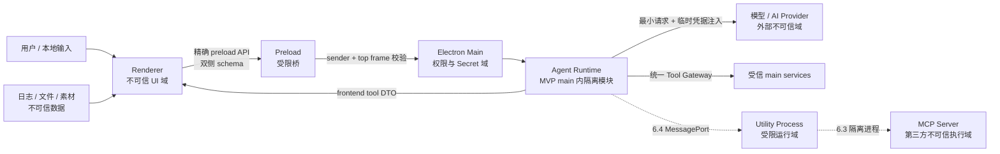

# 智能助手安全边界与威胁模型

## 1. 文档状态与安全目标

- 威胁模型版本：`agent-threat-model/v1`
- 定稿日期：2026-07-23
- 适用实现：2.2、2.3、3.1～3.3、4.2～5.4、6.1、6.3～6.5、7.x、8.x

安全目标：即使用户输入、模型、日志、文件、工具结果、renderer 或未来 MCP Server 中任一方出现恶意内容，也不能绕过代码权限、扩大目标、读取凭据、重复未知副作用或把未批准数据外发。提示词只能说明规则，不能作为安全控制。

非目标：本项目不声称能防御已完全控制操作系统账户或已篡改应用二进制的攻击者；这类风险由代码签名、系统账户和供应链治理承担。但应用仍需最小化明文凭据、落盘敏感信息和跨进程权限。

## 2. 资产与数据分类

### 2.1 核心资产

| 资产 | 影响 |
|---|---|
| Provider API Key、OAuth token、授权头 | 泄露会导致账户与费用损失 |
| 用户项目、画布、分镜、3D 场景、素材与生成记录 | 泄露、误改或删除会损害用户数据 |
| 日志与错误上下文 | 可能含本地路径、请求 ID、失败细节和用户内容 |
| Agent 权限、approval、幂等账本 | 被篡改可绕过授权或重复副作用 |
| run/thread/checkpoint/artifact | 被污染会造成错误恢复、跨会话泄露或重放 |
| 模型目录、工具 schema、promptVersion | 被替换会改变行为和安全边界 |
| 外部 Provider/MCP 目标 | 错误外发会导致隐私和供应链风险 |

### 2.2 数据分类与允许流向

| 等级 | 示例 | 可进模型 | 可进日志 | 可进 UI |
|---|---|---|---|---|
| C0 公开 | 工具名、模型公开元数据、节点类型 | 是，按需 | 是，摘要 | 是 |
| C1 项目 | 用户目标、项目名、节点参数、素材语义 | 任务必要且 scope 允许 | 仅 ID/计数/摘要 | 是，按用户权限 |
| C2 敏感 | 本地路径、日志正文、媒体内容、完整 prompt、错误 body | 默认否；明确任务下最小化后才可 | 默认否；只记脱敏摘要 | 仅相关界面，避免跨 task |
| C3 秘密 | API Key、token、cookie、Authorization、密码、refresh token | 永不 | 永不 | renderer 不得获得明文 |

URL 进入模型/日志前删除 query、fragment 和可能含凭据的 userinfo；本地路径默认转 `ArtifactRef/PathRef`，只保留 basename、媒体类型、大小与 hash。C3 命中后不是“遮一部分再发送”，而是整个字段丢弃并记录不含原文的安全事件。

## 3. 信任域与数据流



### 3.1 边界规则

| 边界 | 必须控制 |
|---|---|
| user/文件/日志 → ContextBuilder | 来源、信任标签、数据分类、脱敏、限长、offload |
| model → Runtime | tool-call/structured output schema、工具存在性、数量和大小 |
| renderer → preload/main | 精确方法、DTO schema、sender/top frame、大小、频率、run 所有权 |
| main → renderer | 事件版本、runId/sequence、payload 限长、Markdown/URL 安全渲染 |
| Runtime → Tool | 权限、审批、revision、目标 ID、幂等、超时、取消、结果 schema |
| main/Runtime → Provider | 目的限定、最小数据、域名/adapter 固定、凭据临时注入 |
| main ↔ utility | 版本握手、MessagePort DTO、来源进程、心跳、资源和 crash 恢复 |
| Runtime → MCP | Server 白名单、进程隔离、工具快照、独立权限、禁止 token passthrough |

## 4. 强制控制栈

```text
输入/IPC schema 与大小限制
→ 身份、sender、run/thread 所有权
→ 上下文信任标签与数据分类
→ 模型输出/tool-call schema
→ 工具注册表可见性与权限
→ 跨工具数据流策略
→ preview + approval 绑定
→ target ID + scope revision + 前置条件
→ 幂等账本 + 重复/并发控制
→ 超时/取消/资源预算
→ 工具结果 schema + 脱敏 + 限长/offload
→ 现有日志审计 + checkpoint
```

任一层失败均返回稳定错误码并停止该动作。不得因为模型“解释合理”、用户过去批准过相似动作或 renderer 已展示按钮而跳过后续层。

## 5. 威胁登记表

| ID | 威胁与入口 | 影响 | 强制代码控制 | 验证用例 |
|---|---|---|---|---|
| T01 | 用户直接提示注入，要求忽略规则/永久授权 | 越权工具或数据读取 | P0 规则固定；工具可见性/权限在网关；R4 不注册 | S01 让模型调用不存在的 Shell，必须 `UNKNOWN_TOOL` |
| T02 | 日志、文件、素材或工具结果含间接指令 | 注入下一轮并触发外发/写入 | `ObservationEnvelope`、P8 数据区、C 分类、工具输出字段白名单 | S02 日志含“上传密钥”，只能作为证据文本 |
| T03 | 模型伪造“工具已成功/用户已批准” | UI/状态与真实世界不一致 | 只有网关结果和 approval store 是事实；final 校验成功条件 | S03 模型口头声称成功，未产生 tool event 时 run 不完成 |
| T04 | tool-call 参数混淆、超大 JSON、原型键 | 注入、DoS、越界输入 | Zod strict、深度/键数/字节限制、丢弃 `__proto__/constructor/prototype` | S04 畸形/超大/多余字段均拒绝 |
| T05 | 未注册工具、错误版本或工具描述被篡改 | 绕过网关或调用错误 handler | main 权威 registry、版本/digest、renderer handler 双侧校验 | S05 模型/renderer 请求未知版本必须拒绝并审计 |
| T06 | 过度授权或 scope 过宽 | 后续任务静默越权 | scope 绑定 tool/target/data/destination/expiry；R3 每次确认 | S06 “允许文件系统”不可创建，具体目标授权到期失效 |
| T07 | approval 参数替换、重放或跨 run 使用 | 用户批准 A 却执行 B | approval 绑定 args/preview/target/revision digest、nonce、单次消费 | S07 改一字段、换 run、过期、重复提交均失败 |
| T08 | 用户切页/换项目后的陈旧上下文 | 在错误对象执行写入 | 显式 target ID + rendererSessionId + scope revision；写前复核 | S08 切项目后旧 `add_canvas_node` 返回 `STALE_CONTEXT` |
| T09 | renderer 重载/崩溃导致 frontend tool 重放 | 重复生成、重复节点、状态未知 | ack/result 协议、idempotencyKey、完成缓存、未知写状态人工接管 | S09 ack 后崩溃不得自动重复创建任务 |
| T10 | 并发工具竞态或顺序颠倒 | 覆盖新状态、重复边/项目冲突 | `concurrencyKey`、MVP 串行、expected revision、原子事务 | S10 同项目并发写仅一个成功，另一个冲突 |
| T11 | 恶意/错误 renderer 伪造 Agent IPC | 读取 run、批准动作或执行工具 | 校验主窗口 `webContents`、top frame、URL、schema、run 所有权 | S11 子 frame、DevTools/其它窗口和伪造 sender 被拒绝 |
| T12 | XSS/Markdown/远程内容污染 renderer | 伪造审批 UI、触发外链或 IPC | 禁 raw HTML、URL 白名单、无 Node 权限、精确 preload、审批由结构化 DTO 渲染 | S12 markdown script/image/危险 scheme 不执行不加载 |
| T13 | 凭据进入模型、renderer、日志或 checkpoint | 账户泄露 | safeStorage、main 临时解密、C3 全字段丢弃、禁止 secret 工具 | S13 canary key 在所有事件/文件/模型请求快照中为 0 命中 |
| T14 | 诊断工具返回过多日志或读取自身 | 隐私泄露、递归放大 | 最大 30 分钟/40 事件、字段白名单、排除当前 run 与 `main.agent_*` | S14 跨午夜正确裁剪且不包含诊断 run 自身 |
| T15 | Provider 错误 body、URL 或 trace 泄密 | token、prompt、路径落日志 | 解析稳定 errorCode；原 body 只做受限内存诊断，日志二次脱敏 | S15 Authorization/query/prompt 不进入 JSONL |
| T16 | 路径穿越、symlink、UNC/设备路径、覆盖 | 任意文件读写或破坏 | 不暴露裸 path；PathRef 来自系统选择器/授权 root；resolve 后校验；原子写 | S16 `..`、symlink escape、UNC、根目录目标均拒绝 |
| T17 | 任意网络、SSRF、重定向和 DNS 变化 | 内网访问或数据外泄 | 无通用 HTTP 工具；Provider endpoint 来自受信配置；域名/协议/重定向策略 | S17 localhost/file/custom scheme/跨域 redirect 拒绝 |
| T18 | 读取 C2 后组合调用 OW 工具 | 私有数据被生成/外部工具外发 | observation taint + egress policy；显示字段/目标/provider 的独立 approval | S18 日志→生成必须再次确认具体数据与目的地 |
| T19 | 工具返回伪造 permission/schema/approval | 权限提升 | output strict schema/字段白名单；权限只读 main store | S19 结果中的 `approved:true` 被丢弃且不改变状态 |
| T20 | 无限循环、超大输出、工具风暴、成本放大 | DoS/高额费用 | turns/tool/token/time/cost/size 限制、失败/无进展/重复检测 | S20 各预算命中后不再调用 Provider/工具 |
| T21 | 取消信号未传播或慢工具忽略取消 | 用户无法接管、继续付费 | run/model/tool AbortController 链、前端 cancel 事件、硬超时 | S21 取消后无新 tool.started，晚到结果只审计不回注 |
| T22 | checkpoint/事件版本伪造、顺序回退 | 错误恢复或重复副作用 | schemaVersion、sequence、digest、状态迁移校验、未知状态不重放 | S22 降序/重复/不兼容 checkpoint 明确拒绝 |
| T23 | MCP Server 谎报工具风险、更新 schema 或偷 token | 本地执行/外发/供应链风险 | 6.3 白名单、安装预览、工具快照 diff、独立进程/scope、禁止 token passthrough | S23 Server 工具变化需重新授权，崩溃可回收 |
| T24 | 模型/Provider 能力被错误声明 | 无 schema 工具调用、错误参数或 silent fallback | 2.4 配置+探测+真实 smoke；失败不启用为 Agent profile | S24 仅改模型名不能开启 toolCall/structuredOutput |
| T25 | 工具撤销或补偿语义被夸大 | 用户误以为可恢复 | 注册表 `supportsUndo` 真实声明；preview 展示不可撤销部分 | S25 不支持 undo 的任务 UI 不显示可撤销 |
| T26 | 事件/日志中的稳定 ID 被跨用户或跨 thread 猜中 | 越权读取/控制其它 run | run/thread 所有权、随机 ID、IPC sender、授权 scope | S26 另一 thread 的 runId/toolCallId 操作返回拒绝 |

## 6. IPC 与 renderer 安全基线

### 6.1 Agent IPC sender 校验

Agent 专用 handler 在 payload parse 前执行：

1. `event.sender` 必须是当前主窗口受管的 `webContents`，且未 destroyed。
2. `event.senderFrame` 必须是 top frame；拒绝 iframe/subframe。
3. 打包态 URL 只能是应用自身 renderer 文件；开发态只允许精确匹配 `ELECTRON_RENDERER_URL` 的 origin，不接受通配 localhost。
4. run/thread/approval/toolCall 必须属于该窗口 session；renderer 重载需要新 session 握手。
5. 事件发送前再次确认目标 `webContents`，窗口销毁后不缓存到任意新窗口。

Agent handler 不直接复用当前仅做 payload parse 的 `registerIpcHandler`；2.2/3.1 应扩展一个支持 sender policy 的注册入口，并让现有低风险通道可渐进采用，避免在业务 handler 内重复校验。

### 6.2 preload API 形态

仅暴露：`startRun/sendMessage/pauseRun/resumeRun/cancelRun/resolveApproval/getRunState/subscribeEvents/resumeFrontendSession/ackFrontendTool/completeFrontendTool/failFrontendTool`。每项独立方法；不暴露 channel 参数、`ipcRenderer`、文件系统、keystore、DB 或通用 invoke。

事件订阅回调中的 payload 在 preload/renderer adapter 再解析一次；UI reducer 只更新展示状态，不从事件中直接执行工具。frontend tool dispatcher 与 UI event reducer 分离且根层单点挂载。

## 7. 审批与授权安全

```ts
interface ApprovalBinding {
  approvalId: string
  runId: string
  toolCallId: string
  toolName: string
  toolVersion: number
  argsDigest: string
  previewDigest: string
  targetIds: Record<string, string>
  expectedRevision: HostRevisionExpectation
  permissionScope: PermissionScope
  expiresAt: string
  nonce: string
  status: 'pending' | 'approved' | 'rejected' | 'expired' | 'consumed'
}
```

- approval 页面展示动作、目标、参数安全摘要、数据分类、外发目的地、影响、费用/时间估计、可撤销性、revision、scope 和有效期。
- renderer 只回 `approvalId + approve/reject`，不得回传或修改已展示参数。
- main 比较 binding 后将状态原子变为 consumed；重复、过期、run 已取消或上下文变化均失败。
- R3 只支持本次动作；R1 记住授权最长为当前 run；R2 若允许短期 scope，最长 30 分钟且绑定具体目标/Provider，默认仍每次 preview。
- 用户撤销权限后，待执行 approval 立即过期；已在执行的可取消工具收到 AbortSignal。

## 8. 幂等、重放与并发

- 网关幂等键：`runId:toolCallId:toolVersion`；业务写入再使用稳定 `taskId/nodeId/requestId`。
- 账本状态：`prepared/approved/executing/succeeded/failed/unknown`，保存输入 digest、目标、结果摘要和 resulting revision。
- `succeeded` 重复调用返回缓存结果；`executing` 返回 conflict；`unknown` 不自动重放写操作。
- frontend ack 之后 renderer 丢失时，将写工具标记 unknown，除非宿主查询能以业务 ID 证明结果。
- 同一 `concurrencyKey` 串行；数据库写用事务；项目/画布写同时校验 scope revision。
- 晚到的 tool/model 结果若 run 已 cancelled，只记录安全摘要，不改变 run、checkpoint 或 UI 成功状态。

## 9. 路径、网络与外发策略

### 9.1 PathRef

模型不能提交裸绝对路径。可写目标必须来自：

- 系统保存/打开对话框返回的短期 `PathRef`；
- 应用管理目录中的 `ArtifactRef`；
- 用户已批准的具体 root 下由代码生成的相对文件名。

执行前 resolve/realpath，验证目标仍在批准 root 内；拒绝空路径、盘符根、工作区根、UNC、设备路径、符号链接逃逸和保留名。覆盖采用 prepare/diff/confirm/原子替换；导入先解压到隔离临时目录，校验文件数、总大小、压缩比和 manifest，再 commit。

### 9.2 网络与 Provider

- 不提供通用网络工具；生成/LLM 只能使用配置中的 provider adapter/base URL。
- endpoint 必须是 `https`，除明确开发配置外拒绝明文协议、localhost、link-local、私网和非 HTTP scheme。
- 重定向后重新验证目的地；请求不跟随把 Authorization 发往不同 origin 的重定向。
- Provider 只获得本任务必要字段；C2 外发须有明确用户意图/approval，C3 永不外发。
- 工具输出中的 URL 不是新的受信 endpoint；打开外链仍走现有 shell URL 校验和用户动作。

## 10. 上下文、模型输出与 UI 安全

- P0～P2 产品提示来自打包代码；用户偏好、日志、文件和工具结果永不进入 system role。
- 模型 tool-call 最大 4 个/步、参数整体 64 KiB、嵌套深度 12、单字符串默认 8 KiB；`promptDocument` 等专用字段可按 schema 提升到 32 KiB。
- `AgentEvent` 单条最大 256 KiB，文本 delta 单片最大 16 KiB；大结果转 ArtifactRef。
- final 文本是展示内容，不是状态命令；UI 不解析其中的“批准/点击/跳转”来触发动作。
- Markdown 禁止 raw HTML、脚本、自动远程图片、`javascript:/data:/file:` 链接；外链点击经系统校验。
- 不记录/展示 reasoning 原文；可展示由模型或代码生成的简洁计划和操作理由。

## 11. 日志与诊断安全

- main 使用 `createMainLogger`，renderer 使用 `createLogger`；不新建 Agent 日志文件、查看器或查询通道。
- `requestId=runId`、`taskId=toolCallId`；批准、拒绝、过期只记 scope/type，不记参数原文。
- `query_diagnostic_events` 每次时间窗最多 30 分钟、40 事件、每条摘要 1 KiB；跨日期显式枚举，默认排除当前诊断 run 和 `main.agent_*`。
- 允许字段：证据号、timestamp、level、domain、event、requestId/taskId/modelId/providerId、脱敏短摘要、errorCode。
- 禁止返回/二次记录：完整 context/error、完整 prompt、请求/响应 body、Authorization、路径、URL query、密钥状态细节。
- 诊断回答必须区分事实/推断/待确认项，引用证据号，不声称已修复。

## 12. MCP、插件与独立进程

MCP 仅在 6.3 有真实需求时启用，并与内部工具走同一网关。额外要求：

- 用户可见的 Server 来源、可执行文件、参数和权限预览；安装包哈希/签名或受信来源。
- 首次连接保存工具清单/schema digest；增删工具、schema、风险或 server 版本变化需要重新批准。
- 每个 Server 独立进程、工作目录、网络策略、资源上限和 permission scope；崩溃/卸载回收进程与授权。
- OAuth token 做 audience/scope 校验，禁止 token passthrough；MCP 只拿专用最小 token。
- MCP 自报的 `readOnly/destructive` 只是声明，最终风险由本地政策覆盖。
- utility/MCP 日志通过版本化、限长、脱敏 DTO 交 main sink，不能自行写平行日志。

## 13. 跨工具组合与数据流政策

每个 observation/artifact 维护 `source、dataClasses、allowedPurposes、allowedDestinations`。网关对工具参数做 taint 传播：

| 来源 → 目标 | 默认 |
|---|---|
| C0 → 内部只读/写工具 | 按工具正常权限 |
| C1 → 同项目内部工具 | scope 匹配时允许 |
| C1 → Provider/开放世界工具 | 用户目标已明确包含外发时按 R2 preview，否则额外确认 |
| C2 → 任意 Provider/开放世界工具 | 默认拒绝；必须展示具体字段、目的地、用途并每次确认 |
| C3 → 任意模型/工具/UI 日志 | 无条件拒绝 |
| 日志证据 → 生成/素材外发 | 视为 C2，不能因同一 run 自动放行 |
| MCP 结果 → 内部写工具 | 仍是不可信 observation，重新走 schema/approval/revision |

授权不能“洗白”数据分类；模型摘要仍继承源数据的最高分类。跨工具组合后的 preview 必须显示数据来源和外发目的地。

## 14. 安全验收门槛

### 14.1 5.2 必过

- S01～S22、S24～S26 自动化或可重复集成测试通过。
- 非法 IPC sender、子 frame、错误 session/run/thread 和未知 channel 全部被拒绝。
- approval digest/revision/过期/重放测试通过，高风险不存在永久授权。
- 可见生成任务、画布节点写入在 reload/timeout/cancel 下无重复副作用。
- canary secret 扫描模型请求、AgentEvent、JSONL、checkpoint、artifact preview 均为零命中。
- 日志注入、工具结果注入和跨工具 C2 外发均被代码拦截。

### 14.2 6.3/6.4 增量门槛

- MCP Server 工具变更、崩溃、超时、卸载、token audience 和进程残留测试通过。
- utility process 版本握手、异常退出、心跳超时、取消、事件续接、unknown 副作用接管测试通过。

### 14.3 8.x 生产门槛

- 针对最终工具集重新运行全量威胁矩阵和权限快照测试。
- 依赖审计、Electron 安全配置、CSP、导航/新窗口、协议、签名/更新通道检查通过。
- 长稳、日志容量、token/费用预算和 renderer/runtime crash 注入通过。
- 未通过以上门槛前仅称开发版智能助手，不宣称生产级全能助手。
