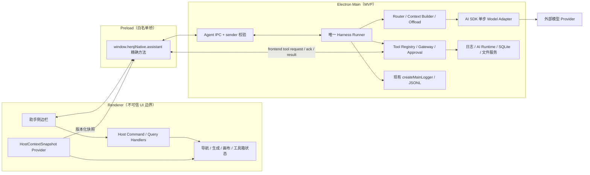

# 智能助手整体架构与执行框架（Harness）设计说明

## 1. 文档状态

- 契约版本：`agent-contract/v1`
- 定稿日期：2026-07-23
- 适用任务：2.1～6.5、7.1～8.2
- 设计边界：本文件冻结可编码契约，不实现业务代码

本设计落实 `重要记录.md` 001～008。已经确定的选型不在后续任务中重新打开；若出现不兼容变更，必须提升契约版本并写迁移或明确拒绝策略。

## 2. 已核实的仓库基线

| 事实 | 当前入口 | 设计结论 |
|---|---|---|
| 工作区导航是组件局部状态 | `src/App.tsx` 的 `activeTab` | 2.1 先收口为宿主状态，Agent 不直接触碰组件 state |
| 工具箱选择是组件局部状态 | `src/workspaces/ToolboxWorkspace.tsx` 的 `activeToolId` | 纳入宿主上下文与命令面 |
| 可见生成任务由 Hook 编排 | `useTaskGeneration.handleGenerate()` | 必须抽取完整编排，不能直接调用 `GenerationService.generate()` |
| 画布已有稳定 ID 与撤销 | `canvasStore.addNode/addEdge/undo/redo` | frontend 工具返回 nodeId/edgeId/undo token |
| 项目状态在 renderer | `projectStore.currentProjectId/currentProject` | main 通过快照和 frontend 工具访问，不导入 store |
| LLM 流只支持文本/reasoning | `electron/main/services/llm/streaming.ts` | 2.3 新建 Agent 模型适配，解析 tool-call/usage/structured output |
| IPC 只有 payload 解析 | `electron/main/ipc/registry.ts` | Agent IPC 必须在通用解析外增加 sender/top-frame 校验 |
| Electron 安全开关已启用 | `electron/main/window.ts` | 保持 `contextIsolation:true/nodeIntegration:false/sandbox:true` |
| 日志查询在 main | `electron/main/services/logging/query.ts` | 诊断工具直接复用 main service，不绕 renderer command |

AI SDK 6 官方文档确认：`generateText/streamText` 默认只执行一个 generation，工具没有 `execute` 时不会被 SDK 自动执行；需要完全控制循环时可以使用 Core API 自建循环。因此本项目使用单步 `streamText/generateText`，不设置多步 `stopWhen`，不把工具 `execute` 交给 SDK。参考：[工具调用](https://ai-sdk.dev/docs/ai-sdk-core/tools-and-tool-calling)、[Loop Control](https://ai-sdk.dev/docs/agents/loop-control)。

## 3. 架构原则

1. Harness Runner 是唯一循环、状态、预算、审批、取消、检查点和停止条件所有者。
2. 模型只产生文本或结构化 tool-call；模型不能执行工具、批准权限或声明副作用已成功。
3. 宿主能力先形成与 Agent 无关的 `HostCommand/HostQuery/HostContextSnapshot`，UI 与 Agent 复用同一业务编排。
4. frontend/backend 两侧执行，但只有 main Runtime 的 Tool Gateway 能裁决工具可见性、权限、审批、预算和幂等。
5. `src/core/assistant/` 只放可序列化 DTO、枚举和 schema，不依赖 React、Electron 或 provider SDK。
6. 所有 IPC、模型输出、工具输入/输出均用 Zod 双侧解析；schema 对象不跨进程，只传普通 DTO。
7. 日志复用现有 sink；`requestId = runId`、`taskId = toolCallId`。
8. 不提供通用 Shell、任意文件系统、任意 URL 请求或通用 IPC 工具。

## 4. 目标分层与数据流



### 4.1 层级职责与禁止事项

| 层 | 负责 | 禁止 |
|---|---|---|
| renderer | 展示、输入、审批 UI、宿主动作、上下文快照 | API Key、模型循环、权限裁决、任意 IPC |
| preload | 精确方法、事件订阅、最小 DTO 转发 | 通用 `invoke/send`、业务判断、缓存权限 |
| main IPC | sender/schema 校验、运行 API、事件转发 | 直接信任 renderer、把 Error/SDK 类型原样跨 IPC |
| Runner | 单一循环、状态、预算、取消、检查点、事件顺序 | UI 逻辑、provider 私有类型、直接绕过网关调用工具 |
| Tool Gateway | 注册表、风险、审批、revision、幂等、结果校验 | 根据模型文本临时放权、执行未注册工具 |
| frontend handler | 调用 renderer 宿主命令并返回稳定结果 | 再做一套权限系统、导入 main/provider |
| backend tool | 直接复用 main service | 导入 `src/components`、renderer command/store |
| Model Adapter | Provider、单步流、tool-call/usage/structured output | 自动多步循环、审批、工具副作用 |

### 4.2 目录冻结

```text
src/core/assistant/                 # DTO、schema、错误码、宿主契约
src/features/assistant/
  hostContext/                     # renderer 快照提供者
  frontendTools/                   # 单点 dispatcher 与 handler map
  sidebar/                         # 侧边栏和展示
  store/                           # 纯 UI 展示状态
src/commands/assistant.ts          # renderer 命令桥
src/platform/contracts/assistant.ts
src/platform/adapters/electron/assistant.ts
electron/main/ipc/assistant.ts
electron/main/services/agent-runtime/
  runner/ models/ tools/ context/ persistence/ diagnostics/
```

6.4 迁移时只把 `electron/main/services/agent-runtime/` 中无 Electron 依赖的部分平移到 utility process；renderer API、共享 DTO、事件和工具契约保持不变。

## 5. 共享宿主契约

### 5.1 通用信封

```ts
interface ContractEnvelope<T> {
  schemaVersion: 1
  requestId: string
  sentAt: string
  payload: T
}

type HostResult<T> =
  | { ok: true; data: T; revision?: HostRevision; undo?: UndoRef }
  | { ok: false; error: HostError }

interface HostError {
  code: HostErrorCode
  message: string
  retryable: boolean
  recovery?: 'refresh_context' | 'request_approval' | 'wait' | 'user_action' | 'none'
  safeDetails?: Record<string, unknown>
}
```

错误码首版冻结为：`INVALID_INPUT`、`NOT_FOUND`、`NOT_READY`、`STALE_CONTEXT`、`PRECONDITION_FAILED`、`PERMISSION_DENIED`、`APPROVAL_REQUIRED`、`CONFLICT`、`TIMEOUT`、`CANCELLED`、`UNAVAILABLE`、`RESULT_INVALID`、`INTERNAL_ERROR`。跨 IPC 只返回安全错误，不返回 stack 和原始 provider body。

### 5.2 HostCommand 与 HostQuery

```ts
interface HostCommand<TName extends string, TInput> {
  name: TName
  commandId: string
  input: TInput
  targetIds: Record<string, string>
  expectedRevision?: HostRevisionExpectation
  idempotencyKey: string
}

interface HostQuery<TName extends string, TInput> {
  name: TName
  queryId: string
  input: TInput
  targetIds?: Record<string, string>
  expectedRevision?: HostRevisionExpectation
}
```

- 每个命令/查询是显式判别联合成员，不提供 `execute(name,args)` 给业务组件。
- 写命令必须携带稳定目标 ID；“当前项目”“当前节点”只能在计划阶段解析，提交时转成 `projectId/nodeId`。
- HostCommand 负责完整业务语义，例如 `create_visible_generation_task` 必须包含媒体落盘、任务入列、队列、历史、提示和 taskId 返回。
- HostQuery 无副作用；读取 main 数据的查询直接落 main service，读取 renderer store 的查询走 frontend 往返。

### 5.3 HostContextSnapshot 与 revision

```ts
interface HostRevision {
  rendererSessionId: string
  global: number
  scopes: {
    navigation: number
    generation: number
    canvas: number
    toolbox: number
    assets: number
  }
}

interface HostContextSnapshot {
  schemaVersion: 1
  snapshotId: string
  capturedAt: string
  revision: HostRevision
  readiness: { app: 'initializing' | 'ready' | 'degraded'; reasons: string[] }
  workspace: { active: WorkspaceId; assetView: 'closed' | 'workspace' | 'floating' }
  generation: { selectedModelId?: string; activeTaskIds: string[] }
  canvas: { projectId?: string; selectedNodeIds: string[]; nodeCount: number; edgeCount: number }
  toolbox: { activeToolId?: 'cameraStage' | 'imageMark'; cameraStageProjectId?: string }
  assets: { selectedAssetIds: string[]; activeLibraryId?: string }
  capabilities: string[]
}
```

规则：

- `rendererSessionId` 每次 renderer 启动变化；计数只在会影响工具前置条件的状态变化时递增，不跟随鼠标、动画或生成进度抖动。
- 工具声明 `requiredContext` 和 `revisionScopes`；网关只比较相关 scope，避免无关 UI 变化制造冲突。
- session 不同、目标 ID 不存在或相关 scope 不同均返回 `STALE_CONTEXT`，附最新快照摘要，Runner 最多自动刷新一次后重新规划。
- revision 校验不能替代明确 ID；二者同时满足才执行写操作。

## 6. Tool 契约与权威网关

```ts
interface AgentToolDefinition<TInput, TOutput> {
  name: string
  version: 1
  title: string
  description: string
  side: 'frontend' | 'backend'
  inputSchema: ZodType<TInput>
  outputSchema: ZodType<TOutput>
  risk: 'read' | 'reversible_write' | 'impactful_write' | 'high_risk' | 'blocked'
  permissions: string[]
  approval: 'automatic' | 'once_per_run' | 'preview_each_time' | 'confirm_each_time' | 'never'
  readOnly: boolean
  destructive: boolean
  openWorld: boolean
  idempotent: boolean
  timeoutMs: number
  retryPolicy: { maxAttempts: number; retryOn: string[] }
  supportsPreview: boolean
  supportsUndo: boolean
  concurrencyKey?: string
  requiredContext: string[]
  revisionScopes: Array<keyof HostRevision['scopes']>
}
```

注册表只在 main/Runtime 持有 Zod schema 和 handler。发送给模型的是从权威定义投影、裁剪后的 JSON Schema；发送给 renderer 的是版本化普通 DTO。renderer handler map 再按共享 schema 解析，缺少 handler 或版本不匹配时拒绝。

### 6.1 网关固定顺序

```text
查注册表/版本
→ 输入 schema 与大小限制
→ 工具可见性、权限、风险和数据流策略
→ 预算、并发键、取消状态
→ preview（若需要）
→ approval 绑定并等待
→ revision/目标/前置条件复核
→ 幂等账本与重复调用检测
→ 执行（frontend 或 backend）
→ 输出 schema、脱敏、限长与 artifact offload
→ 记录日志、观察和检查点
```

自动重试只允许只读或明确幂等工具，且默认最多 2 次。非幂等写操作在超时、renderer 崩溃或进程退出后状态未知时不得自动重放，必须查询幂等账本或交用户接管。

## 7. AgentEvent v1

### 7.1 基础字段

```ts
interface AgentEventBase {
  schemaVersion: 1
  eventId: string
  sequence: number
  occurredAt: string
  runId: string
  threadId: string
  toolCallId?: string
  modelCallId?: string
  causationId?: string
}
```

- `sequence` 在单个 run 内由 Runner 单调递增且不复用；UI 以 `runId + sequence` 去重和补洞。
- `eventId` 全局唯一，用于跨进程去重；`causationId` 指向触发本事件的 event/tool/model call。
- 事件 payload 必须是可序列化 DTO，单条不超过 256 KiB；大内容只发 `ArtifactRef`。
- 不发送或持久化私有思维链；UI 只展示模型最终文本、简洁计划、工具理由和证据。

### 7.2 事件集合

| 领域 | 事件 |
|---|---|
| run | `run.started/paused/resumed/cancelling/completed/failed/cancelled` |
| model | `model.started/output_delta/completed/failed` |
| plan | `plan.updated` |
| context | `context.snapshot_updated/compacted/artifact_offloaded` |
| tool | `tool.requested/acknowledged/started/progress/completed/failed` |
| approval | `approval.required/resolved/expired` |
| checkpoint | `checkpoint.saved/restored` |
| artifact | `artifact.created` |

`model.completed` 带 provider/model、finishReason 和实际 usage；`tool.completed` 只带安全摘要、稳定 ID、artifact/undo 引用，不携带未裁剪原始结果。

## 8. frontend 工具往返协议

```text
main Tool Gateway
  → frontend_tool.requested(callId, tool, version, args, deadline, idempotencyKey)
renderer dispatcher
  → frontend_tool.acknowledged(callId, rendererSessionId)
renderer handler
  → frontend_tool.completed(callId, result, resultingRevision)
  或 frontend_tool.failed(callId, safeError, resultingRevision?)
```

规则：

1. ack 只表示唯一 dispatcher 已认领，不代表执行成功；默认 2 秒未 ack 判 renderer 不可用。
2. 执行超时由工具定义，默认 30 秒；创建可见生成任务允许 60 秒，但只等待 taskId 入列，不等待生成完成。
3. renderer 必须缓存本 session 已完成的 `callId/idempotencyKey → result`；重复请求返回同一结果，不重复副作用。
4. renderer 重载后先调用 `resumeFrontendSession(lastSequence)`，main 返回未完成调用。未 ack 的只读调用可重发；已 ack 的写调用先查幂等账本，状态未知则 `CONFLICT + user_action`。
5. main 忽略重复 terminal result；未知 callId、错误 runId、过期 deadline、错误 session 或版本不匹配全部拒绝并记录安全日志。
6. 取消链为 `run AbortController → model/tool AbortSignal → frontend_tool.cancelled`；handler 必须在可取消边界检查信号。

## 9. 唯一 Runner 与状态机

### 9.1 状态

```text
created → running ↔ paused
running → waiting_approval → running
running → waiting_frontend_tool → running
任意非终态 → cancelling → cancelled
任意非终态 → failed
running → completed
```

终态为 `completed/failed/cancelled`，不可恢复为 running。审批过期返回 running 并追加拒绝观察，或按任务政策 failed；应用崩溃后的恢复使用新 recovery attempt，不篡改旧事件序列。

### 9.2 每轮固定算法

```text
预算/取消/截止时间检查
→ 获取或刷新 HostContextSnapshot
→ 构建分层上下文和 activeTools
→ AI SDK 单步模型调用（工具不带 execute，不启用多步 stopWhen）
→ 校验 final 或 tool-call
→ final：验证成功条件后完成
→ tool-call：逐个进入 Tool Gateway（MVP 默认串行）
→ 将已校验 observation 回注
→ 保存检查点
→ 重复/无进展/失败限制检查
→ 下一轮
```

同一模型响应包含并行工具时，只有全部为只读、无共享 `concurrencyKey`、预算允许且无审批时才可并行；首版统一串行，3.2 经测试后再开放。

### 9.3 停止与恢复

- 默认上限：12 turns、12 model calls、20 tool calls、10 分钟、连续失败 3 次、等价调用连续 2 次、无进展 3 轮。
- 任一硬限制命中后停止模型调用；若已有可用结果则返回“部分完成”，否则 failed，并说明恢复建议。
- 写工具成功后立即保存检查点；生成工具以“可见 taskId 已创建”为该工具成功，不等待远端生成完毕。
- checkpoint 记录 prompt/model/tool/contract 版本和 observation 引用；版本不兼容时明确拒绝恢复。

## 10. 审批、预算与幂等骨架

- approval 绑定 `approvalId/runId/toolCallId/toolVersion/argsDigest/targetIds/revision/previewDigest/scope/expiresAt/nonce`，一次消费；参数或上下文变化后失效。
- 高风险操作只允许本次确认；可记住的授权最多绑定具体工具、具体目标、具体数据类别和有限时长。
- 写工具 idempotency key 固定为 `runId:toolCallId:toolVersion`；业务层若已有稳定任务 ID，再作为第二层幂等键。
- 重复检测使用规范化 `toolName + argsDigest + targetIds`，同一组合连续两次无状态变化即暂停并要求模型换策略。
- 预算权威数据来自 AI SDK `usage/totalUsage`；价格未知时不伪造费用，只执行 token、调用次数和时长硬限制。

## 11. 日志契约

| domain | 最小 event |
|---|---|
| `main.agent_runtime` | `agent_runtime.run.started/completed/failed/cancelled` |
| `main.agent_model` | `agent_model.call.started/completed/failed` |
| `main.agent_context` | `agent_context.build.completed/compacted/artifact_offloaded/failed` |
| `main.agent_tool` | `agent_tool.execute.started/completed/failed` |
| `main.agent_approval` | `agent_approval.requested/resolved/expired` |
| `main.agent_checkpoint` | `agent_checkpoint.save.completed/restored/failed` |
| `features.assistant.frontend_tools` | `assistant_frontend_tool.execute.started/completed/failed` |
| `features.assistant.ui` | `assistant_ui.run.started/cancelled`、`assistant_ui.approval.resolved` |

所有事件使用 `requestId=runId`；工具和审批事件使用 `taskId=toolCallId`；模型事件携带 `modelId/providerId`。`threadId/toolName/step/usage/durationMs/errorCode` 放脱敏 context。禁止记录 API Key、Authorization、完整 prompt、完整消息、原始日志、原始工具结果或私有 reasoning。

高频 delta/progress 只记 debug/trace 且不含正文。日志写入失败不得破坏业务流程；但运行事件流和 checkpoint 失败属于 Runtime 状态错误，必须显式处理。

## 12. 进程迁移边界

MVP 的 Runner 暂驻 main，但必须满足：

- 只依赖序列化端口接口，不持有 `BrowserWindow`、`ipcMain`、safeStorage 或 renderer store 引用。
- Electron、凭据和日志 sink 通过 main adapter 注入。
- 事件、命令、查询、审批和 checkpoint 都使用上述 v1 DTO。
- 6.4 迁移后 main 增加 RuntimeManager；utility process 通过 MessagePort 复用同一协议，凭据仍由 main 按调用临时代理，不广播明文。
- utility crash 后未知副作用不自动重放；根据幂等账本和 checkpoint 进入人工确认。

## 13. 直接支撑后续编码的验收门槛

- 2.2：共享 schema 在 renderer/main 双侧拒绝非法 payload；快照 scope revision 冲突可恢复；frontend request/ack/result 去重测试通过。
- 3.1：状态迁移、sequence、取消、预算、失败上限和检查点单测通过；不存在 SDK 自动第二循环。
- 3.2：每个工具均经网关；绕过权限、审批、revision、output schema 的调用不可达。
- 3.3：上下文只接收可信 DTO 和带标签 observation；大结果 offload。
- 4.2：UI 可按 sequence 重放，不执行事件中的动作，不展示 reasoning 原文。
- 6.4：迁移 utility process 时 renderer API 和 AgentEvent v1 不变。

## 14. 非目标

- 第一阶段不安装 AI SDK 依赖、不新增 IPC、不修改业务代码。
- MVP 不使用 `ToolLoopAgent`、Mastra、LangGraph、Python Sidecar、多 Agent 或 MCP。
- 内部能力不强制包装成 MCP；MCP 只在 6.3 有真实需求时接入同一网关。
