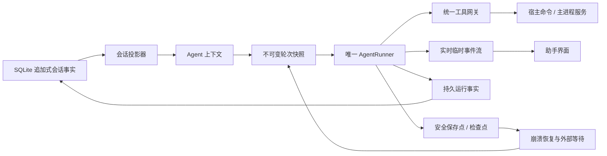

# 01 · 实施方案 —— 智能助手持续会话与运行时演进

## 当前项目和相关功能现状

Henji-AI 是 Electron + React + TypeScript 桌面应用。智能助手已经形成较完整的安全执行平面，主要链路如下：

- `src/features/assistant/`：侧边栏、对话、审批、运行历史和前端工具宿主；
- `src/commands/assistant.ts`、`src/platform/contracts/assistant.ts`：渲染层稳定命令和 PAL 契约；
- `electron/main/ipc/agent-runtime.ts`、`electron/preload/index.ts`：白名单 IPC 与安全桥；
- `electron/main/services/agent-runtime/runtime.ts`：主进程运行所有权、持久化、前端桥和恢复协调；
- `electron/main/services/agent-runtime-manager/manager.ts`：Utility Process 握手、心跳、RPC、崩溃检测和重启；
- `electron/main/agent-utility.ts`：独立 Agent 运行宿主；
- `electron/main/services/agent-runtime/runner/runner.ts`：唯一 Agent 循环、预算、模型步骤、工具调度和结果验证；
- `electron/main/services/agent-runtime/tools/`：注册表、网关、审批、幂等、并发、风险和数据分类；
- `electron/main/services/agent-runtime/context/`：路由、分层提示词、工具目录、压缩和 Artifact offload；
- `electron/main/services/agent-runtime/persistence/`：SQLite run、event、message、artifact、permission audit 和 checkpoint；
- `electron/main/services/llm/sdk/`：基于 AI SDK 的模型单步和 OpenAI-compatible Provider；
- `src/workspaces/GenerationWorkspace/application/visibleGenerationTaskCommand.ts`：可见生成任务创建、排队和状态更新。

两套既有计划已完成基础框架和第一轮智能化升级：

- `docs/task/智能助手`：基础架构、宿主工具、运行时、侧边栏和业务能力接入；仍有真实 Provider、交互和生产化验收待执行。
- `docs/task/智能助手智能化升级`：路由、工具语义、结果验证、上下文、记忆和可解释性；九项任务已完成，最终真实验收仍为待验证。

本计划以当前真实代码为基线，不把旧计划中“设计上已经覆盖”的描述当作现状结论；凡是代码仍存在的缺口，以当前实现为准。

## 当前实现方式

当前一次运行的核心流程是：

```text
renderer 提交 goal
  → main 创建 run、写入用户 goal
  → utility 创建全新的 AgentRunner
  → 固定本 run 的主模型 / 路由模型 / 摘要模型
  → 路由一次得到工具域
  → 每轮读取宿主快照、记忆和最多 8 个工具
  → 调用模型并逐条发布 ModelDelta
  → 统一网关执行工具、审批和验证
  → 完成后写入最终 assistant message
```

`threadId` 已存在，但目前主要用于 run 分组和同一 thread 的活动锁。每个 `AgentRunner` 的 `conversation` 都从空数组开始，持久化层没有提供按 thread 加载消息的 API，因此“在同一会话继续提问”实际上仍是互不共享 transcript 的新 run。

## 已核实的问题

| 问题 | 当前证据 | 影响 | 对应任务 |
|---|---|---|---|
| 长 run 恢复读取最早 2000 条事件 | `persistence/store.ts` 使用 `ORDER BY sequence ASC LIMIT 2000`，内存却保留最后 2000 条 | 重连可能缺少最新工具、审批和终局事件 | 1.1 |
| 流式增量逐条写 SQLite | `runner.ts` 每个文本 delta 发布 `ModelDelta`，`runtime.ts` 对所有事件执行 `appendEvent` | 长回答产生明显写放大，实时流与持久事实混用 | 1.1 |
| 截断工具调用仍可能执行 | `runner.ts` 只检查 `toolCalls.length`，未在 `finishReason=length` 等截断状态阻止执行 | 残缺参数可能触发真实副作用 | 1.2 |
| 审批预览没有完整消费绑定 | `approval.ts` 创建时保存 `previewDigest` 与目标，消费时只核对工具、参数和 revision | 用户批准后若预览语义漂移，审批约束不完整 | 1.2 |
| 权限审计表未形成实际闭环 | `migrations.ts` 已建 `agent_permission_audit`，当前运行链路没有持久写入入口 | 批准、拒绝、过期和消费难以追责 | 1.2 |
| 审批文案与策略不一致 | UI 将 `assistant_decides` 描述为“安全读取自动执行”，网关会自动放行全部 R1 | 用户预期与真实持久写入行为不一致；已确定 R1 及以上写操作进入审批，R0 仅保留非破坏轻量命令 | 1.2 |
| 部分已注册工具实际不可达 | `context/catalog.ts` 将静态领域列表直接 `slice(0, 8)`，有直接领域时不自动加入能力搜索 | 画布、素材等后半工具无法进入模型 schema | 1.3 |
| Artifact 只能写不能回读 | 大结果超过 8 KiB 或 100 条会 offload；Utility 中 `load: () => null` | 后续轮次只有引用，无法按需查看完整结果 | 1.3 |
| thread 不是真正多轮会话 | `agent_messages` 只写入用户 goal 和最终回答；Runner 不加载历史；PAL 无 transcript API | 追问、重启和历史切换无法重建真实上下文 | 2.1 |
| 压缩仍以裁剪为主 | `compaction.ts` 主要保留最近消息并使用确定性工作摘要；字符数除以 4 估 token | 中文估算不准，早期意图和决定易丢失 | 2.2 |
| 摘要模型已选择但未使用 | `runner/models.ts` 返回 `summarizer`，运行链路没有调用 | 语义摘要配置没有产生实际效果 | 2.2 |
| 缺少明确 turn snapshot / save point | 每轮会重读宿主快照、记忆和工具，但没有不可变轮次快照及生效边界 | 忙碌时设置或资源变化的时序不清晰 | 2.3 |
| 运行中不能发送新消息 | `AssistantComposer` 在 busy 时禁用；运行 API 只有 start/pause/resume/cancel/approval | 无法补充当前任务、回答澄清或安排下一步 | 3.1 |
| 生成任务不能自动续接 | 任务创建时发变更，排队/开始/终态没有 Agent 可恢复的持久等待条件 | Agent 只能报告“已提交”，无法等待结果继续验证 | 3.2 |
| 模型协议边界较弱 | `llm/sdk/provider.ts` 统一使用 `createOpenAICompatible()` | Provider 差异、结构化错误和兼容测试难以扩展 | 4.1 |
| 成本预算没有接入真实费用 | `budget.ts` 提供 `recordKnownCost`，当前没有调用者 | `maxCostUsd` 不能成为可靠运行门槛 | 4.1 |

## Pi 参考项目的适配结论

### 值得借鉴

- `AgentMessage → transformContext → Provider Message`：会话事实、Agent 上下文和供应商请求分层；
- append-only session 与 context projection：原始历史保留，上下文是可重建投影；
- `turn_start / tool / turn_end / save_point / settled`：轮次和持久化边界显式化；
- `steer / followUp / nextTurn`：运行中消息有清晰语义，不直接篡改正在发送的请求；
- 长度截断时禁止执行全部工具调用；
- 语义压缩、工具调用与结果配对、overflow 后只压缩重试一次；
- Provider、API 协议、Model、凭据与兼容元数据分层；
- Faux Provider 和内存 Harness：脚本化文本、工具、错误、usage、abort 和截断行为；
- 扩展的来源、冲突诊断、生命周期失效和顺序规则。

### 不直接照搬

- Pi 明确不提供 Henji 所需的桌面权限沙箱，不能替换现有工具网关和审批体系；
- 不使用 JSONL 替换已有 SQLite；JSONL 只可作为诊断或导出格式；
- 不复制同时承担大量职责的巨型 `AgentSession`；新增职责继续拆入 repository、projector、compactor、coordinator 等模块；
- 不加载拥有 Node/宿主权限的任意 TypeScript 扩展；
- 不采用参数被 hook 修改后不再校验的行为；任何变换后必须重新 schema 校验并重算权限摘要；
- 不把 Pi 新 `AgentHarness` 文档中的规划项误认为成熟实现；自动压缩和部分通用 hook 在参考项目中仍处于迁移阶段。

若后续实质复制 Pi 的源码或测试实现，执行者必须先核对 `docs/ref/pi` 中的 MIT 许可并保留必要声明；默认优先移植行为契约和测试用例思想。

## 最终目标架构



三类数据职责必须固定：

1. **会话事实**：用户消息、最终助手消息、压缩条目、队列消息、模型/工具配置变化和外部等待结果；追加式保存，可重建 transcript。
2. **实时事件**：文本 delta、进度和临时更新；允许合并、丢弃已确认前缀或按游标补拉，不作为长期会话事实。
3. **运行检查点**：当前 run 状态、预算、工作摘要、工具副作用、等待条件和安全保存点；用于恢复，不直接当聊天内容展示。

## 总体实施策略

### 1. 先修正确性，再扩会话能力

事件尾部恢复、截断工具调用、审批绑定和权限审计属于现存安全或数据正确性问题，应在引入更长生命周期前修复。所有修复先补回归测试，并保持旧 run 可读取。

### 2. 以 SQLite 会话事实驱动多轮上下文

新增版本化的追加式会话条目，旧 `agent_messages` 和 `agent_runs` 不删除。会话记录先支持线性顺序、分页和稳定 sequence；同一 thread 的新 run 从有效会话投影构建初始上下文，不再依赖进程内 `conversation` 作为唯一历史。

### 3. 保留确定性安全摘要，再增加语义摘要

`AgentWorkingSummary` 继续记录已执行事实、revision、Artifact、审批和未知副作用；LLM summarizer 只负责用户意图、决定、约束和未解决问题，并明确标记为不可信历史摘要。任何语义摘要都不能覆盖网关证据或推断工具已经执行。

### 4. 只在保存点应用动态变化

每个模型 turn 以不可变快照固定模型、工具集合、会话 head、宿主 revision、上下文版本和请求选项。工具结束且相关事实持久化后创建保存点；运行中新增消息、工具发现、设置变化和外部唤醒只在后续保存点生效。

### 5. 异步任务采用持久等待，不保持忙轮询

生成任务进入 queued/generating 后，Agent 记录权威 taskId、目标终态、超时和所属会话，然后释放模型循环。终态业务事件只唤醒一次，续接后先查询可信状态再验证，绝不重复提交未知副作用。

### 6. 模型分层复用现有注册系统

继续使用当前模型 ID、Profile、Provider 配置、safeStorage 和 AI SDK。新增的 Provider/API 协议边界只负责协议选择、动态凭据、结构化错误、retry-after、usage/cost 和兼容元数据，不另建平行模型目录。

## 阶段划分与关系

### 第一阶段：运行正确性与能力可达性

1.1 与 1.2 可并行执行；1.3 在 1.1 的事件与 Artifact 持久语义稳定后开始。阶段结束时，长 run 可可靠重连、截断工具绝不执行、审批可审计、所有已注册领域能力可继续发现、大结果可受控回读。

### 第二阶段：持续会话与上下文内核

2.1 先建立会话事实与兼容迁移。2.2 和 2.3 可以并行做方案与测试设计，但共同修改会话/上下文契约时必须先冻结字段；代码集成以 2.1 的 sequence 和 projection 契约为准。

### 第三阶段：持续交互与异步闭环

3.1 与 3.2 可并行，但必须共用 2.3 定义的保存点、队列和等待状态，不各自新增状态机。前端只展示用户可理解的“补充当前任务”“任务结束后继续”“等待生成结果”等语义。

### 第四阶段：模型适配与持续验收

4.1 在 1.2 完成后即可与第二、三阶段并行，不必等待阶段编号顺序；涉及 `ModelStepResult` 或错误契约的变动要提前通知 2.2、2.3。4.2 是唯一最终收口任务，不与功能开发并行。

## 数据与接口兼容要求

- 所有 SQLite 变更采用追加 migration；禁止删除或原地重解释旧表和旧事件。
- 旧 run、旧 `agent_messages`、旧 checkpoint 仍可查看；无法安全恢复的旧活动 run 继续进入 `recovery_required`。
- `agent-event/v1`、`agent-runtime/v1` 等契约如需升级，必须保留解析旧版本的兼容层，并在主进程、preload、PAL、命令和 UI 同步更新。
- 会话 transcript 使用稳定 sequence/cursor 分页；不得依赖本机数组下标或 React 状态作为事实顺序。
- Artifact 只按 `artifactRef` 和明确范围回读，必须校验 run/thread 所有权、数据分类、大小、分页和脱敏；不得退化为任意路径读取。
- 工具定义和模型配置继续配置驱动；业务 UI 不新增基于具体 `modelId` 的分支。
- 生成任务终态来源必须是权威业务状态，不依赖助手面板组件是否挂载。

## 风险控制与回退原则

- 每个任务独立提交，数据库 migration、运行时契约和 UI 适配尽量分提交验证；失败时只回退当前任务，不覆盖用户数据。
- 新会话投影可通过功能开关或版本选择回退为当前单 run 上下文；已写入的追加式条目保留，不做破坏性降级。
- summarizer 失败、超时或输出无效时回退到确定性工作摘要与最近完整消息，不阻塞任务。
- context overflow 最多执行一次“压缩后重试”；若此前可能发生未知写副作用，先查询验证，禁止直接重放。
- 动态工具激活失败时保留能力搜索入口和最小安全工具集，不回退到静默固定截断。
- 外部等待恢复失败时保持等待记录和可见错误，由用户重试；不得重复创建生成任务。
- Provider 新协议异常时可回退现有 OpenAI-compatible 路径，但不能吞掉结构化错误或改变用户选定模型。
- 所有安全相关分支 fail-closed，并接入现有 `createMainLogger` / `createLogger`；不得新建平行日志通道。

## 全局开发约束

- 继续遵守 Electron 主进程、preload、PAL、命令层和 UI 的职责边界；渲染层不直接访问 Node、SQLite 或 Provider。
- `AgentRunner` 保持唯一循环所有者；会话、压缩、等待和 Provider 能力以协作模块接入，不再叠加第二套自动 Agent Loop。
- 工具仍统一经过 `AgentToolGateway`，审批后的最终参数必须重新校验并重新计算摘要。
- 新增或修改的导出函数写明返回类型，不新增裸 `any`；新文件优先不超过 400 行，修改超过 500 行的存量文件时优先拆分。
- 新增状态流转、网络、数据库、长任务和用户可见失败必须记录 start/completed/failed 结构化日志，并携带稳定 `runId`、`toolCallId`、`taskId` 等关联字段。
- 助手 UI 继续使用 `@/components/ui` 的 `Ui*` primitive；界面改动需要执行表面、颜色和图标检查。
- 涉及鼠标、拖拽、窗口、审批点击和真实生成的验收写清步骤，由用户执行。

## 最终验收条件

1. 同一 thread 连续三次追问和应用重启后，助手仍能正确使用先前用户约束、决定和已验证结果；新 thread 不串入旧内容。
2. 超过 2000 个实时事件的 run 重连后，最新工具结果、审批、最终文本和终局状态完整、顺序一致；流式增量不会一对一写入 SQLite。
3. `finishReason=length` 或等价截断结果中的任何工具调用均不执行；审批对象、参数、预览、目标和 revision 不可漂移，审批全生命周期可查询。
4. 画布、素材等工具数量超过 8 的领域仍可按计划继续发现和激活；大结果可按权限分页回读且不会暴露任意文件能力。
5. 中文长会话经过至少两次压缩后仍保留目标、约束、决定、已完成证据和未完成事项；summarizer 失败有确定性回退。
6. 在模型请求前、工具执行后和保存点后注入崩溃，恢复不会重复未知写操作，队列消息和外部等待不会丢失或重复消费。
7. 运行中可以补充当前任务、回答澄清或安排任务结束后的下一步；消息状态可见且语义稳定。
8. 生成任务跨重启进入 success/error/cancelled/timeout 后只唤醒一次，续接先查询再验证，不重复提交付费生成。
9. 脚本化假模型覆盖文本、工具、reasoning、usage、截断、错误、重试、abort 和 overflow；Provider 差异不进入业务 UI 或工具实现。
10. 助手专项测试、全仓测试、类型检查、双侧 lint、Electron build、Utility smoke 和必要的真实 Electron 手动验收均有记录；未验证项保持“待验证”。

## 验证入口

执行具体任务时按范围选择，最终任务统一收口：

```bash
npm run test:assistant-eval
npm run test:assistant-persistence
npm test
npm run lint
npx tsc -p tsconfig.electron.json --noEmit
npx eslint electron --ext ts --report-unused-disable-directives --max-warnings 0
npm run check:colors
npm run check:surface
npm run check:icons:strict
npm run electron:assistant-utility-smoke
npm run electron:build
npm run electron:smoke
```

真实 Provider、费用、鼠标交互、审批点击、窗口重连和长稳验收沿用 `docs/task/智能助手/第七阶段-最终手动测试清单.md` 及旧计划已有记录；本计划 4.2 统一执行并按 [重要记录](重要记录.md) 的既定规则回填可完整覆盖的旧验收项。
